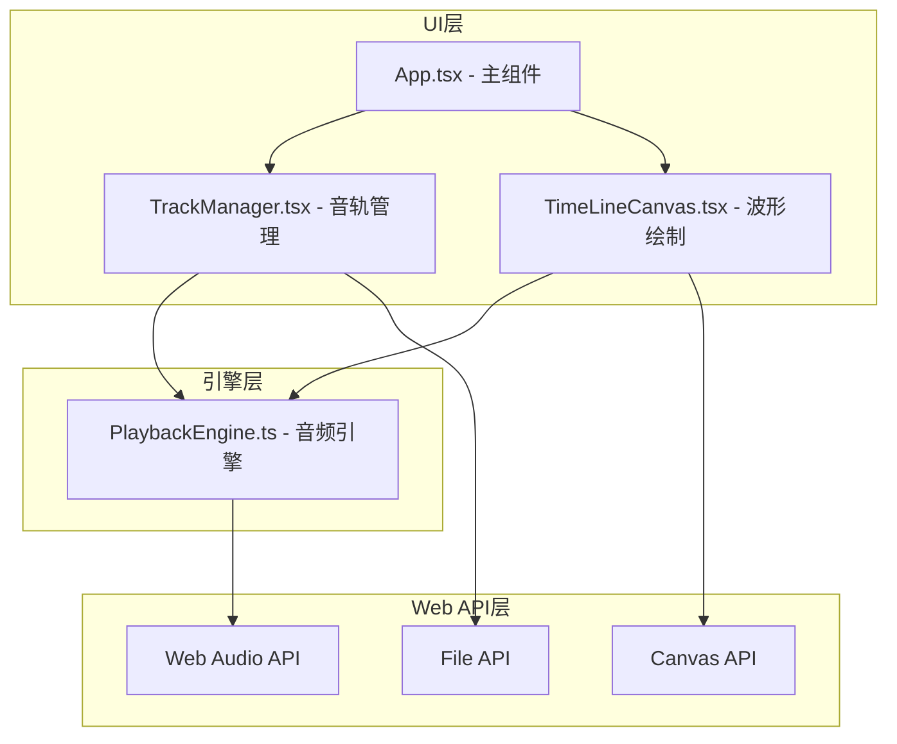

## 1. 架构设计



## 2. 技术描述
- **前端框架**：React@18 + TypeScript
- **构建工具**：Vite + @vitejs/plugin-react
- **音频处理**：Web Audio API（AudioContext、AudioBuffer、GainNode）
- **图形渲染**：Canvas API
- **状态管理**：React useState/useRef（轻量场景无需额外状态库）
- **无后端依赖**：纯前端应用

## 3. 数据模型

### 3.1 音轨数据结构
```typescript
interface Track {
  id: string;
  name: string;
  buffer: AudioBuffer;
  color: string;
  volume: number;        // 0-1
  muted: boolean;
  solo: boolean;
  gainNode: GainNode | null;
}
```

### 3.2 播放状态
```typescript
interface PlaybackState {
  isPlaying: boolean;
  isLooping: boolean;
  loopStart: number;     // 秒
  loopEnd: number;       // 秒
  currentTime: number;   // 秒
  masterVolume: number;  // 0-2
  bpm: number;          // 60-200
}
```

## 4. 文件结构与调用关系

```
src/
├── App.tsx              # 主组件：状态管理、事件分发
│   ├── TrackManager.tsx # 音轨管理：上传/删除/排序/音量控制
│   │   └── 调用: PlaybackEngine.createTrackGain()
│   └── TimeLineCanvas.tsx # 波形绘制：Canvas渲染/播放头/循环区间
│       └── 调用: PlaybackEngine 状态
└── PlaybackEngine.ts    # 音频引擎：AudioContext管理/GainNode调度/播放控制
    ├── 依赖: Web Audio API
    └── 被调用: App.tsx, TimeLineCanvas.tsx
```

**数据流向**：
1. 文件上传 → TrackManager → decodeAudioData → AudioBuffer → App.state.tracks → TimeLineCanvas渲染
2. 音量/静音调整 → TrackManager → GainNode.gain.setTargetAtTime → 实时生效
3. 播放指令 → TimeLineCanvas/App → PlaybackEngine.play → requestAnimationFrame驱动播放头更新
4. 循环设置 → TimeLineCanvas拖拽 → App.state.loopStart/loopEnd → PlaybackEngine调度

## 5. 性能约束实现方案

| 约束 | 实现方案 |
|------|---------|
| 播放帧率≥30fps | requestAnimationFrame驱动，每次更新仅重绘增量区域 |
| 停止帧率≥50fps | 静态波形使用离屏Canvas缓存，避免重复计算 |
| 解码时间≤1s | 异步decodeAudioData，10MB WAV文件现代浏览器可满足 |
| 无pop噪音 | 使用setTargetAtTime平滑过渡音量，时间常数0.01s |

