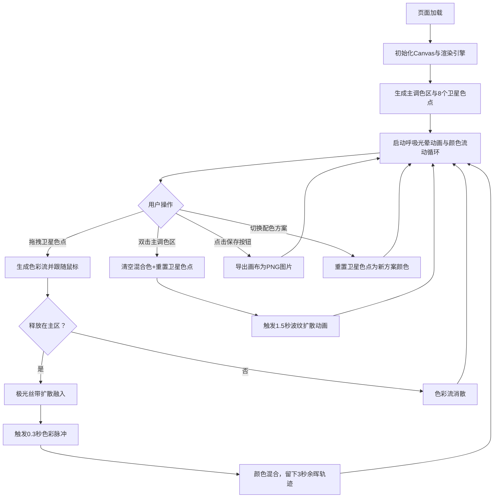

## 1. 产品概述

「极光幻彩调色盘」是一款基于浏览器的交互式数字艺术创作工具，用户通过鼠标拖拽和点击在数字画布上实时混合色彩，模拟极光般的流动、交融与扩散效果，创造独特的纹理图案，宛如在调色盘上演绎一场微缩的极光秀。

- 面向数字艺术爱好者、设计师和普通用户，提供沉浸式色彩混合体验
- 将色彩混合转化为可视化的动态艺术，带来视觉愉悦与创作乐趣

## 2. 核心功能

### 2.1 用户角色

| 角色 | 注册方式 | 核心权限 |
|------|----------|----------|
| 访客用户 | 无需注册，直接访问 | 使用全部调色、混色、保存功能 |

### 2.2 功能模块

1. **主画布渲染模块**：全屏Canvas画布，深蓝紫渐变背景，中央主调色区与卫星色点布局
2. **色彩交互模块**：卫星色点拖拽、色彩流生成、主区扩散混色、色彩脉冲反馈
3. **颜色流动系统**：主调色区内颜料自然扩散流动、半透明涡旋叠加效果
4. **重置与清空模块**：双击主区清空颜色、波纹扩散动画效果
5. **控制面板模块**：保存画布为PNG、配色方案切换（极光/火焰/海洋/霓虹）

### 2.3 页面详情

| 页面名称 | 模块名称 | 功能描述 |
|----------|----------|----------|
| 主画布页 | 背景层 | #0A0A23深蓝紫全屏渐变背景，营造深邃太空氛围 |
| 主画布页 | 主调色区 | 半径120px圆形区域，位于画布中央，承载颜色混合与流动效果 |
| 主画布页 | 卫星色点 | 8个直径40px色点均匀环绕主区，带柔和光晕呼吸动画（半径12-18px，周期2s） |
| 主画布页 | 拖拽交互 | 从卫星色点拖拽出30px宽、透明度0.7的色彩流，释放后融入主区并触发脉冲 |
| 主画布页 | 余晖轨迹 | 色彩扩散方向留下渐淡余晖，持续3秒后消失 |
| 主画布页 | 颜色流动 | 主区内颜色以2px/s速度自然扩散流动，半透明涡旋叠加 |
| 主画布页 | 双击重置 | 清空主区混合色、重置卫星色点，触发1.5秒波纹扩散动画 |
| 主画布页 | 控制面板 | 右上角悬浮面板（#1A1A2E背景，圆角12px，宽200px），含保存按钮和配色下拉 |

## 3. 核心流程

用户进入页面 → 全屏画布加载，展示中央主调色区与8个卫星色点（呼吸光晕动画） → 用户从任意卫星色点拖拽色彩流 → 拖拽过程显示30px宽半透明色流，跟随粒子轨迹 → 释放到主调色区 → 色彩如极光丝带扩散融入 → 触发0.3秒色彩脉冲闪烁 → 混合为新颜色，留下3秒渐淡余晖 → 主区内颜色持续自然流动 → 可重复拖拽多次混色 → 双击主区清空重置，波纹扩散 → 或通过控制面板切换配色方案/保存作品

## 4. 用户界面设计

### 4.1 设计风格

- **主色调**：深空蓝紫渐变 `#0A0A23 → #1A1A3E`，营造宇宙极光氛围
- **强调色**：8种极光色系（红、橙、黄、绿、蓝、紫、粉、白），高饱和度发光效果
- **控制面板**：深紫半透明背景 `#1A1A2E`，圆角12px，毛玻璃质感
- **按钮样式**：圆角8px，悬停放大1.1倍+加深光晕，点击微缩反馈
- **字体**：采用现代无衬线字体（如 'Segoe UI' / 'PingFang SC'），轻量字重，文字带柔和发光
- **布局风格**：全屏沉浸式画布，右上角悬浮控制，极简科幻美学
- **动效风格**：所有交互带柔和光晕和微动效，过渡使用 ease-in-out 贝塞尔曲线

### 4.2 页面设计概览

| 页面名称 | 模块名称 | UI元素 |
|----------|----------|--------|
| 主画布页 | 背景层 | 全屏径向渐变（中心略亮边缘深），深邃太空感 |
| 主画布页 | 主调色区 | 120px半径圆，边缘柔和发光，内部颜料动态流动 |
| 主画布页 | 卫星色点 | 40px直径，均匀分布在半径200px圆周上，呼吸光晕周期2秒 |
| 主画布页 | 拖拽色流 | 30px宽，0.7透明度，末端粒子轨迹，跟随鼠标 |
| 主画布页 | 扩散效果 | 极光丝带式扩散，半透明叠加混合 |
| 主画布页 | 脉冲效果 | 主区快速闪烁0.3秒，亮度+50%后回落 |
| 主画布页 | 余晖轨迹 | 沿扩散方向渐变透明，3秒衰减 |
| 主画布页 | 波纹动画 | 从中心向外扩散圆环，透明度0.5→0，1.5秒至边缘 |
| 主画布页 | 控制面板 | 200px宽，#1A1A2E背景，12px圆角，内边距16px，标题+按钮+下拉 |

### 4.3 响应式设计

- 桌面优先设计，Canvas全屏自适应窗口尺寸
- 主调色区与卫星色点基于画布中心计算坐标，自动适配不同分辨率
- 控制面板固定右上角，保持200px宽度，不随画布缩放
- 触摸设备支持：支持触屏拖拽与双击操作

### 4.4 性能要求

- 画布渲染保持60FPS稳定帧率
- 色彩流动计算每帧不超过2ms（使用轻量粒子系统，限制最大粒子数）
- 拖拽交互延迟低于50ms（直接在requestAnimationFrame中处理鼠标位置）
- 颜色混合使用Canvas全局复合操作（globalCompositeOperation = 'lighter' / 'screen'），避免逐像素计算
