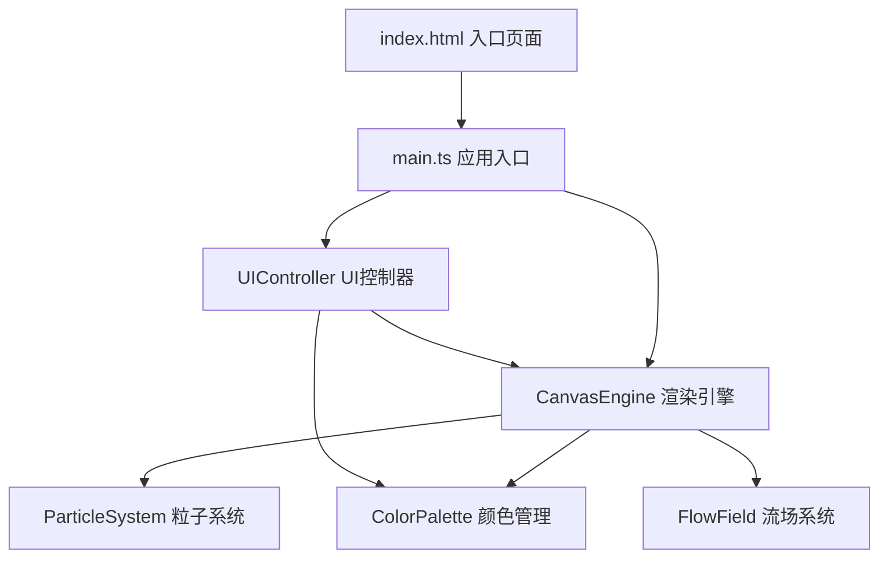

## 1. 架构设计

本项目为纯前端单页应用，采用分层架构设计，将渲染引擎、颜色管理、UI控制分离，实现高内聚低耦合。



## 2. 技术选型

| 层级 | 技术 | 说明 |
|------|------|------|
| 构建工具 | Vite@5 | 原生ESM，极速HMR，轻量配置 |
| 语言 | TypeScript@5 | 严格模式，ES2020目标，类型安全 |
| 渲染 | Canvas 2D API | 高性能2D图形绘制，支持globalCompositeOperation混合模式 |
| 动画 | requestAnimationFrame | 浏览器原生动画循环，60FPS同步 |
| 样式 | 原生CSS | 无CSS框架依赖，减少包体积 |

## 3. 文件结构定义

```
auto211/
├── package.json          # 项目依赖与脚本
├── index.html            # 入口HTML页面
├── tsconfig.json         # TypeScript配置（严格模式，ES2020）
├── vite.config.js        # Vite构建配置（HMR支持）
└── src/
    ├── main.ts           # 入口初始化，创建画布实例绑定事件
    ├── canvasEngine.ts   # 核心渲染引擎，粒子系统、色彩混合、动画循环
    ├── colorPalette.ts   # 颜色管理与预设方案，颜色混合计算工具
    └── uiController.ts   # 控制面板UI逻辑，按钮与下拉选择器事件绑定
```

## 4. 核心模块接口定义

### 4.1 ColorPalette 模块

```typescript
// 配色方案名称
type SchemeName = 'aurora' | 'fire' | 'ocean' | 'neon';

// RGB颜色对象
interface RGB { r: number; g: number; b: number; }

// 预设配色方案
const COLOR_SCHEMES: Record<SchemeName, string[]> = {
  aurora: ['#FF0040', '#FF8C00', '#FFD700', '#00FF88', '#00BFFF', '#8A2BE2', '#FF69B4', '#FFFFFF'],
  fire:   ['#FF0000', '#FF4500', '#FF8C00', '#FFD700', '#FF6347', '#DC143C', '#FF1493', '#FFFF00'],
  ocean:  ['#00FFFF', '#00BFFF', '#1E90FF', '#4169E1', '#00CED1', '#20B2AA', '#48D1CC', '#E0FFFF'],
  neon:   ['#FF00FF', '#00FFFF', '#FFFF00', '#FF0080', '#00FF00', '#BF00FF', '#FF3300', '#0080FF'],
};

class ColorPalette {
  satelliteColors: string[];  // 当前8个卫星色点颜色
  currentScheme: SchemeName;  // 当前配色方案
  
  constructor();
  setScheme(name: SchemeName): void;       // 切换配色方案
  shuffleColors(): void;                   // 随机打乱颜色顺序
  mixColors(c1: string, c2: string, ratio?: number): string;  // 颜色混合
  static hexToRgb(hex: string): RGB;       // HEX转RGB
  static rgbToHex(rgb: RGB): string;       // RGB转HEX
  static lerpColor(a: RGB, b: RGB, t: number): RGB;  // 颜色线性插值
}
```

### 4.2 CanvasEngine 模块

```typescript
// 粒子对象
interface Particle {
  x: number; y: number;
  vx: number; vy: number;
  color: string;
  alpha: number;
  size: number;
  life: number;
  maxLife: number;
  type: 'flow' | 'trail' | 'ripple' | 'pulse';
}

// 卫星色点
interface Satellite {
  x: number; y: number;
  radius: number;
  color: string;
  glowRadius: number;
  phase: number;  // 呼吸动画相位
}

// 拖拽状态
interface DragState {
  isDragging: boolean;
  satelliteIndex: number;
  currentX: number;
  currentY: number;
}

class CanvasEngine {
  canvas: HTMLCanvasElement;
  ctx: CanvasRenderingContext2D;
  width: number;
  height: number;
  centerX: number;
  centerY: number;
  mainRadius: number;         // 主调色区半径120
  satellites: Satellite[];    // 8个卫星色点
  particles: Particle[];      // 粒子池
  mainColor: RGB;             // 主区当前混合色
  dragState: DragState;
  palette: ColorPalette;
  animationId: number;
  lastTime: number;
  
  constructor(canvas: HTMLCanvasElement, palette: ColorPalette);
  start(): void;               // 启动动画循环
  stop(): void;                // 停止动画循环
  resize(): void;              // 响应窗口大小变化
  handleMouseDown(x: number, y: number): void;
  handleMouseMove(x: number, y: number): void;
  handleMouseUp(x: number, y: number): void;
  handleDoubleClick(x: number, y: number): void;
  saveAsPNG(): void;           // 导出PNG
  resetMainArea(): void;       // 清空主调色区
  triggerRipple(): void;       // 触发波纹动画
  private render(): void;      // 单帧渲染
  private update(dt: number): void;  // 状态更新
  private spawnFlowParticles(fromX: number, fromY: number, toX: number, toY: number, color: string): void;
  private spawnTrailParticles(x: number, y: number, color: string): void;
}
```

### 4.3 UIController 模块

```typescript
interface UIControllerOptions {
  engine: CanvasEngine;
  palette: ColorPalette;
  container: HTMLElement;
}

class UIController {
  engine: CanvasEngine;
  palette: ColorPalette;
  container: HTMLElement;
  panelEl: HTMLElement;
  saveBtn: HTMLButtonElement;
  schemeSelect: HTMLSelectElement;
  
  constructor(options: UIControllerOptions);
  render(): void;              // 渲染控制面板DOM
  bindEvents(): void;          // 绑定UI事件
  private onSchemeChange(e: Event): void;
  private onSaveClick(e: Event): void;
}
```

## 5. 性能优化策略

### 5.1 渲染性能

1. **粒子池复用**：预分配粒子数组，通过life字段标记活跃/非活跃，避免频繁GC
2. **最大粒子数限制**：总粒子数不超过500，超出时优先回收最旧粒子
3. **离屏画布缓存**：主调色区颜色混合使用离屏Canvas，减少主画布重绘开销
4. **globalCompositeOperation**：使用 `lighter` / `screen` 模式实现光效叠加，避免逐像素混合计算

### 5.2 计算优化

1. **流场简化**：颜色流动使用2D柏林噪声简化版，预计算噪声表，每帧采样而非计算
2. **时间增量dt**：所有动画基于deltaTime，确保不同帧率下速度一致
3. **坐标预计算**：卫星色点位置、主区中心点只在resize时重新计算
4. **颜色缓存**：混合颜色结果存入Map缓存，相同输入直接返回

### 5.3 交互优化

1. **鼠标事件节流**：mousemove使用原生RAF同步，不额外节流，确保<50ms延迟
2. **拖拽命中检测优化**：8个卫星色点使用圆形碰撞检测，数学计算O(1)
3. **被动事件监听**：touch事件使用`{passive: true}`，避免阻塞滚动

## 6. 关键算法

### 6.1 颜色混合算法

使用加权RGB线性插值，支持多次混合累积：

```
混色公式：C_result = C_main * (1 - weight) + C_new * weight
其中 weight ∈ [0.15, 0.35]，根据扩散粒子数动态调整
```

### 6.2 极光扩散效果

粒子初始速度沿拖拽方向，添加垂直方向正弦扰动模拟丝带飘动，同时增加径向速度分量模拟扩散：

```
vx = baseSpeed * cos(angle) + sin(time * freq) * wobble
vy = baseSpeed * sin(angle) + cos(time * freq) * wobble
```

### 6.3 呼吸光晕动画

使用正弦函数驱动光晕半径，周期2秒：

```
glowRadius = 12 + (18 - 12) * (sin(t * π) + 1) / 2
其中 t = (time % 2000) / 2000
```
