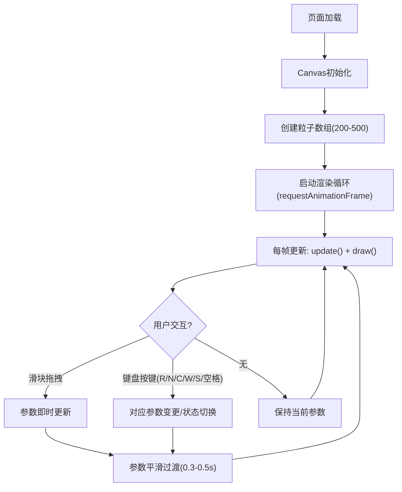

## 1. 产品概述

一款基于Canvas的交互式「光污染粒子瀑布」视觉应用，为特效设计师和创意爱好者提供赛博朋克风格的沉浸式动态背景生成工具。用户可通过鼠标拖拽和键盘按键实时调整粒子参数，生成霓虹灯雨幕效果。

- 主要用途：创意视觉展示、动态背景生成、交互艺术体验
- 目标用户：特效设计师、前端开发者、数字艺术爱好者
- 产品价值：提供低门槛、高自由度的粒子视觉参数化调优工具

## 2. 核心功能

### 2.1 用户角色
无多角色区分，所有用户拥有完整功能权限。

### 2.2 功能模块
1. **Canvas渲染层**：粒子系统实时绘制、尾迹效果、光晕层叠加
2. **粒子系统**：200-500个粒子的生命周期管理、运动物理、颜色渐变
3. **控制面板**：可折叠的参数调节面板（速度、旋涡强度、粒子数量滑块，重置按钮）
4. **状态显示**：左下角实时显示粒子数、FPS、色彩模式
5. **键盘交互**：R/N/C切换色彩模式、W/S调节速度、空格暂停、R键重置

### 2.3 页面详情

| 页面名称 | 模块名称 | 功能描述 |
|-----------|-------------|---------------------|
| 主视觉页 | Canvas画布 | 全屏粒子瀑布渲染，深蓝色渐变背景，底部光晕效果 |
| 主视觉页 | 控制面板 | 右侧毛玻璃风格面板，含三个滑块和重置按钮，支持折叠展开 |
| 主视觉页 | HUD信息 | 左下角显示粒子数（绿色）、FPS（黄色）、色彩模式（淡紫色） |

## 3. 核心流程

用户打开页面 → Canvas初始化并生成粒子 → 渲染循环开始（60FPS）→ 用户通过滑块/键盘调整参数 → 参数实时传递给渲染循环 → 粒子系统根据新参数更新运动和颜色 → 用户可随时暂停/重置

## 4. 用户界面设计

### 4.1 设计风格
- **主色调**：深蓝色渐变背景（#0A0E27 → #141852）
- **强调色**：霓虹粉#FF006E、青蓝#00F5FF、亮黄#FFE600
- **面板风格**：半透明毛玻璃 rgba(30,30,60,0.7)，backdrop-filter: blur(8px)，圆角12px，边框rgba(255,255,255,0.2)
- **按钮风格**：圆角8px，红色#FF5E5E重置按钮，hover亮度提升15%
- **字体**：无衬线系统字体，HUD信息12px
- **整体美学方向**：赛博朋克·霓虹雨幕·沉浸式

### 4.2 页面设计概述

| 页面名称 | 模块名称 | UI元素 |
|-----------|-------------|-------------|
| 主视觉页 | Canvas画布 | 全屏、深蓝色径向渐变、粒子带尾迹下落、底部柔光叠加 |
| 主视觉页 | 控制面板 | 宽280px、距右20px、毛玻璃面板、三个滑块（带标签和数值显示）、重置按钮 |
| 主视觉页 | HUD | 左下角三行文字：粒子数#00FF88、FPS#FFD700、模式#C084FC，带半透明深色背景 |
| 主视觉页 | 折叠图标 | 宽<800px时显示右侧圆形按钮(40px)，点击展开，滑入动画0.2s ease-out |

### 4.3 响应式
- Desktop-first设计，宽度<800px触发移动端适配
- 移动端自动降低粒子数至200-300，关闭尾迹绘制
- 控制面板自动折叠为图标按钮
- Canvas自适应窗口尺寸，resize事件实时调整

### 4.4 性能预算
- 1200x800 + 500粒子：稳定60FPS，更新+绘制总耗时≤10ms
- 375x667（移动）：200-300粒子，关闭尾迹，≥30FPS
