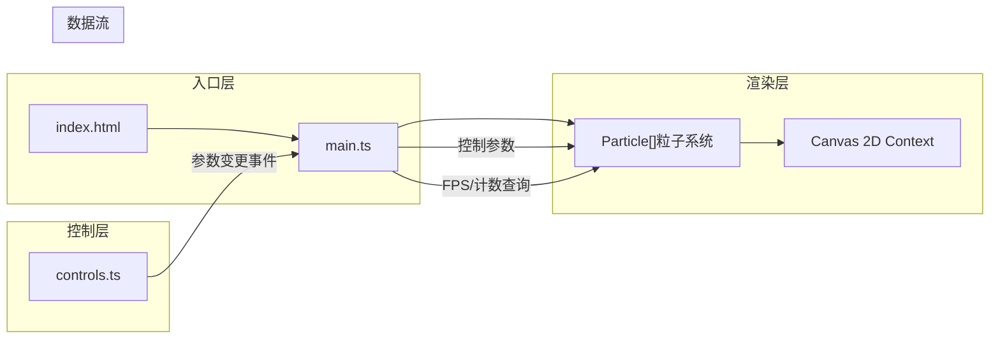

## 1. 架构设计

纯前端Canvas渲染架构，采用模块化分层设计，核心模块职责清晰，数据单向流动。



**文件间调用关系与数据流向：**

| 文件 | 职责 | 输出/调用 | 接收输入 |
|------|------|-----------|----------|
| `index.html` | 页面结构、Canvas容器、面板DOM挂载点 | 加载main.ts | - |
| `src/main.ts` | 应用入口，Canvas初始化，渲染循环驱动，窗口resize，参数分发 | 调用particle.update/draw，接收controls回调 | controls参数变更、window事件 |
| `src/particle.ts` | 粒子类定义，单粒子的位置/速度/颜色/生命周期管理，update/draw方法 | Canvas绘制指令 | main.ts传入的控制参数（速度/旋涡/颜色模式/时间） |
| `src/controls.ts` | 控制面板渲染，滑块/按钮/键盘事件监听，参数平滑过渡 | 通过回调向main.ts发射参数值 | 用户DOM交互、键盘事件 |

## 2. 技术描述

- **前端框架**：原生 TypeScript（无框架）+ Vite 构建
- **初始化工具**：Vite vanilla-ts 模板
- **渲染技术**：HTML5 Canvas 2D Context
- **状态管理**：模块内闭包 + 回调事件通信（轻量，无需额外状态库）
- **后端**：无
- **数据库**：无

## 3. 核心类型定义

```typescript
// 颜色模式枚举
type ColorMode = 'rainbow' | 'neon' | 'cold';

// 控制参数接口（平滑过渡中当前值）
interface ControlParams {
  speed: number;           // 下落速度 px/s, 范围 30-120
  vortexStrength: number;  // 旋涡强度 0-1
  particleCount: number;   // 粒子数 200-500
  colorMode: ColorMode;    // 色彩模式
  paused: boolean;         // 暂停状态
}

// 目标参数（用于平滑过渡）
interface TargetParams extends ControlParams {
  // 过渡参数
  speedTransition: number;
  vortexTransition: number;
  colorTransition: number; // 0-1 颜色混合进度
  prevColorMode: ColorMode;
}

// 粒子接口
interface ParticleData {
  x: number;
  y: number;
  prevX: number;
  prevY: number;
  vy: number;       // y方向速度
  size: number;     // 4-12
  color: string;    // 当前颜色(hex或rgba)
  baseColorIndex: number; // 用于neon模式的颜色选择
  alpha: number;    // 透明度 0.4-0.7 (cold模式)
  offsetPhase: number; // 旋涡sin相位偏移
}
```

## 4. 渲染循环设计

```
requestAnimationFrame → 计算deltaTime → 参数平滑插值 → 清屏+背景渐变 → 遍历粒子update → 遍历粒子draw → 绘制底部光晕 → 绘制HUD文字
```

关键性能优化：
- 粒子数组预分配，不动态创建/销毁，重置时复用
- 颜色计算缓存彩虹色阶数组，每帧查表而非实时计算
- 尾迹使用单条lineTo而非多次叠加
- HUD仅在整数FPS变化时重绘文本内容

## 5. 项目文件结构

```
auto213/
├── .trae/documents/
│   ├── PRD-光污染粒子瀑布.md
│   └── 技术架构-光污染粒子瀑布.md
├── index.html
├── package.json
├── tsconfig.json
├── vite.config.js
└── src/
    ├── main.ts          # 应用入口、渲染循环
    ├── particle.ts      # 粒子类
    └── controls.ts      # 控制面板与键盘事件
```
