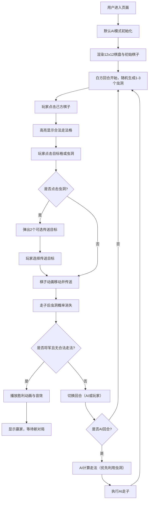

## 1. 产品概述

「星际棋局」是一款基于浏览器的在线国际象棋变体对战平台，核心创新点是在12x12的扩展棋盘上引入随机生成的「虫洞」传送门机制。棋子踏入虫洞后会被随机传送到另一个虫洞位置，彻底打破传统象棋的战术布局，带来强烈的策略不确定性与新鲜感。

- **主要用途**：为象棋爱好者提供新颖、刺激的策略对战体验
- **目标用户**：国际象棋爱好者、策略游戏玩家、追求新鲜感的休闲玩家
- **市场价值**：通过虫洞机制创新，将传统象棋与科幻元素融合，打造独特的轻量级网页对战游戏

## 2. 核心特性

### 2.1 用户角色
本产品为纯前端单机/本地双人游戏，无需注册登录。

| 角色 | 参与方式 | 核心权限 |
|------|----------|----------|
| 玩家（先手） | 进入游戏即可参与 | 操控白色棋子、发起走子、使用功能按钮 |
| 玩家（后手/AI） | 本地双人或人机对战 | 操控黑色棋子、响应走子 |

### 2.2 功能模块
1. **主游戏区**：12x12棋盘渲染、棋子显示、虫洞特效、交互处理
2. **控制面板**：回合信息、统计数据、棋局日志、功能按钮
3. **游戏逻辑引擎**：走法合法性检查、虫洞传送、将军检测、AI策略
4. **视觉效果**：深空背景、虫洞旋转动画、棋子移动过渡、胜利粒子特效
5. **音效系统**：Web Audio API 生成胜利音效

### 2.3 页面详情
| 页面名称 | 模块名称 | 功能描述 |
|-----------|-------------|---------------------|
| 游戏主页面 | 深空背景 | 径向渐变#0B0C10到#1F2833，营造宇宙氛围 |
| 游戏主页面 | 12x12棋盘 | 发光边框#45A29E，格子交替#2E4057/#4A6684，非对称初始布局 |
| 游戏主页面 | 虫洞系统 | 每回合随机1-3个虫洞，紫色#B10DC9旋转螺旋光效，1.5秒光晕周期 |
| 游戏主页面 | 棋子交互 | 点击选择+目标移动，0.3秒缓动动画，支持虫洞传送选择 |
| 游戏主页面 | 右侧控制面板 | 280px半透明面板，回合统计、传送计数、棋局日志、功能按钮 |
| 游戏主页面 | 底部状态栏 | 当前玩家、剩余时间、虫洞数量显示 |
| 游戏主页面 | 胜利动画 | 金色粒子效果（80个，3-6px，持续3秒）+上升音调音效+赢家文字 |
| 游戏主页面 | 响应式布局 | 1920x1080/1440x900自适应缩放，768px以下面板折叠为底部浮动条 |

## 3. 核心流程

用户进入页面 → 默认AI对战模式 → 棋盘渲染完成 → 先手（白方）回合开始 → 随机生成虫洞 → 玩家点击棋子高亮可选走法 → 玩家点击目标格/虫洞 → 棋子动画移动 → 若踏入虫洞则弹出传送目标选择 → 传送完成 → 检测将军/胜负 → 切换回合 → 后手（AI/玩家）行动 → 循环直至胜负判定 → 胜利动画播放 → 可开始新对局

## 4. 用户界面设计

### 4.1 设计风格
- **主色调**：深空蓝黑渐变背景（#0B0C10 → #1F2833），棋盘格子蓝灰（#2E4057/#4A6684）
- **强调色**：虫洞紫色（#B10DC9）、边框青绿（#45A29E）、按钮悬停金（#F2A900）、胜利金（#FFD700）
- **按钮风格**：圆角8px，半透明暗色底，悬停背景变亮为金色
- **字体**：无衬线科幻风格字体，标题大号粗体，正文小号精修
- **布局风格**：居中棋盘 + 右侧固定面板 + 底部状态栏，卡片式半透明面板
- **图标风格**：Unicode象棋字符 + CSS动画，无需额外图标库

### 4.2 页面设计概述
| 页面名称 | 模块名称 | UI元素 |
|-----------|-------------|-------------|
| 主游戏页 | 棋盘区域 | 12x12发光网格，交替色格子，悬停高亮，选中棋子发光边框 |
| 主游戏页 | 棋子显示 | Unicode字符，大号尺寸，悬浮阴影，点击选中动画 |
| 主游戏页 | 虫洞特效 | 旋转紫色螺旋，脉冲光晕，CSS动画，传送时闪烁效果 |
| 主游戏页 | 右侧面板 | 280px宽，半透明#1A1A2E，圆角12px，内边距16px，可滚动日志区 |
| 主游戏页 | 功能按钮 | 三个按钮水平排列，圆角8px，悬停变金色，过渡0.2秒 |
| 主游戏页 | 状态栏 | 底部细长条，三栏布局（玩家/时间/虫洞数），发光分隔线 |
| 主游戏页 | 胜利遮罩 | 全屏半透明遮罩，居中金色大字，粒子动画覆盖全屏 |

### 4.3 响应式
- **桌面优先**：1920x1080及以上为最佳显示尺寸，棋盘根据视口高度自适应
- **中等屏幕**：1440x900自动缩放棋盘尺寸，保持宽高比例
- **平板及以下（≤768px）**：右侧面板折叠为底部浮动抽屉，棋盘占满宽度，按钮横排显示
- **触摸优化**：增大点击热区至48x48px，禁用双击缩放

### 4.4 动画与性能
- **棋子移动**：0.3秒CSS缓动过渡（ease-out），位移+轻微缩放
- **虫洞旋转**：CSS transform: rotate() 配合 animation 3秒无限循环
- **虫洞开合**：opacity + transform: scale() 0.4秒过渡
- **胜利粒子**：Canvas或CSS实现80个粒子随机发散，3秒后自动清理
- **性能目标**：60FPS流畅渲染，点击响应<200ms，使用GPU加速属性（transform/opacity）
