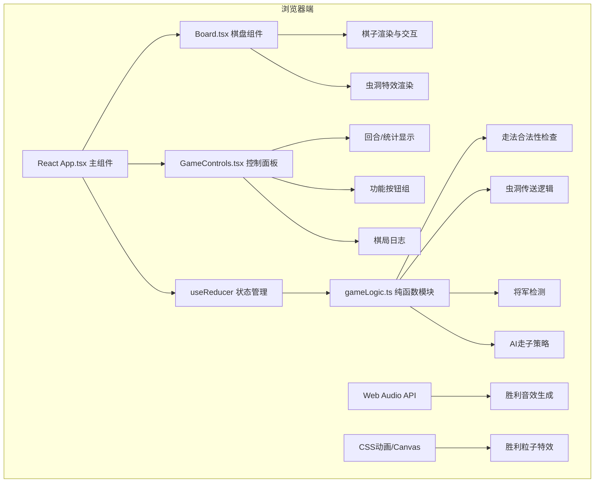

## 1. 架构设计

本项目为纯前端React应用，无后端服务，所有状态管理和游戏逻辑均在浏览器端完成。



## 2. 技术描述

- **前端框架**：React 18 + TypeScript
- **构建工具**：Vite（目标ES2020，开启HMR）
- **状态管理**：React useReducer（纯函数状态转换）
- **样式方案**：原生CSS + CSS变量 + 响应式媒体查询
- **动画库**：react-move（棋子过渡动画）
- **音频库**：tone（Web Audio API封装，生成音效）
- **后端**：无（纯前端）
- **数据持久化**：无（会话级内存状态）

**用户指定依赖版本控制**：
- react、react-dom
- typescript
- vite
- @vitejs/plugin-react
- @types/react、@types/react-dom
- react-move
- tone

## 3. 文件结构与职责

| 文件路径 | 职责描述 |
|----------|----------|
| `package.json` | 项目依赖与脚本配置（dev/build） |
| `vite.config.js` | Vite基础配置，React插件，build目标es2020 |
| `index.html` | 入口HTML，设置charset/viewport，引入全局样式 |
| `tsconfig.json` | TS严格模式，目标ES2020，模块ESNext，jsx: react-jsx |
| `src/App.tsx` | 主组件，useReducer管理state，回合逻辑，虫洞生成，棋局控制 |
| `src/Board.tsx` | 棋盘组件，12x12网格、棋子、虫洞渲染，点击/拖拽交互（div实现） |
| `src/GameControls.tsx` | 右侧面板+底部状态栏，统计日志、按钮组，响应式布局 |
| `src/utils/gameLogic.ts` | 纯函数：走法合法性、虫洞传送、将军检测、AI策略 |
| `src/index.css` | 全局样式、CSS变量、深空背景、动画关键帧 |

## 4. 核心数据模型（TypeScript类型）

```typescript
type PieceColor = 'white' | 'black';
type PieceType = 'king' | 'queen' | 'rook' | 'bishop' | 'knight' | 'pawn';

interface Piece {
  id: string;
  type: PieceType;
  color: PieceColor;
  x: number; // 0-11
  y: number; // 0-11
}

interface Wormhole {
  id: string;
  x: number;
  y: number;
  createdAt: number; // 回合数
}

interface MoveLog {
  turn: number;
  pieceId: string;
  pieceType: PieceType;
  color: PieceColor;
  fromX: number;
  fromY: number;
  toX: number;
  toY: number;
  isWormholeTeleport: boolean;
  teleportFrom?: { x: number; y: number };
  teleportTo?: { x: number; y: number };
}

interface GameStats {
  whiteTeleports: number;
  blackTeleports: number;
}

type GameMode = 'ai' | 'pvp';

interface GameState {
  board: (Piece | null)[][]; // 12x12
  pieces: Piece[];
  currentPlayer: PieceColor;
  turn: number;
  wormholes: Wormhole[];
  wormholeMode: boolean;
  selectedPieceId: string | null;
  validMoves: { x: number; y: number }[];
  pendingWormholeChoice: {
    pieceId: string;
    enterWormholeId: string;
    options: { x: number; y: number }[];
  } | null;
  moveHistory: MoveLog[];
  stats: GameStats;
  mode: GameMode;
  winner: PieceColor | null;
  timeRemaining: { white: number; black: number };
}

type GameAction =
  | { type: 'SELECT_PIECE'; pieceId: string }
  | { type: 'MOVE_PIECE'; toX: number; toY: number }
  | { type: 'TELEPORT_VIA_WORMHOLE'; targetX: number; targetY: number }
  | { type: 'CANCEL_SELECTION' }
  | { type: 'NEW_GAME' }
  | { type: 'UNDO_MOVE' }
  | { type: 'TOGGLE_WORMHOLE_MODE' }
  | { type: 'TOGGLE_MODE' }
  | { type: 'AI_MOVE' }
  | { type: 'TICK_TIMER' };
```

## 5. 核心算法逻辑

### 5.1 初始布局（12x12棋盘，非对称）
- 白方（底部，y=10,11）：
  - y=11: [rook, knight, bishop, queen, king, bishop, knight, knight, rook, pawn, pawn, pawn]
  - y=10: 12个pawn
- 黑方（顶部，y=0,1）：
  - y=0: [rook, knight, bishop, queen, king, bishop, knight, knight, rook, pawn, pawn, pawn]
  - y=1: 12个pawn
- 说明：每方在标准棋子基础上，后和车旁额外多一个马，不对称开局

### 5.2 走法合法性检查
- **兵(Pawn)**：标准走法，首步可走2格，吃子斜走，考虑12x12边界
- **马(Knight)**：L形走法（±1,±2或±2,±1）
- **象(Bishop)**：斜线任意格，直到被阻挡
- **车(Rook)**：直线任意格，直到被阻挡
- **后(Queen)**：直线+斜线任意格，直到被阻挡
- **王(King)**：周围8格1步

### 5.3 虫洞机制
- 每回合开始时，随机生成1-3个虫洞（空白格上）
- 虫洞半径25px，紫色#B10DC9旋转螺旋光效，光晕周期1.5秒
- 棋子移动到虫洞格时，弹出2个可选传送目标（其他虫洞位置或随机合法空格）
- 走子完成后，每个虫洞有40%概率消失
- 传送统计计入双方各自的传送次数

### 5.4 AI策略
- 简单随机AI，但优先利用虫洞
- 算法步骤：
  1. 遍历己方所有棋子，计算所有合法走法
  2. 筛选出踏入虫洞的走法（高优先级，70%概率选择）
  3. 若无可利用虫洞，则从所有合法走法中随机选择一步
  4. 走子动画延迟400ms后执行

### 5.5 胜负判定
- 每步走子后检测：对方王是否被将军且无任何合法走法
- 若是，则当前方获胜，触发胜利动画和音效
