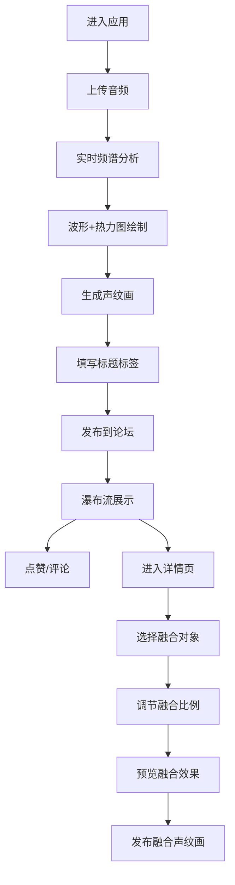

## 1. 产品概述

「声纹绿洲」是一个在线音频可视化论坛，用户上传短音频（1分钟内的清唱、说话或乐器声），系统实时分析频谱特征并生成独一无二的「声纹画」，用户可发布到论坛时间线，社区成员可点赞、评论，并将多张声纹画融合生成新的「融合声纹画」，形成由社区声音构建的视觉绿洲。

- 核心价值：将声音转化为独特视觉艺术，通过融合机制激发社区创造力
- 目标用户：音乐爱好者、声音艺术家、普通社交用户

## 2. 核心功能

### 2.1 用户角色
| 角色 | 注册方式 | 核心权限 |
|------|---------|---------|
| 普通用户 | 无需注册（本地模拟） | 上传音频、发布声纹画、点赞、评论、融合声纹画 |

### 2.2 功能模块
1. **首页/上传页**：音频上传区、实时频谱波形、频谱热力图生成
2. **论坛时间线**：声纹画瀑布流展示、点赞评论入口
3. **声纹画详情页**：完整声纹画展示、评论列表、融合功能
4. **融合功能**：双声纹画加权融合、比例调节、融合结果发布

### 2.3 页面详情
| 页面名称 | 模块名称 | 功能描述 |
|---------|---------|---------|
| 首页 | 上传区 | 圆形拖拽/点击上传，支持1分钟内音频 |
| 首页 | 实时分析 | 横向滚动频率波形（#A8E6CF到#DCEDC1渐变，2px线宽） |
| 首页 | 热力图生成 | 256x200像素频谱热力图（#0B3D3D→#3B82A8→#FDE68A） |
| 首页 | 发布卡片 | 声纹画缩略图、标题输入、标签输入（#清唱、#吉他等） |
| 时间线 | 瀑布流卡片 | 浅绿色边框#7BB3B3，hover上移4px+10px阴影，0.3s ease-out |
| 时间线 | 点赞按钮 | 点击+1，按钮短暂放大跳动 |
| 时间线 | 评论面板 | 底部滑入，背景#152F2F，宽80%高60vh，0.4s cubic-bezier |
| 详情页 | 声纹画展示 | 左侧完整声纹画，可放大查看 |
| 详情页 | 评论区 | 圆角椭圆气泡，左对齐，底部3px三角，#2C6B6B背景白字 |
| 详情页 | 融合功能 | 加权平均融合、滑块调节比例0-100、中心渐现动画0.6s |

## 3. 核心流程

用户进入应用 → 上传音频 → 实时频谱分析与波形绘制 → 生成声纹画 → 填写标题标签 → 发布到论坛 → 浏览瀑布流 → 点赞/评论 → 进入详情页 → 选择融合对象 → 调节融合比例 → 发布融合声纹画

## 4. 用户界面设计

### 4.1 设计风格
- **主色调**：深绿#0B3D3D、蓝绿#1A6B6B、青绿#45A29E、淡绿#A8E6CF
- **按钮**：圆角胶囊形，高36px，hover时#45A29E→#66FCF1，0.2s过渡
- **卡片/面板**：半透明磨砂玻璃效果（backdrop-filter: blur(8px)）
- **整体**：暗色调绿洲主题，统一深绿到蓝绿渐变背景

### 4.2 页面设计概述
| 页面名称 | 模块名称 | UI元素 |
|---------|---------|--------|
| 首页 | 背景 | #0B3D3D到#1A6B6B渐变 |
| 首页 | 上传区 | 直径300px圆形，微光描边，淡绿色音符图标 |
| 首页 | 发布卡片 | 圆角16px，#1A4A4A背景#A8E6CF边框 |
| 时间线 | 瀑布流 | 多列布局，<768px单列 |
| 详情页 | 布局 | 左右分栏，<768px上下堆叠 |
| 融合预览 | 动画 | 中心向外渐现，0.6s |

### 4.3 响应式
- 桌面端：瀑布流多列、上传区300px、详情页左右分栏
- 移动端（<768px）：瀑布流单列、上传区200px、详情页上下堆叠
- 触摸优化：所有按钮和交互区域≥44px

### 4.4 性能要求
- 频谱分析+热力图生成总耗时≤1秒
- FPS≥50，滚动和动画流畅无卡顿
