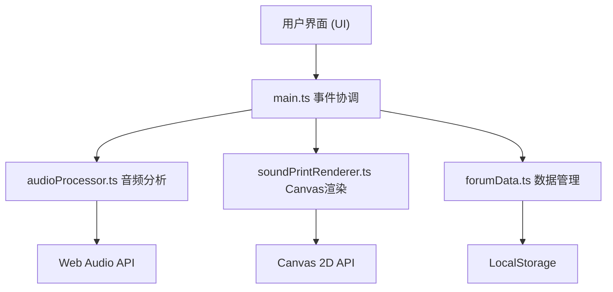
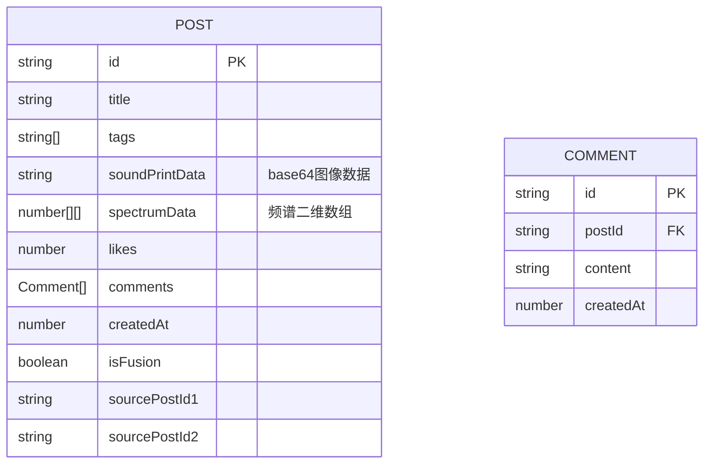

## 1. 架构设计

## 2. 技术描述

- **前端框架**：纯 TypeScript + Vite（无框架，按用户要求）
- **音频分析**：Web Audio API（AudioContext、AnalyserNode）
- **可视化渲染**：HTML5 Canvas 2D API
- **数据持久化**：LocalStorage（本地模拟存储）
- **构建工具**：Vite
- **目标**：ES2020，模块：ESNext

## 3. 文件结构定义

| 文件 | 职责 |
|------|------|
| package.json | 依赖（typescript、vite、@types/web）、启动脚本 |
| index.html | 入口页面，包含Canvas、上传区、瀑布流容器、模态框 |
| tsconfig.json | TS配置（严格模式、ES2020目标、ESNext模块） |
| vite.config.js | Vite基础配置、HMR支持 |
| src/audioProcessor.ts | 音频加载、Web Audio频谱分析、输出频率数组 |
| src/soundPrintRenderer.ts | 频谱数据→Canvas波形+热力图、输出声纹画数据 |
| src/forumData.ts | LocalStorage帖子数据管理、点赞评论CRUD |
| src/main.ts | UI初始化、事件绑定、模块协调、渲染到页面 |

## 4. 数据模型

### 数据接口
- `getPosts(): Post[]`
- `getPost(id: string): Post | undefined`
- `createPost(data: Omit<Post, 'id' | 'likes' | 'comments' | 'createdAt'>): Post`
- `likePost(id: string): void`
- `addComment(postId: string, content: string): Comment`
- `getComments(postId: string): Comment[]`

## 5. 性能优化策略

1. **音频分析**：使用AnalyserNode.getByteFrequencyData，FFT大小256，减少计算量
2. **Canvas渲染**：requestAnimationFrame调度，离屏Canvas预渲染热力图
3. **瀑布流**：CSS columns布局，避免JavaScript手动定位
4. **动画**：优先使用CSS transform/opacity，避免触发重排
5. **数据处理**：频谱数据降采样存储，热力图一次性生成后缓存为ImageData
