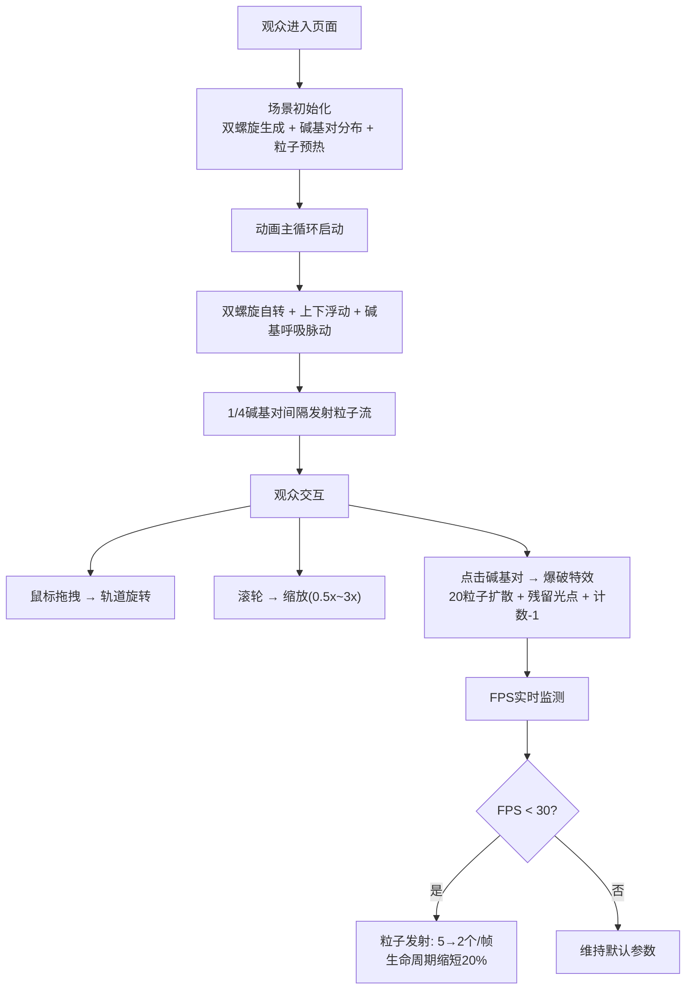

## 1. 产品概述

发光的基因链 —— 一个在浏览器中运行的3D交互式生物艺术可视化作品。通过旋转、缩放和点击操作，观众可以观察一段半透明双螺旋结构上随机分布的发光碱基对如何随时间缓慢脉动并释放彩色粒子流。目标场景为生物艺术展览，面向艺术爱好者与科普观众。

产品价值：将微观的分子生物学结构转化为沉浸式、可交互的艺术装置，兼具教育意义与审美体验。

## 2. 核心特性

### 2.1 功能模块

1. **3D主场景**：双螺旋DNA结构 + 发光碱基对 + 粒子系统
2. **交互控制**：轨道旋转、滚轮缩放、点击爆破
3. **实时UI**：FPS计数器、碱基对数量显示
4. **参数面板**：Tweakpane控制面板（旋转速度、粒子密度、脉动幅度、自动旋转开关）
5. **性能自适应**：帧率下降时自动降级粒子参数

### 2.2 页面详情

| 页面名称 | 模块名称 | 功能描述 |
|----------|----------|----------|
| 主界面 | 3D画布 | 全屏Three.js渲染，深空径向渐变背景 |
| 主界面 | FPS计数器 | 左上角显示，每秒更新，低帧率告警触发性能降级 |
| 主界面 | 碱基对计数器 | 右下角显示实时数量，点击爆破后自动递减 |
| 主界面 | Tweakpane面板 | 右侧固定，控制动画与粒子参数；移动端收起为齿轮按钮 |

## 3. 核心流程

## 4. 用户界面设计

### 4.1 设计风格

- **主色调**：深空渐变 `#0B0E14` → `#16213E`（径向渐变背景）
- **强调色**：DNA骨架 `#1A5276`；碱基 `#FF5733/#33FF57/#3357FF/#F333FF`；FPS `#00FF88`；计数 `#88CCFF`
- **字体**：等宽字体 `monospace`，桌面16px / 移动14px
- **面板样式**：半透明深色 `#1A1A2E` 背景，浅色 `#CCCCCC` 字体，圆角8px，内边距12px，hover时遮罩不透明度提升
- **动效**：所有滑块/开关过渡0.2s，粒子平滑渐变，碱基呼吸脉动

### 4.2 页面设计概述

| 页面名称 | 模块名称 | UI元素 |
|----------|----------|--------|
| 主界面 | 3D画布 | 全屏WebGL渲染，径向深空背景，中央聚焦双螺旋 |
| 主界面 | FPS计数器 | `#0A0A0A60`半透明黑底遮罩，`monospace 16px #00FF88`，带`#00FF8844`发光阴影 |
| 主界面 | 碱基计数器 | 同遮罩风格，`#88CCFF`颜色，等宽字体 |
| 主界面 | Tweakpane面板 | 宽280px，距右10px，`#1A1A2E`半透明背景，`#CCCCCC`浅色字，控件间距8px |
| 主界面 | 移动端适配 | 控制面板收起为右下角齿轮图标，点击展开全屏覆盖；FPS/计数器字号14px |

### 4.3 响应式

- **桌面优先**，断点768px
- 移动端：控制面板→浮动齿轮（点击展开全屏）；FPS/计数器字体缩小至14px
- 触控优化：支持双指缩放旋转

### 4.4 3D场景指引

- **环境**：深空径向渐变背景，无HDRI，氛围雾效可选
- **光照**：环境光(强度0.4) + 2盏点光源(螺旋上下各一，颜色匹配主题)
- **相机**：PerspectiveCamera，初始距离15，fov 60°
- **构图**：DNA双螺旋居中垂直放置，上下浮动±0.3单位
- **交互**：OrbitControls（拖拽旋转、滚轮缩放0.5x~3x、禁用平移）；Raycaster点击检测碱基对
- **后期**：轻微Bloom发光效果（碱基、粒子、光点）
- **性能**：粒子池上限3000，FIFO淘汰；低帧率自动降级

