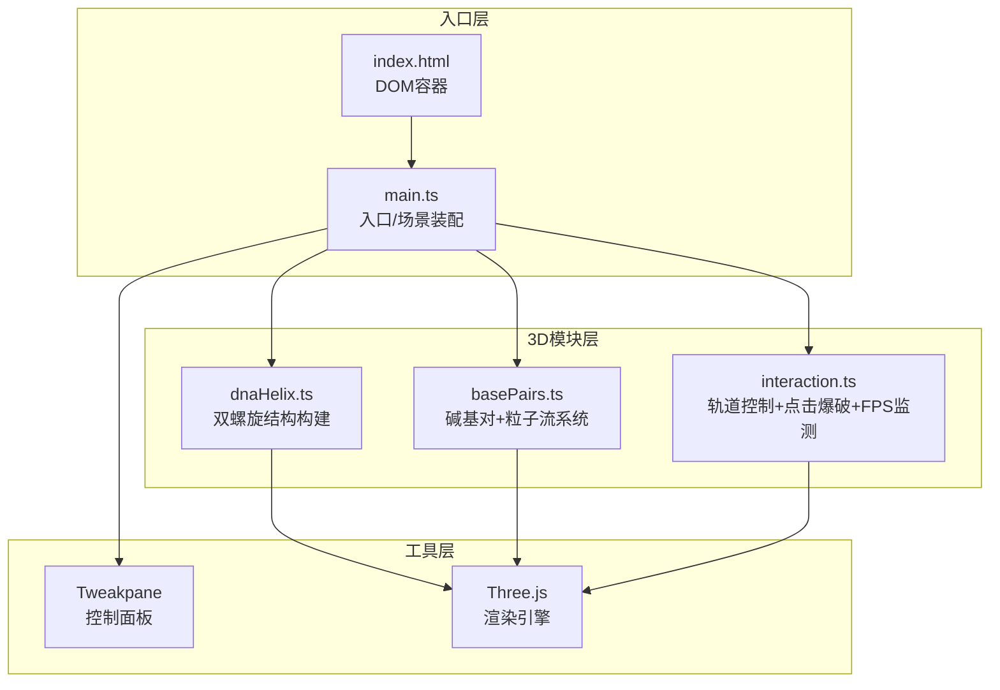

## 1. 架构设计



**调用关系与数据流向：**
1. `index.html` → 提供 `#app` 容器，FPS `<span id="fps">`，计数 `<span id="count">`
2. `main.ts` → 初始化 Scene/Camera/Renderer/Tweakpane；调用 `createDNAHelix(time)` 与 `createBasePairs(...)` 构建对象；注入到 `initInteraction(scene, camera, renderer, pane, onCountChange)`；主循环 `requestAnimationFrame` 中传递 elapsedTime 到各模块更新函数
3. `dnaHelix.ts` → 纯构造函数，返回 `THREE.Group`；内部使用 `CatmullRomCurve3` + `TubeGeometry` 构建两条半透明螺旋管；update回调处理自转与上下浮动
4. `basePairs.ts` → 构造函数返回 `{ group, update(time), particles, basesMap }`；沿螺旋参数方程分布40对碱基；管理粒子池（上限3000，FIFO淘汰）；呼吸动画、粒子流发射
5. `interaction.ts` → 返回 `{ update(), dispose() }`；封装 OrbitControls、Raycaster 点击检测、爆破粒子生成、FPS采样与性能降级逻辑；通过回调更新DOM计数与Tweakpane参数

## 2. 技术描述

- **前端**：TypeScript + Three.js r160+ + Vite 5
- **初始化**：Vite vanilla-ts 模板（非React/Vue，按需求纯Three.js）
- **UI库**：Tweakpane 4.x（控制面板），原生 DOM 操作（FPS/计数器）
- **无后端、无数据库**

依赖清单（package.json）：
- `three` — 3D渲染引擎
- `@types/three` — Three.js类型定义
- `tweakpane` — 参数控制面板
- `typescript` — 编译
- `vite` — 构建/开发服务器

## 3. 目录结构

```
auto219/
├── index.html                 # 入口DOM：#app画布, #fps, #count
├── package.json               # 依赖+dev脚本
├── vite.config.js             # Vite配置（内置TS支持）
├── tsconfig.json              # strict:true, target:ES2020, module:ESNext
└── src/
    ├── main.ts                # 入口：场景装配+主循环+Tweakpane
    ├── dnaHelix.ts            # 双螺旋管状曲线构建
    ├── basePairs.ts           # 碱基对生成+呼吸动画+粒子流+粒子池
    └── interaction.ts         # OrbitControls+点击爆破+FPS+性能降级
```

## 4. 数据模型

### 4.1 碱基对数据结构

```typescript
interface BasePair {
  id: number;
  group: THREE.Group;         // 该碱基对的Group（含2球1柱）
  sphereA: THREE.Mesh;        // 球体A
  sphereB: THREE.Mesh;        // 球体B
  color: THREE.Color;         // 源颜色（用于粒子色系）
  helixT: number;             // 在螺旋上的参数位置 0~1
  emitsParticles: boolean;    // 是否发射粒子流（随机1/4）
  breathPhase: number;        // 呼吸动画相位偏移
  pulseAmp: number;           // 当前脉动幅度（受Tweakpane调制）
  alive: boolean;             // 是否未被点击销毁
}
```

### 4.2 粒子数据结构

```typescript
interface Particle {
  mesh: THREE.Mesh;
  velocity: THREE.Vector3;    // 单位/秒
  life: number;               // 剩余秒数
  maxLife: number;            // 总生命周期
  initialSize: number;
  colorStart: THREE.Color;
  colorEnd: THREE.Color;
}
```

### 4.3 Tweakpane 参数

```typescript
interface PaneParams {
  rotationSpeed: number;   // 0~2 默认1
  particleDensity: number; // 0~100 默认100 (%)
  pulseAmplitude: number;  // 0.5~1.5 默认1
  autoRotate: boolean;     // 默认true
}
```

## 5. 性能约束实现

| 约束 | 实现策略 |
|------|----------|
| 粒子上限 3000 | `basePairs.ts` 中维护 `particlePool: Particle[]`，超出时 `shift()` 移除最早粒子并释放其 mesh |
| FPS < 30 降级 | `interaction.ts` 每秒采样帧率，触发后修改全局 `performanceScale = 0.8`（生命周期×0.8）+ `emissionRate = 2`（默认5） |
| 稳定 45FPS+ | 使用 BufferGeometry 共享、Material 复用、TubeGeometry 分段数适中（径向6段，曲线64段）、粒子使用 `THREE.Points` 或小 Mesh 合并（视实现选择轻量方案） |

