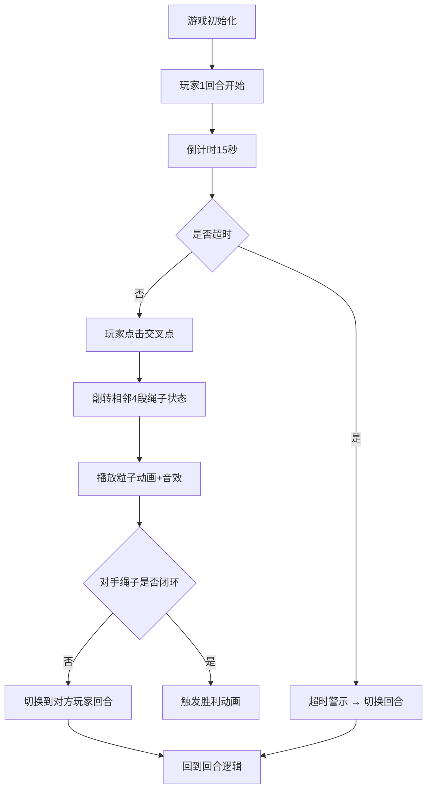

## 1. 产品概述

「量子翻绳」是一款将传统翻花绳游戏与量子力学概念相结合的双人对战浏览器游戏。玩家通过点击交叉点翻转绳子线段的叠加态（实线/虚线），目标是让对手的绳子形成闭环（所有线段全实或全虚）以获得胜利。

- 目标用户：喜欢策略类游戏、对量子概念感兴趣的休闲玩家
- 产品价值：以趣味方式呈现量子叠加概念，提供新颖的双人对战策略游戏体验

## 2. 核心功能

### 2.1 用户角色
| 角色 | 参与方式 | 核心权限 |
|------|----------|----------|
| 玩家1 | 本地双人对战 | 操作珊瑚红色绳子，优先回合 |
| 玩家2 | 本地双人对战 | 操作薄荷青色绳子，次回合 |

### 2.2 功能模块
1. **游戏主界面**：蜂窝状网格、双方绳子、状态栏、浮动菜单
2. **回合控制系统**：玩家轮流操作、回合计时、超时处理
3. **绳子状态系统**：线段叠加态管理、翻转操作、闭环检测
4. **动画特效系统**：交叉点高亮、粒子扩散、胜利爆发动画
5. **音效系统**：操作音效、胜利旋律、音效开关
6. **视角控制**：标准俯视模式、玩家跟随旋转模式

### 2.3 页面详情
| 页面名称 | 模块名称 | 功能描述 |
|----------|----------|----------|
| 游戏主页 | 蜂窝网格 | 80个交叉点的六边形网格布局，半透明灰色网格线 |
| 游戏主页 | 玩家绳子 | 每位玩家20段绳子，随机初始叠加态，端点光晕效果 |
| 游戏主页 | 回合状态栏 | 显示当前回合玩家、回合数、倒计时进度条 |
| 游戏主页 | 浮动菜单 | 重新开始、视角切换、音效开关 |
| 游戏主页 | 胜利界面 | 金色绳子、环形粒子爆发、胜利用语显示 |

## 3. 核心流程

玩家进入游戏 → 初始状态展示 → 玩家1回合开始（15秒倒计时） → 玩家点击交叉点翻转相邻4段绳子 → 检测对手绳子是否闭环 → 是则胜利动画 → 否则切换到玩家2回合 → 循环直到胜负决出

## 4. 用户界面设计

### 4.1 设计风格
- 主色调：珊瑚红 #FF6B6B（玩家1）、薄荷青 #4ECDC4（玩家2）、金色 #FFD700（胜利）
- 背景色：浅色 #F5F5F0（默认）、深蓝 #2C3E50（胜利）
- 辅助色：灰色 #CCCCCC（网格）、绿色 #2ECC71（进度）、红色 #E74C3C（超时）
- 字体：无衬线字体，扁平化设计
- 按钮：圆形悬浮按钮，Material Design 线性图标，悬停上移动效

### 4.2 页面设计概述
| 页面名称 | 模块名称 | UI元素 |
|----------|----------|--------|
| 游戏主页 | 蜂窝网格 | 交叉点半径6px、间隔30px、半透明网格线 #CCCCCC 透明度0.3 |
| 游戏主页 | 绳子绘制 | 实线线宽3px主色、虚线线宽2px主色半透明、3px间隔 |
| 游戏主页 | 端点效果 | 直径12px圆点、光晕半径20px、透明度0.4 |
| 游戏主页 | 回合高亮 | 主色光晕闪烁，周期0.8秒 |
| 游戏主页 | 状态栏 | 背景#FFFFFF透明度0.7、圆角12px、玩家指示点、回合数、倒计时进度条 |
| 游戏主页 | 浮动菜单 | 直径44px圆形按钮、#2C3E50背景、白色齿轮图标、弹出三个选项 |
| 胜利界面 | 胜利效果 | 金色绳子、环形粒子40个半径50-200px、文字48px金色带模糊阴影 |

### 4.3 响应式
- 桌面优先：默认格子间距30px、交叉点半径6px
- 移动端适配：窗口宽度<768px时，格子间距25px、交叉点半径5px
- 画布自适应：Canvas根据窗口尺寸居中并缩放

### 4.4 动画设计
- 粒子扩散：翻转时8个微粒从交叉点向外扩散，半径4px→0px，0.3秒
- 线段过渡：状态切换0.2秒平滑过渡
- 胜利爆发：40个环形粒子50px→200px扩散，1秒
- 失败淡出：透明度1→0，2秒
- 视角旋转：ease-out曲线，0.4秒
- 按钮悬停：上移2px，阴影加深50%，0.2秒
