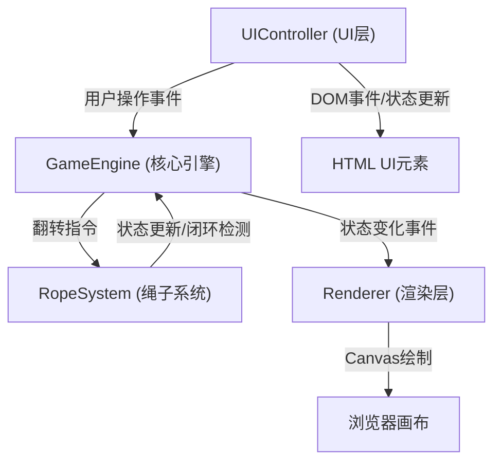

## 1. 架构设计



## 2. 技术描述
- 前端框架：原生 TypeScript
- 渲染引擎：HTML5 Canvas 2D
- 构建工具：Vite
- 音效引擎：Web Audio API
- 依赖：typescript、vite、html-webpack-plugin

## 3. 文件结构

```
/
├── package.json
├── index.html
├── tsconfig.json
├── vite.config.js
└── src/
    ├── core/
    │   ├── GameEngine.ts      # 游戏循环、回合切换、胜负判断
    │   └── RopeSystem.ts      # 网格数据、绳子状态、闭环检测
    ├── render/
    │   └── Renderer.ts        # Canvas绘制、动画、粒子特效
    ├── ui/
    │   └── UIController.ts    # 用户交互、状态栏、菜单、音效
    └── main.ts                # 入口文件
```

## 4. 数据模型

### 4.1 核心类型定义

```typescript
// 玩家标识
type PlayerId = 1 | 2;

// 绳子段状态
type SegmentState = 'solid' | 'dashed';

// 交叉点坐标
interface GridPoint {
  x: number;
  y: number;
  index: number;
}

// 绳子段
interface RopeSegment {
  startIndex: number;
  endIndex: number;
  state: SegmentState;
  targetState: SegmentState;
  transitionProgress: number;
}

// 玩家绳子数据
interface PlayerRope {
  playerId: PlayerId;
  color: string;
  segments: RopeSegment[];
  endpointIndices: [number, number];
}

// 游戏状态
interface GameState {
  currentPlayer: PlayerId;
  turnCount: number;
  turnTimeRemaining: number;
  winner: PlayerId | null;
  ropes: Map<PlayerId, PlayerRope>;
  soundEnabled: boolean;
  viewMode: 'standard' | 'follow';
  cameraAngle: number;
  targetCameraAngle: number;
}

// 粒子
interface Particle {
  x: number;
  y: number;
  vx: number;
  vy: number;
  radius: number;
  color: string;
  life: number;
  maxLife: number;
}
```

## 5. 模块接口

### 5.1 GameEngine
```typescript
class GameEngine {
  start(): void;
  flipAtPoint(playerId: PlayerId, pointIndex: number): boolean;
  switchTurn(): void;
  restart(): void;
  on(event: 'stateChange' | 'turnChange' | 'win' | 'flip', cb: Function): void;
  getState(): Readonly<GameState>;
}
```

### 5.2 RopeSystem
```typescript
class RopeSystem {
  generateGrid(): GridPoint[];
  initializeRopes(): Map<PlayerId, PlayerRope>;
  flipSegmentsAtPoint(rope: PlayerRope, pointIndex: number): number[];
  checkClosure(rope: PlayerRope): boolean;
  getAdjacentSegments(pointIndex: number): number[];
}
```

### 5.3 Renderer
```typescript
class Renderer {
  resize(width: number, height: number): void;
  render(state: GameState, grid: GridPoint[], particles: Particle[]): void;
  spawnFlipParticles(x: number, y: number, color: string): void;
  spawnVictoryParticles(centerX: number, centerY: number): void;
}
```

### 5.4 UIController
```typescript
class UIController {
  attach(engine: GameEngine, renderer: Renderer): void;
  playFlipSound(): void;
  playVictorySound(): void;
  updateStatusBar(state: GameState): void;
}
```
