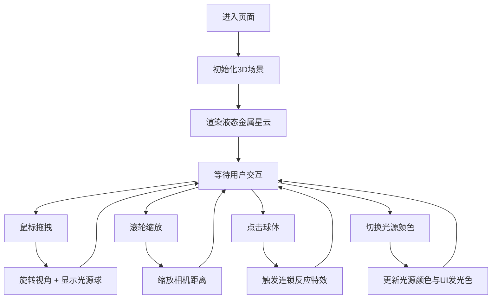

## 1. 产品概述
液态金属星云3D交互可视化应用，解决现有数字星云效果多为静态贴图或简单粒子系统，缺乏对液态金属流动感、高光反射和实时形变的真实模拟问题，让艺术家可以在网页中直接操控星云形态与色彩。
- 核心目标：在浏览器中实现高质量3D液态金属星云的实时渲染与交互
- 目标用户：数字艺术家、视觉设计师、创意开发者
- 产品价值：提供可交互、可操控的液态金属星云可视化工具

## 2. 核心功能

### 2.1 用户角色
无多角色区分，为单一用户端应用。

### 2.2 功能模块
1. **3D星云场景**：200个液态金属球体组成不规则螺旋星云，含动态高光效果
2. **相机交互系统**：鼠标拖拽旋转视角、滚轮缩放
3. **光源影响系统**：拖拽时显示彩色光源球，实时影响球体高光颜色与强度
4. **粒子流系统**：球体间随机产生细长发光粒子流
5. **动画系统**：星云自转、球体浮动、液态金属黏滞流动模拟
6. **连锁反应特效**：点击球体触发膨胀、粒子爆裂与高光增强
7. **UI控制面板**：光源颜色切换、FPS与球体数显示

### 2.3 页面详情
| 页面名称 | 模块名称 | 功能描述 |
|-----------|-------------|---------------------|
| 主页面 | 3D渲染场景 | 全屏展示液态金属星云，纯黑背景 |
| 主页面 | 控制面板 | 右下角半透明圆形面板，中央显示当前光源色，边缘三色切换按钮 |
| 主页面 | 状态显示 | 左上角显示实时FPS和球体总数 |

## 3. 核心流程
用户进入页面后看到悬浮的液态金属星云，可通过拖拽旋转视角、滚轮缩放；拖拽时出现彩色光源球影响附近球体高光；点击球体触发连锁爆炸反应；通过右下角面板切换光源颜色。

## 4. 用户界面设计

### 4.1 设计风格
- 主色调：纯黑背景(#000000)，液态金属银(#C0C0C0)
- 强调色：橙红(#FF4500)、深天蓝(#00BFFF)、金色(#FFD700)
- 面板背景：深蓝紫(#1A1A2E)，透明度0.7
- UI风格：科技感深色主题，发光描边效果
- 过渡动画：0.3秒缓入缓出(ease-in-out)
- 字体：等宽或无衬线字体，配合发光效果

### 4.2 页面设计概述
| 页面名称 | 模块名称 | UI元素 |
|-----------|-------------|-------------|
| 主页面 | 3D场景 | 全屏黑色背景，200个金属球体螺旋分布，动态高光 |
| 主页面 | 控制面板 | 圆形(半径80px)，半透明背景，中央颜色指示点(半径10px)，边缘三个色块按钮 |
| 主页面 | 状态显示 | 左上角文字显示FPS和球体数，发光描边 |

### 4.3 响应式
桌面端优先，画布自适应窗口尺寸，UI元素使用固定像素尺寸。

### 4.4 3D场景指导
- 环境：纯黑背景，无HDRI，强调自发光与高光反射效果
- 光照：多光源配置，配合动态高光位置模拟液态金属反光
- 相机：PerspectiveCamera，距离2-20单位，上下摆动-30°至30°
- 动画：星云绕Y轴自转(0.3rad/s)，球体随机浮动(0.1单位幅度，0.5-1.5Hz)
- 后处理：发光效果(Bloom)增强金属质感与粒子亮度
- 性能：30FPS以上，球体+粒子流总数不超过400个
