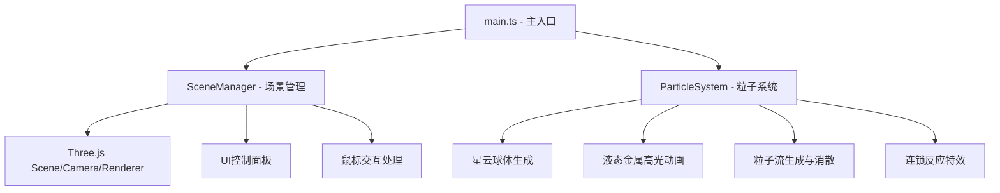

## 1. 架构设计
纯前端3D可视化应用，采用模块化设计，分为场景管理层、粒子系统层和主入口层。



## 2. 技术描述
- 前端框架：TypeScript + Three.js + Vite
- 构建工具：Vite 5.x（支持HMR热更新）
- 编程语言：TypeScript（严格模式，目标ES2020，模块ESNext）
- 3D引擎：Three.js 最新版
- 无后端服务，纯前端运行

## 3. 文件结构
```
auto221/
├── package.json
├── index.html
├── tsconfig.json
├── vite.config.js
└── src/
    ├── main.ts           # 主入口，初始化场景与动画循环
    ├── SceneManager.ts   # 场景、相机、渲染器、UI交互管理
    └── ParticleSystem.ts # 球体、粒子流、连锁反应特效管理
```

## 4. 核心类与接口定义

### 4.1 SceneManager
```typescript
class SceneManager {
  scene: THREE.Scene
  camera: THREE.PerspectiveCamera
  renderer: THREE.WebGLRenderer
  lightColor: string
  lightSource: THREE.Mesh
  isDragging: boolean
  cameraDistance: number
  cameraAngleY: number
  cameraAngleX: number

  init(): void
  setupUI(): void
  handleMouseDown(e: MouseEvent): void
  handleMouseMove(e: MouseEvent): void
  handleMouseUp(e: MouseEvent): void
  handleWheel(e: WheelEvent): void
  handleClick(e: MouseEvent): void
  setLightColor(color: string): void
  updateLightSourcePosition(x: number, y: number): void
  updateCamera(): void
  resize(): void
  render(): void
}
```

### 4.2 ParticleSystem
```typescript
class ParticleSystem {
  scene: THREE.Scene
  spheres: SphereData[]
  particleStreams: ParticleStream[]
  burstParticles: BurstParticle[]
  sphereCount: number

  createNebula(count: number): void
  updateHighlights(time: number, lightPos: THREE.Vector3, lightColor: string): void
  updateFloat(time: number): void
  updateStreams(time: number, delta: number): void
  spawnParticleStream(): void
  triggerChainReaction(clickWorldPos: THREE.Vector3): void
  updateBurstParticles(delta: number): void
  rotateNebula(delta: number): void
  getTotalCount(): number
}
```

## 5. 关键实现要点
1. **螺旋星云分布**：使用极坐标公式生成螺旋线上的点，加入随机偏移形成不规则星云
2. **液态金属材质**：MeshStandardMaterial配合动态环境贴图模拟，高光位置使用shader或光照偏移实现
3. **光源影响**：计算每个球体与光源球的距离，距离<3时调整emissive颜色和强度
4. **粒子流**：在两个球体间生成线段型粒子，随时间渐变透明度和大小
5. **球体拾取**：使用Raycaster进行点击检测
6. **性能优化**：限制粒子总数，对象池复用，合理使用几何体合并
7. **发光效果**：使用UnrealBloomPass后处理或emissive材质自发光模拟
