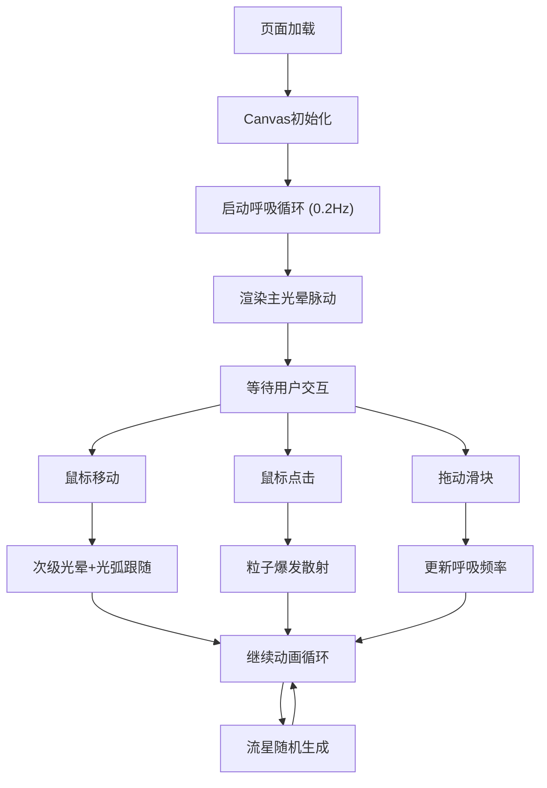

## 1. 产品概述

「呼吸光影」是一款基于Canvas的动态光效交互应用，通过模拟呼吸节奏生成宁静而富有生命力的光影流动体验。用户可通过鼠标交互产生光晕、光弧和粒子散射效果，在深蓝与暖橙交织的视觉氛围中获得沉浸式的放松体验。

## 2. 核心特性

### 2.1 功能模块
1. **主画布渲染**：深空蓝渐变背景，中央呼吸光晕，鼠标跟随光效
2. **呼吸控制系统**：正弦波呼吸曲线模拟，频率可调（0.1Hz-0.5Hz）
3. **粒子系统**：300粒子上限，点击触发粒子爆发，呼吸峰值散射
4. **流星系统**：随机边缘生成流星，带渐变尾迹
5. **UI控件**：实时FPS与呼吸频率显示，可拖动呼吸速率滑块

### 2.2 功能详情
| 功能模块 | 子功能 | 详细描述 |
|---------|-------|---------|
| 画布渲染 | 背景 | 深空蓝渐变（#0B0E1A → #1A2B4C） |
| 画布渲染 | 主光晕 | 半径120px，暖橙→淡黄渐变（#FF7E5F→#FEB47B），透明度随呼吸0.3-0.9脉动 |
| 画布渲染 | 次级光晕 | 半径60px，冷蓝渐变（#4A90D9→#87CEEB），透明度随鼠标速度0.1-0.5变化 |
| 画布渲染 | 径向光弧 | 鼠标周围8条，长度40-80px随机，主光晕色渐变透明 |
| 交互 | 鼠标跟随 | 主光晕带0.1秒惯性延迟跟随鼠标 |
| 交互 | 点击爆发 | 呼吸峰值附近点击触发30粒子散射 |
| 粒子系统 | 粒子属性 | 初始半径4-8px，速度150-250px/s，2秒内缩小至透明消失 |
| 粒子系统 | 粒子拖尾 | 20px拖尾，透明度0.2 |
| 流星系统 | 流星属性 | 半径6px白色，速度300px/s，每3-5秒随机生成 |
| 流星系统 | 流星尾迹 | 80px渐变尾迹，透明度0.6→0 |
| UI控件 | 信息显示 | 左上角显示呼吸频率和FPS |
| UI控件 | 速率滑块 | 右下角40px圆形滑块，可调0.1-0.5Hz，带呼吸动画 |
| 性能优化 | 动态调整 | 帧率<50fps时粒子上限300→200，光弧8→5 |
| 响应式 | 自适应 | 画布随窗口自动缩放，控件位置固定 |

## 3. 核心流程

用户进入页面 → 画布初始化并开始呼吸动画 → 鼠标移动产生跟随光效 → 点击触发粒子爆发 → 拖动滑块调整呼吸频率 → 流星随机划过画面

## 4. 用户界面设计

### 4.1 设计风格
- **主色调**：深空蓝（#0B0E1A、#1A2B4C）作为背景基底
- **强调色**：暖橙色系（#FF7E5F、#FEB47B）用于主光晕
- **辅助色**：冷蓝色系（#4A90D9、#87CEEB）用于次级光晕
- **视觉风格**：极简沉静，柔和渐变与半透明叠加，呼吸脉动自然柔和
- **动效原则**：所有动画采用ease-in-out缓动函数

### 4.2 页面布局
| 区域 | 元素 | 设计说明 |
|-----|-----|---------|
| 全屏 | Canvas画布 | 深空蓝渐变背景，所有光效渲染区域 |
| 左上角 | 信息面板 | 呼吸频率（Hz）+ FPS数值显示，白色半透明文字 |
| 右下角 | 速率滑块 | 40px圆形可拖动滑块，淡灰描边，带呼吸动画，内显频率值 |
| 中央 | 主光晕 | 跟随鼠标（带惯性），呼吸脉动效果 |

### 4.3 响应式设计
- 桌面优先设计，画布随窗口大小自动缩放
- 控件位置固定，不被画布内容遮挡
- 触屏设备支持触摸拖动与点击交互

### 4.4 自定义鼠标指针
- 画布区域鼠标指针变为20px半径发光圆圈
- 半透明效果，与次级光晕视觉绑定
- 提升交互沉浸感
