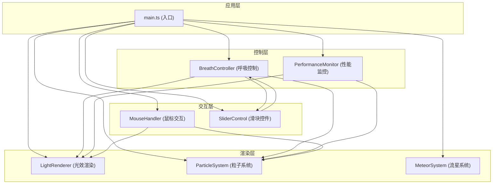

## 1. 架构设计



## 2. 技术选型

- **前端框架**：原生TypeScript（无框架，纯Canvas渲染）
- **构建工具**：Vite 5.x（支持HMR，快速开发）
- **语言版本**：TypeScript 5.x，目标ES2020，模块ESNext
- **第三方库**：simplex-noise（用于噪声扰动光效）
- **包管理**：npm

## 3. 文件结构

```
.
├── package.json              # 依赖配置 (typescript, vite, simplex-noise)
├── index.html                # 入口HTML，全屏Canvas，UI控件
├── tsconfig.json             # TS配置 (严格模式, ES2020, ESNext)
├── vite.config.js            # Vite基础配置
└── src/
    ├── main.ts               # 入口文件，初始化协调各模块
    ├── BreathController.ts   # 呼吸曲线模拟，正弦波生成
    ├── LightRenderer.ts      # 光晕、光弧渲染器
    ├── ParticleSystem.ts     # 300粒子系统管理
    ├── MeteorSystem.ts       # 流星系统
    ├── types.ts              # 共享类型定义
    └── utils.ts              # 工具函数
```

## 4. 核心类与接口定义

### 4.1 BreathController
```typescript
interface BreathState {
  value: number;           // 0-1 呼吸值 (吸气0→1，呼气1→0)
  phase: 'inhale' | 'exhale' | 'peak' | 'valley';
  frequency: number;       // Hz, 默认0.2
  isNearPeak: boolean;     // 是否接近峰值（用于触发粒子爆发）
}

class BreathController {
  setFrequency(hz: number): void;
  getState(): BreathState;
  subscribe(callback: (state: BreathState) => void): () => void;
  update(deltaTime: number): void;
}
```

### 4.2 LightRenderer
```typescript
interface MouseState {
  x: number;
  y: number;
  targetX: number;
  targetY: number;
  velocity: number;
  isMoving: boolean;
}

class LightRenderer {
  setMouse(state: MouseState): void;
  setBreathValue(value: number): void;
  setArcCount(count: number): void;
  render(ctx: CanvasRenderingContext2D): void;
}
```

### 4.3 ParticleSystem
```typescript
interface Particle {
  x: number;
  y: number;
  vx: number;
  vy: number;
  radius: number;
  initialRadius: number;
  color: string;
  alpha: number;
  life: number;        // 0-1, 1=新生
  trail: {x:number, y:number}[];
}

class ParticleSystem {
  setMaxParticles(max: number): void;
  burst(x: number, y: number, count: number, colors: string[]): void;
  update(deltaTime: number): void;
  render(ctx: CanvasRenderingContext2D): void;
  getParticleCount(): number;
}
```

### 4.4 MeteorSystem
```typescript
interface Meteor {
  x: number;
  y: number;
  vx: number;
  vy: number;
  radius: number;
  alpha: number;
  life: number;
  trail: {x:number, y:number, alpha:number}[];
  fadeIn: number;     // 0-1
  fadeOut: number;    // 0-1
}

class MeteorSystem {
  update(deltaTime: number, canvasW: number, canvasH: number): void;
  render(ctx: CanvasRenderingContext2D): void;
}
```

## 5. 渲染循环

```typescript
// main.ts 主循环
function animate(timestamp: number): void {
  const deltaTime = (timestamp - lastTime) / 1000;
  lastTime = timestamp;
  
  // 1. 更新呼吸状态
  breathController.update(deltaTime);
  
  // 2. 性能监控与动态调整
  fpsMonitor.update(deltaTime);
  if (fpsMonitor.fps < 50) {
    particleSystem.setMaxParticles(200);
    lightRenderer.setArcCount(5);
  } else {
    particleSystem.setMaxParticles(300);
    lightRenderer.setArcCount(8);
  }
  
  // 3. 更新各系统
  mouseHandler.update(deltaTime);
  particleSystem.update(deltaTime);
  meteorSystem.update(deltaTime, canvas.width, canvas.height);
  
  // 4. 清空画布
  ctx.fillStyle = backgroundGradient;
  ctx.fillRect(0, 0, canvas.width, canvas.height);
  
  // 5. 渲染各层
  meteorSystem.render(ctx);
  lightRenderer.render(ctx);
  particleSystem.render(ctx);
  
  // 6. 渲染UI
  uiRenderer.render(ctx, fpsMonitor.fps, breathController.getState().frequency);
  
  requestAnimationFrame(animate);
}
```

## 6. 性能优化策略

1. **Canvas离屏渲染**：静态背景渐变预渲染到离屏canvas
2. **对象池模式**：粒子与流星对象复用，避免频繁GC
3. **动态降级**：帧率<50fps时降低粒子数(300→200)和光弧数(8→5)
4. **requestAnimationFrame**：使用原生动画循环，与显示器刷新率同步
5. **矩阵变换优化**：使用ctx.save()/restore()减少状态切换
6. **批量渲染**：同类型粒子合并渲染路径
7. **Throttle resize**：窗口resize事件节流处理
