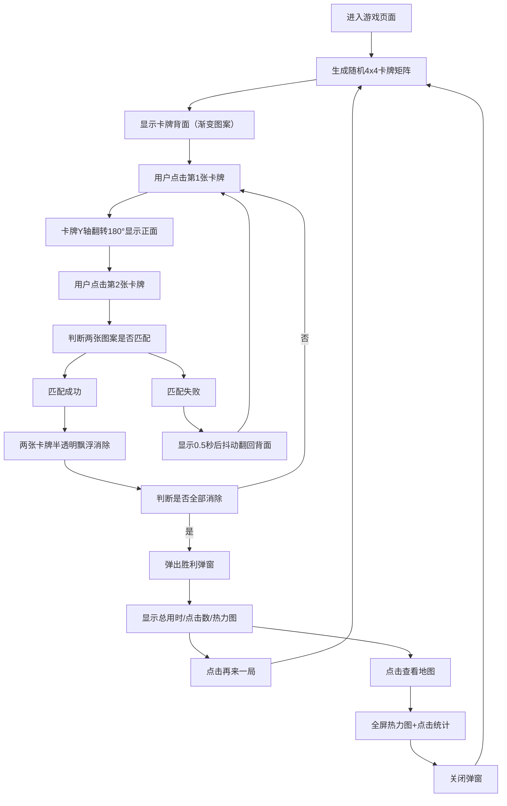

## 1. 产品概述

「记忆回廊」是一款复古风格的在线图片记忆配对游戏，用户通过翻开卡牌寻找同一张老照片的不同局部进行配对。产品通过沉浸式的旧纸质感UI、流畅的翻牌动画、以及创新的「记忆地图」热力图功能，为用户提供兼具趣味性和数据可视化的游戏体验。

- 核心目标：打造一款视觉精美、交互流畅的记忆配对小游戏
- 目标用户：喜欢复古美学、休闲益智类游戏的互联网用户
- 产品价值：将经典记忆配对游戏与复古视觉美学、行为数据可视化相结合

## 2. 核心功能

### 2.1 功能模块

1. **游戏主界面**：4x4卡牌矩阵、旧纸纹理背景、卡牌翻转动画
2. **信息面板**：实时计时器、点击次数统计、配对进度圆环、重新洗牌按钮
3. **卡牌交互系统**：翻牌音效、配对消除飘浮动画、错误抖动提示
4. **胜利弹窗**：总用时/总点击数展示、记忆地图热力图、双模式切换（结果模式/地图模式）
5. **响应式适配**：桌面端、平板、手机端自适应布局

### 2.2 页面详情

| 页面名称 | 模块名称 | 功能描述 |
|-----------|-------------|---------------------|
| 游戏主页面 | 卡牌矩阵 | 4x4布局展示16张卡牌，每张卡牌有独特渐变色背面和老照片风格正面图案 |
| 游戏主页面 | 信息面板 | 显示MM:SS格式计时器、xx次点击计数、SVG进度圆环（百分比显示）、洗牌按钮 |
| 游戏主页面 | 胜利弹窗 | 游戏完成后弹出，展示统计数据+记忆地图热力图，支持结果/地图双模式切换 |

## 3. 核心流程

用户进入页面后看到随机排列的4x4卡牌矩阵 → 点击卡牌触发翻转（音效+动画） → 连续翻开两张卡牌 → 判断图案是否匹配 → 匹配成功则半透明飘浮消除，匹配失败则抖动后翻回 → 全部配对完成后弹出胜利弹窗 → 弹窗展示统计数据和记忆地图热力图 → 用户可选择「再来一局」重开或「查看地图」查看详细热力图

## 4. 用户界面设计

### 4.1 设计风格

- **主色调**：复古暖色调，米黄旧纸色 #F4ECD8 到 #E8D5B7 渐变背景
- **辅色调**：暖金 #D4A373、深褐 #7F4F24、灰蓝 #8CA6A6、暗蓝 #2E4A62、深棕 #5C4033、红褐 #8B5E3C
- **强调色**：金色 #B5833A、暗红 #D9344C
- **字体**：选择具有复古感的衬线字体
- **按钮风格**：圆角按钮，填充式/边框式两种，悬停有颜色过渡动画
- **特殊效果**：细砂粒噪点纹理、毛玻璃半透明效果、CSS3翻转动画、飘浮消失动画、抖动反馈

### 4.2 页面设计概述

| 页面名称 | 模块名称 | UI 元素 |
|-----------|-------------|-------------|
| 游戏主页面 | 背景层 | 旧纸色渐变(#F4ECD8→#E8D5B7) + 细砂粒噪点SVG滤镜，上下留白 |
| 游戏主页面 | 卡牌矩阵 | CSS Grid 4x4布局，卡牌120×160px，间距8px深色缝隙(#5C4033)，整体居中 |
| 游戏主页面 | 卡牌背面 | 随机水平渐变（暖金→深褐、灰蓝→暗蓝等交替） |
| 游戏主页面 | 卡牌正面 | Canvas绘制6种老照片风格简笔图案（老爷车、钟楼、礼帽人像等） |
| 游戏主页面 | 信息面板 | 宽220px，毛玻璃背景rgba(244,236,216,0.8)，固定于右侧 |
| 游戏主页面 | 进度圆环 | SVG圆弧，直径60px，渐变#B5833A→#6B3A2A，中心显示百分比 |
| 游戏主页面 | 洗牌按钮 | 圆形直径36px，背景#8B5E3C，悬停#A67C52 |
| 胜利弹窗 | 弹窗容器 | 360×220px，圆角16px，背景#F4ECD8，描边#8B5E3C |
| 胜利弹窗 | 热力图 | 150×150px深色方块，金色细线边框，Canvas绘制亮点（冷色→暖色渐变） |

### 4.3 响应式设计

- **桌面端（≥768px）**：卡牌120×160px，信息面板固定于游戏区域右侧
- **移动端（<768px）**：卡牌缩小为80×106px，信息面板移至游戏区域正下方，洗牌按钮调整为右下角浮动
- 触摸设备适配：增大点击热区，优化触摸反馈动画

### 4.4 动画设计规范

| 动画名称 | 时长 | 缓动函数 | 描述 |
|-----------|------|----------|------|
| 卡牌翻转 | 0.6s | ease-out | Y轴旋转180°，以中心为轴 |
| 配对消除飘浮 | 0.5s | ease-out | 透明度1→0，向上位移 |
| 错误抖动 | 0.2s | linear | 水平振幅5px |
| 错误翻回 | 0.4s | ease-out | 显示0.5s后Y轴翻回 |
| 按钮悬停 | 0.2s | ease-in-out | 背景色平滑过渡 |
| 弹窗出现 | 0.3s | ease-out | 缩放+淡入 |
