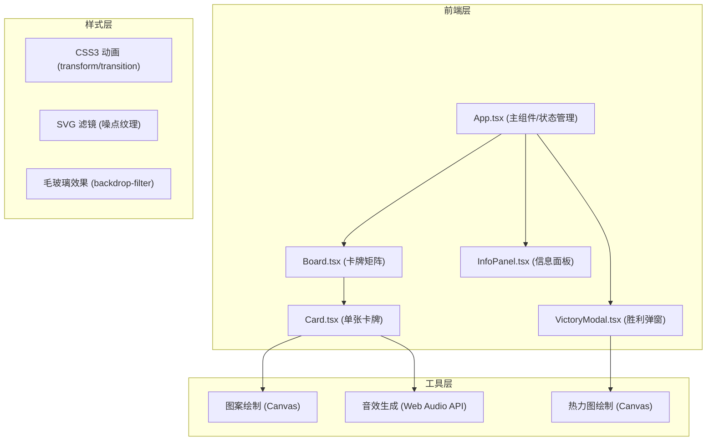

## 1. 架构设计



## 2. 技术栈描述

- **前端框架**: React 18 + TypeScript
- **构建工具**: Vite 5.x
- **样式方案**: 原生 CSS3 + CSS Modules（避免Tailwind，以精确控制动画细节）
- **渲染技术**: Canvas API（绘制老照片图案、热力图）、SVG（进度圆环、噪点滤镜）
- **音频技术**: Web Audio API（程序生成翻牌音效，无需外部资源）
- **状态管理**: React useState/useEffect 局部状态管理

## 3. 项目文件结构

```
auto223/
├── package.json
├── index.html
├── tsconfig.json
├── vite.config.js
└── src/
    ├── App.tsx              # 主组件：游戏状态管理、核心逻辑
    ├── Board.tsx            # 卡牌矩阵：CSS Grid 4x4布局
    ├── Card.tsx             # 单张卡牌：翻转动画、配对逻辑、Canvas图案
    ├── InfoPanel.tsx        # 信息面板：计时器、点击数、SVG进度圆环、洗牌按钮
    ├── VictoryModal.tsx     # 胜利弹窗：统计数据、Canvas热力图、双模式切换
    └── index.css            # 全局样式：背景纹理、CSS变量、响应式断点
```

## 4. 核心数据模型

### 4.1 Card 数据结构

```typescript
interface CardData {
  id: number;           // 唯一标识
  patternId: number;    // 图案编号（0-5，共6种图案，每种出现2-3次）
  isFlipped: boolean;   // 是否已翻开
  isMatched: boolean;   // 是否已配对成功
  isShaking: boolean;   // 是否处于抖动状态
  isFloating: boolean;  // 是否处于飘浮消除状态
  gradientIndex: number;// 背面渐变配色索引
}
```

### 4.2 ClickPoint 热力图数据结构

```typescript
interface ClickPoint {
  x: number;           // 相对于游戏区域的X坐标 (0-100百分比)
  y: number;           // 相对于游戏区域的Y坐标 (0-100百分比)
  timestamp: number;   // 点击时间戳
}
```

### 4.3 GameState 游戏状态

```typescript
interface GameState {
  cards: CardData[];               // 16张卡牌数组
  firstCardId: number | null;      // 第一张翻开的卡牌ID
  isLocked: boolean;               // 是否锁定交互（动画播放中）
  clickCount: number;              // 总点击次数
  elapsedSeconds: number;          // 已用时间（秒）
  matchedPairs: number;            // 已配对成功数量
  clickPoints: ClickPoint[];       // 热力图点击坐标集合
  isVictory: boolean;              // 是否胜利
}
```

## 5. 组件数据流

```
App.tsx (状态源)
├── cards[] ──────────────────────► Board.tsx ──► Card.tsx (onClick回调)
├── cardClickHandler(id, x, y) ◄── Board.tsx ◄── Card.tsx (点击事件)
├── clickCount / elapsedSeconds ──► InfoPanel.tsx
├── matchedPairs / totalPairs ────► InfoPanel.tsx (进度计算)
├── resetGame() ◄───────────────── InfoPanel.tsx (洗牌按钮)
├── isVictory / clickPoints ──────► VictoryModal.tsx
└── resetGame() ◄───────────────── VictoryModal.tsx (再来一局/关闭)
```

## 6. 核心算法说明

### 6.1 卡牌生成与洗牌算法
- 6种图案，每种出现2-3次（确保总数为16）
- Fisher-Yates 洗牌算法随机排列
- 背面渐变配色随机分配，相邻卡牌尽量使用不同渐变

### 6.2 配对判断逻辑
- 用户点击卡牌时，记录firstCardId
- 点击第二张时，比较patternId
- 匹配成功：设置isMatched=true，触发飘浮动画，延迟500ms后从DOM移除
- 匹配失败：设置isShaking=true，500ms后翻回并取消抖动

### 6.3 热力图颜色映射
- 统计每个网格区域的点击频率
- 使用线性插值在 #2E4A62（冷色低频）和 #D9344C（暖色高频）之间渐变
- 点击频率越高，点的半径和透明度越大
