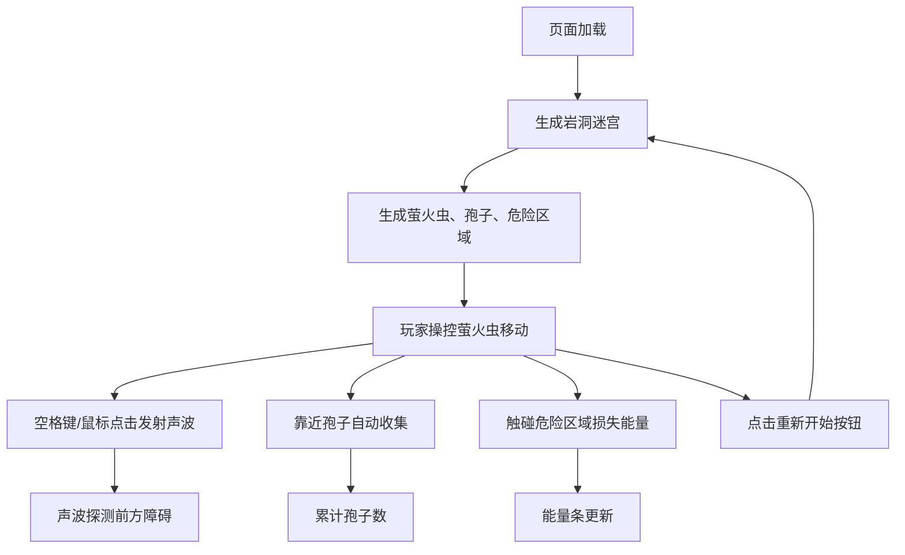

## 1. 产品概述

「岩洞回音」是一款2D冒险探索游戏，玩家操控一只萤火虫在程序化生成的岩洞迷宫中飞行探索。游戏以声波探测为核心玩法，通过发出声波揭示隐藏路径，收集荧光孢子照亮洞穴，最终抵达洞穴最深处。

- 目标用户：休闲游戏爱好者、喜欢探索类游戏的玩家
- 产品价值：提供独特的声波探测玩法，营造幽暗神秘的洞穴探险氛围

## 2. 核心功能

### 2.1 用户角色

| 角色 | 注册方式 | 核心权限 |
|------|----------|----------|
| 玩家 | 无需注册 | 进行游戏、重新开始 |

### 2.2 功能模块

1. **游戏主界面**：岩洞场景渲染、萤火虫角色、声波效果、孢子收集
2. **UI系统**：能量条显示、孢子计数、重新开始按钮
3. **地图系统**：程序化岩洞迷宫生成、危险裂缝区域
4. **交互系统**：鼠标/键盘控制、声波发射、碰撞检测

### 2.3 页面详情

| 页面名称 | 模块名称 | 功能描述 |
|----------|----------|----------|
| 游戏主界面 | 场景渲染 | 800x600岩洞迷宫、深灰到暗棕渐变背景、石纹墙面、荧光尘地面 |
| 游戏主界面 | 萤火虫角色 | 圆形主体+动态光晕、平滑旋转朝向鼠标、声波发射冷却指示 |
| 游戏主界面 | 声波系统 | 扇形声波（5条射线）、墙面碰撞高亮、环形扩散波纹 |
| 游戏主界面 | 孢子系统 | 40颗荧光孢子、发光动画、靠近自动收集、收集扩散效果 |
| 游戏主界面 | 危险区域 | 3个不规则多边形裂缝、暗红色闪动光、碰撞损失能量 |
| 游戏主界面 | UI系统 | 左上角能量条（渐变色）、孢子计数、右下角重新开始按钮 |

## 3. 核心流程

## 4. 用户界面设计

### 4.1 设计风格

- **主色调**：深灰 #1A1A1A、暗棕 #2B2B1A 作为背景
- **强调色**：荧光绿 #7FFF00/#B0FF50/#6BFF6B、电光蓝 #00E5FF、暖黄 #D4FF80
- **危险色**：暗红 #8B0000、警示红 #FF6B6B
- **风格定位**：幽暗神秘、洞穴探险、荧光生物发光美学
- **整体氛围**：黑暗中点点荧光、声波涟漪扩散的视觉冲击

### 4.2 页面设计概述

| 页面名称 | 模块名称 | UI元素 |
|----------|----------|--------|
| 游戏主界面 | 场景 | 全屏Canvas、深灰→暗棕垂直渐变背景、随机石子纹理墙面、荧光尘小点 |
| 游戏主界面 | 萤火虫 | 半径8px圆形主体(#D4FF80)、外围脉动光晕(20-28px, 1.2s周期, 透明度0.3-0.7) |
| 游戏主界面 | 声波 | 5条扇形射线(150px, #00E5FF, 2px宽度)、拖尾粒子效果 |
| 游戏主界面 | 墙面碰撞 | 碰撞点短暂高亮(#FFFFFF, 0.3s渐隐)、环形波纹(10→40px, 透明度0.6→0, 0.5s) |
| 游戏主界面 | 孢子 | 直径6-10px圆形(#B0FF50)、柔和发光、收集时缩小+扩散光圈 |
| 游戏主界面 | 危险区域 | 不规则多边形(#8B0000)、内部细微闪动暗红 |
| 游戏主界面 | 能量条 | 左上角水平条、#FF6B6B→#7FFF00渐变、显示剩余比例 |
| 游戏主界面 | 孢子计数 | 左上角能量条旁、荧光绿文字 |
| 游戏主界面 | 重新开始 | 右下角按钮、荧光绿边框/文字 |

### 4.3 响应式

- Canvas自动适配窗口大小，viewport变化时重新计算比例
- 游戏逻辑区域保持800x600基准，按比例缩放渲染

### 4.4 性能要求

- 声波碰撞检测每帧≤100次
- 粒子总数≤500
- 稳定60FPS
