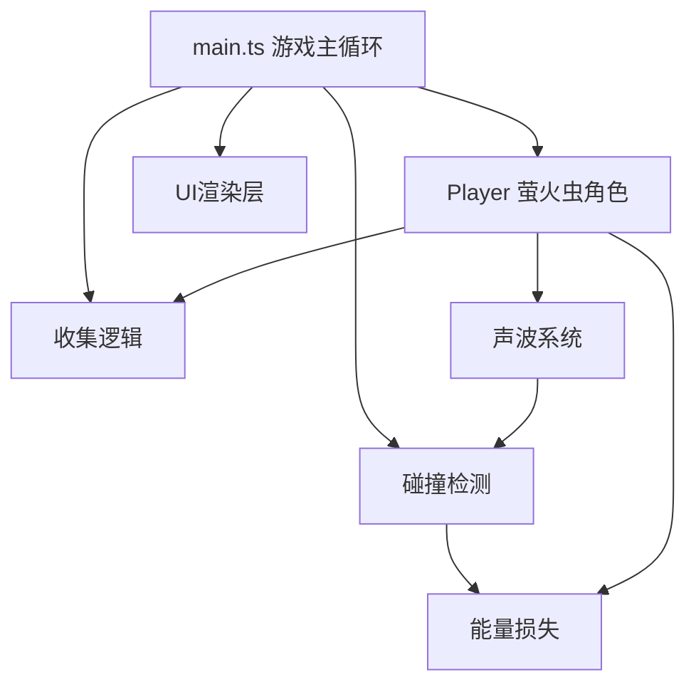

## 1. 架构设计



## 2. 技术说明

- **前端**：TypeScript + Canvas 2D API + Vite
- **构建工具**：Vite
- **无后端**：纯前端游戏，所有逻辑在浏览器端执行

## 3. 文件结构

| 文件路径 | 用途 |
|----------|------|
| `package.json` | 依赖配置（typescript、vite）、启动脚本 |
| `index.html` | 入口页面、全屏Canvas、UI容器 |
| `tsconfig.json` | TypeScript配置（严格模式、ES2020、ESNext模块） |
| `vite.config.js` | Vite构建配置、HMR支持 |
| `src/main.ts` | 游戏主循环、场景管理、全局状态、事件监听 |
| `src/player.ts` | 萤火虫类：移动、声波发射、碰撞检测、光晕动画 |
| `src/cave.ts` | 岩洞迷宫生成（细胞自动机）、墙面渲染、危险区域 |
| `src/collectible.ts` | 荧光孢子类：散布、发光动画、收集逻辑 |

## 4. 核心类定义

### 4.1 Player 类

```typescript
class Player {
  x: number;
  y: number;
  radius: number;
  energy: number;
  angle: number;
  cooldown: number;
  
  update(dt: number, mouseX: number, mouseY: number, cave: Cave): void;
  emitSoundWave(): SoundWave | null;
  draw(ctx: CanvasRenderingContext2D, time: number): void;
  checkCollision(cave: Cave, x: number, y: number): boolean;
}
```

### 4.2 Cave 类

```typescript
class Cave {
  width: number;
  height: number;
  grid: number[][]; // 0=空地, 1=墙壁
  wallHighlights: Map<string, { startTime: number }>;
  ripples: Ripple[];
  dangerZones: DangerZone[];
  
  generate(): void; // 细胞自动机生成洞穴
  isWall(x: number, y: number): boolean;
  raycast(x1: number, y1: number, x2: number, y2: number): { x: number; y: number } | null;
  addWallHighlight(x: number, y: number, time: number): void;
  addRipple(x: number, y: number, time: number): void;
  drawBackground(ctx: CanvasRenderingContext2D): void;
  drawWalls(ctx: CanvasRenderingContext2D, time: number): void;
  drawDangerZones(ctx: CanvasRenderingContext2D, time: number): void;
  checkDangerCollision(x: number, y: number): boolean;
  getSpawnPoint(): { x: number; y: number };
}
```

### 4.3 Collectible 类

```typescript
class Collectible {
  x: number;
  y: number;
  radius: number;
  baseRadius: number;
  collected: boolean;
  collectProgress: number;
  collectRipples: CollectRipple[];
  
  update(player: Player, dt: number, time: number): void;
  draw(ctx: CanvasRenderingContext2D, time: number): void;
}
```

## 5. 性能优化策略

- 声波射线使用Bresenham或DDA算法进行网格级碰撞检测
- 粒子池化管理，限制最大500个粒子
- 墙体预渲染到离屏Canvas缓存
- requestAnimationFrame驱动主循环，dt时间步进
- 孢子与萤火虫距离检测采用平方距离比较避免开方
