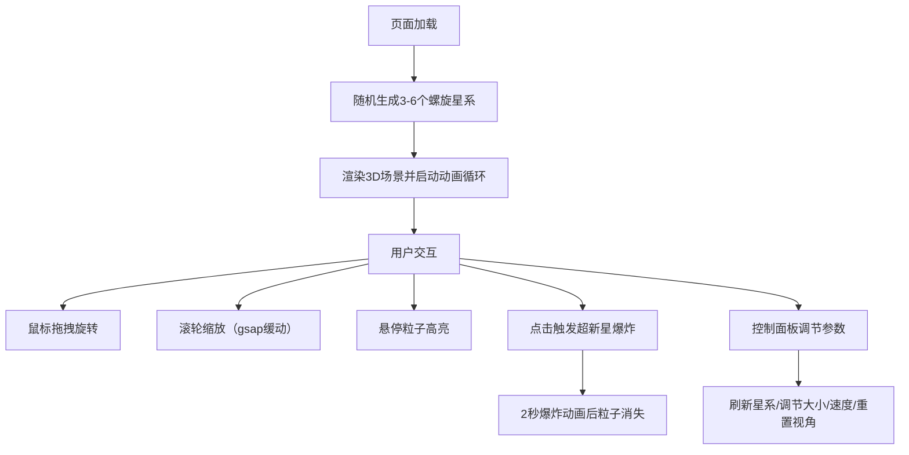

## 1. 产品概述

交互式宇宙星图可视化应用，让用户沉浸式浏览三维星系分布，缩放查看恒星细节，通过点击触发超新星爆炸动画效果。面向天文爱好者、教育场景和视觉艺术展示。

- 核心价值：通过 WebGL 渲染真实感宇宙星图，提供流畅的交互体验和震撼的视觉效果
- 目标用户：天文爱好者、科普教育者、前端开发者（作为技术演示）

## 2. 核心功能

### 2.1 功能模块

1. **主场景页面**：3D 星系群渲染、轨道控制器、相机缩放、超新星爆炸动画
2. **信息面板**：实时可见星系数量、最近恒星距离、相机缩放层级进度条
3. **控制面板**：星系数量刷新按钮、粒子大小滑块、旋转速度滑块、重置视角按钮
4. **星系列表**：左侧可点击星系列表，点击聚焦对应星系

### 2.2 页面详情

| 页面名称 | 模块名称 | 功能描述 |
|---------|---------|---------|
| 主场景 | 3D 星系渲染 | 3-6 个螺旋星系，每星系 5000-10000 粒子，暖黄到冷蓝颜色渐变 |
| 主场景 | 轨道控制 | 鼠标拖拽旋转场景，滚轮缩放（视野半径 1000 到 1），gsap 平滑缓动 0.5s |
| 主场景 | 悬停高亮 | 鼠标悬停粒子变白并出现淡蓝色光晕 |
| 主场景 | 超新星爆炸 | 点击粒子膨胀碎裂飞散，2s 消失，屏幕过曝闪光 0.1s |
| 信息面板 | 实时数据 | 可见星系数量、最近恒星距离、5 级缩放进度条 |
| 控制面板 | 参数调节 | 星系数量刷新、粒子大小(0.5-5.0)、旋转速度(0.0-2.0)、重置视角 |
| 星系列表 | 聚焦导航 | 点击列表项相机平滑聚焦对应星系 |

## 3. 核心流程

用户打开页面 → 随机生成星系群 → 拖拽旋转 / 滚轮缩放浏览 → 悬停查看恒星 → 点击触发超新星爆炸 → 通过控制面板调节参数或重置视角

## 4. 用户界面设计

### 4.1 设计风格

- **主色调**：深空纯黑背景 `#000000`
- **强调色**：粒子颜色从暖黄 `#FFD700` → 橙红 `#FF6B35` → 蓝紫 `#6B4EFF` → 冷蓝 `#4FC3F7` 渐变
- **滑块手柄**：低值青蓝 `#4FC3F7` 到高值暖橙 `#FF6B35` 渐变
- **面板背景**：半透明深色毛玻璃效果 `rgba(10, 15, 30, 0.75)` + `backdrop-filter: blur(8px)`
- **边框圆角**：12px
- **字体**：白色细体 sans-serif（font-weight: 300）

### 4.2 页面设计概览

| 页面名称 | 模块名称 | UI 元素 |
|---------|---------|---------|
| 主场景 | 3D Canvas | 全屏黑色背景，粒子加法混合发光，近大远小 |
| 信息面板 | 左上角面板 | 半透明深色毛玻璃，圆角边框，白色细体文字 |
| 控制面板 | 右侧面板 | 毛玻璃效果，圆角轨道+圆形手柄滑块，渐变手柄色 |
| 星系列表 | 左侧面板 | 可点击列表项，悬停高亮，选中聚焦效果 |

### 4.3 响应性

- Desktop-first 设计
- Canvas 自适应窗口大小
- 控制面板固定右侧（280px 宽），信息面板固定左上角（240px 宽）
- 星系列表固定左侧（200px 宽），可滚动

### 4.4 3D 场景指导

- **环境**：纯黑深空背景，无 HDRI，粒子加法混合营造发光感
- **光照**：自发光粒子，无场景光源
- **相机**：PerspectiveCamera，FOV 60°，初始距离能容纳所有星系
- **动画**：星系绕 Y 轴自转，粒子近大远小
- **交互**：OrbitControls 轨道控制，gsap 平滑缩放/聚焦
- **后处理**：超新星时屏幕短暂过曝闪光效果
- **性能预算**：总粒子数 ≤ 50000，单帧更新 ≤ 8ms，帧率 60FPS
