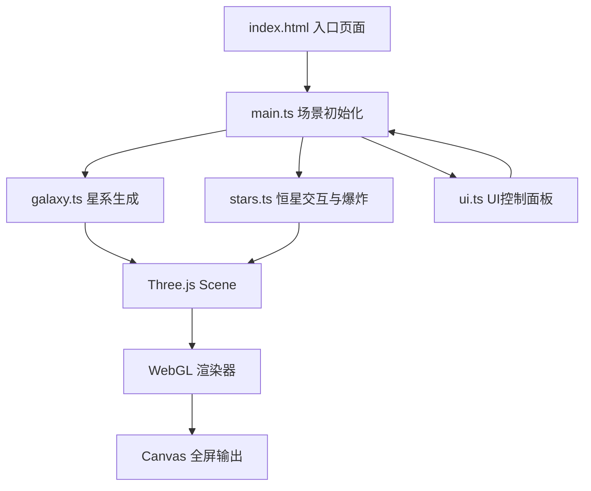

## 1. 架构设计

## 2. 技术说明

- **前端框架**：原生 TypeScript（无 React/Vue），模块化组织
- **构建工具**：Vite（基础配置）
- **3D 渲染**：Three.js @latest，OrbitControls 轨道控制
- **动画库**：GSAP @latest，用于相机缓动和爆炸动画
- **类型定义**：@types/three @latest
- **后端**：无（纯前端项目）
- **数据库**：无

## 3. 文件结构

| 文件路径 | 用途 |
|---------|------|
| `package.json` | 依赖：three、@types/three、vite、typescript、gsap |
| `index.html` | 入口页面，全屏 canvas，面板容器 |
| `tsconfig.json` | 严格模式，目标 ES2020，模块 ESNext |
| `vite.config.js` | 基础构建配置 |
| `src/main.ts` | 场景、相机、渲染器初始化，动画循环 |
| `src/galaxy.ts` | 螺旋星系粒子系统生成 |
| `src/stars.ts` | 射线检测、超新星爆炸动画 |
| `src/ui.ts` | 滑块控制、星系列表、FPS 计数器、信息面板 |

## 4. 核心模块说明

### 4.1 galaxy.ts

导出 `Galaxy` 类：
- 构造参数：`position: Vector3`、`particleCount: number`
- 方法：`generate()` 生成粒子，`rotate(speed: number)` 每帧更新旋转
- 内部使用 `THREE.BufferGeometry` + `THREE.PointsMaterial`
- 粒子颜色：中心核球暖黄 → 旋臂冷蓝渐变
- 螺旋算法：基于对数螺旋公式 `r = a * e^(b*θ)`，添加随机扰动

### 4.2 stars.ts

导出 `StarManager` 类：
- 射线检测 `Raycaster`，鼠标悬停高亮
- 超新星爆炸：将点击粒子替换为爆炸粒子系统，向外扩散并淡出
- 屏幕过曝：临时叠加白色全屏半透明层，0.1s 后淡出

### 4.3 ui.ts

导出 `UIManager` 类：
- 三个滑块：星系数量刷新按钮、粒子大小(0.5-5.0)、旋转速度(0.0-2.0)
- 重置视角按钮
- 星系列表点击聚焦（gsap 相机移动）
- FPS 计数器（基于 `performance.now()` 计算）
- 信息面板更新：可见星系数量、最近恒星距离、5 级缩放进度条

### 4.4 main.ts

场景管理：
- `THREE.Scene` + `THREE.PerspectiveCamera` + `THREE.WebGLRenderer`
- `OrbitControls`，缩放范围 1 - 1000
- 动画循环：更新星系旋转、爆炸粒子、UI 面板

## 5. 性能优化

- 粒子使用 `BufferGeometry` 而非 `Geometry`
- 所有星系共享同一 `PointsMaterial`（按星系克隆并区分颜色）
- 射线检测使用包围盒预过滤，减少精确检测次数
- 爆炸粒子独立管理，动画结束后及时释放 GPU 资源
- 每帧耗时控制在 8ms 以内，确保 60FPS
