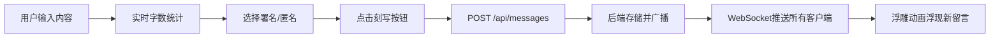
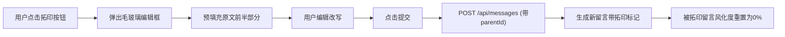
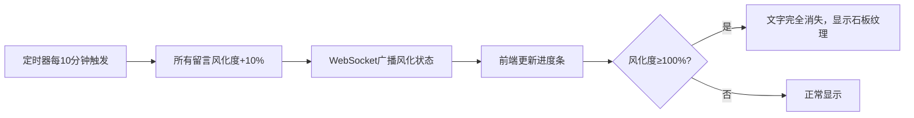

## 1. 产品概述

「记忆碑文」是一个在线协作书写平台，让用户在虚拟石碑上匿名或署名刻写简短留言（≤140字）。留言随时间逐渐风化剥落，其他用户可通过「拓印」功能复制改写，形成跨越时间的文字接力链。

- 核心价值：用时间与传承的概念，创造一个充满仪式感的文字记忆空间
- 目标用户：文字爱好者、寻求情感表达的用户、纪念书写需求群体
- 市场定位：独特的社交文字体验，融合时间流逝与文化传承的美学

## 2. 核心功能

### 2.1 用户角色

| 角色 | 注册方式 | 核心权限 |
|------|---------|---------|
| 访客用户 | 无需注册 | 浏览留言、拓印留言、刻写留言（匿名/署名） |

### 2.2 功能模块

1. **留言展示区**：石碑纹理背景、留言卡片列表、风化进度显示、剩余可见时间
2. **留言输入区**：内容输入框（140字限制）、署名/匿名切换、刻写提交按钮
3. **拓印功能**：拓印按钮、毛玻璃编辑弹框、拓印来源标记
4. **拓印链视图**：树状关系图、SVG连线、节点大小映射拓印次数
5. **实时系统**：WebSocket推送、风化状态同步、在线人数统计
6. **虚拟滚动**：懒加载留言、滚动加载更多、帧率优化

### 2.3 页面详情

| 页面名称 | 模块名称 | 功能描述 |
|---------|---------|---------|
| 主页面 | 顶部信息栏 | 显示在线人数、总留言数、视图切换按钮 |
| 主页面 | 留言输入区 | 内容输入、字数统计、署名选择、刻写提交 |
| 主页面 | 留言列表区 | 纵向排列留言卡片、显示风化进度、拓印按钮、虚拟滚动 |
| 主页面 | 拓印编辑弹框 | 毛玻璃效果、预填充原文、编辑区、提交/取消 |
| 主页面 | 拓印链视图 | SVG树状图、节点关系连线、缩放浏览 |

## 3. 核心流程

### 3.1 刻写留言流程

### 3.2 拓印留言流程

### 3.3 风化更新流程

## 4. 用户界面设计

### 4.1 设计风格

- **主色调**：石板灰 #3A3A3C、刻字色 #D4C5A9、风化褪色 #8B7D6B、连线色 #A67B5B
- **背景**：深灰色径向渐变 #2C2C2C → #3A3A3A，叠加细微噪点纹理模拟粗糙石面
- **字体风格**：深色浮雕效果，文字带细微内阴影模拟石纹凹陷
- **按钮风格**：古代印章样式拓印按钮，悬停旋转10°放大1.1倍（0.2s过渡）
- **动画效果**：刻写浮现（0.3s ease-out浮雕动画）、风化进度平滑过渡
- **布局风格**：居中纵向单列，卡片式留言块，移动端自适应

### 4.2 页面设计概览

| 页面名称 | 模块名称 | UI元素 |
|---------|---------|--------|
| 主页面 | 顶部信息栏 | 石板灰背景、金色文字、在线人数图标、视图切换按钮 |
| 主页面 | 留言输入区 | 深色输入框（石槽效果）、字数统计标签、署名输入框、匿名复选框、刻写按钮 |
| 主页面 | 留言卡片 | 石板纹理卡片、浮雕金色文字、署名标签、风化进度条、剩余时间、拓印印章按钮 |
| 主页面 | 拓印弹框 | 毛玻璃backdrop、深色编辑区、拓印来源标记、提交/取消按钮 |
| 主页面 | 拓印链视图 | SVG画布、圆形节点（大小随拓印次数）、棕色连线、连接线标签 |

### 4.3 响应式设计

- **设计策略**：桌面端优先，移动端自适应
- **桌面端**：最大宽度800px居中布局，留言卡片左右留白
- **平板端**：宽度自适应，卡片占满可用空间
- **移动端**：单列布局，卡片宽度100%，触摸交互优化，按钮尺寸≥44px
- **触摸优化**：hover效果转换为active态，确保点击热区充足

### 4.4 性能指标

- 首屏加载时间 ≤ 1.5秒（代码分割、懒加载）
- 滚动200条留言帧率 ≥ 50FPS（虚拟滚动）
- WebSocket消息延迟 < 200ms
- 单服务器支持 ≥ 1000并发连接
