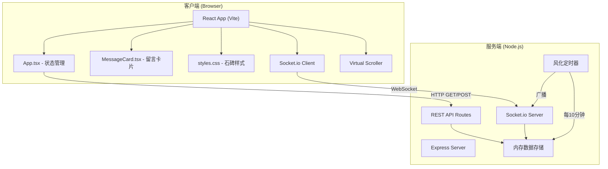
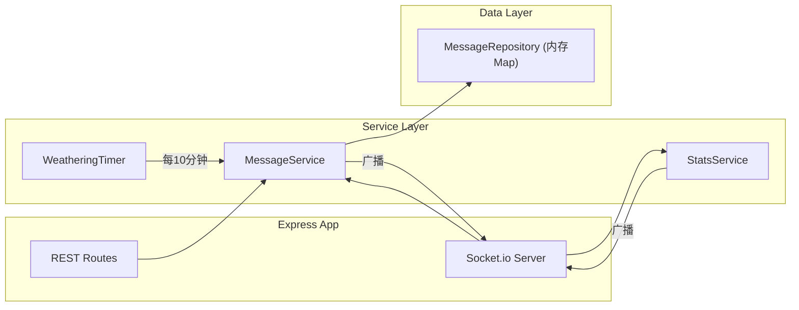
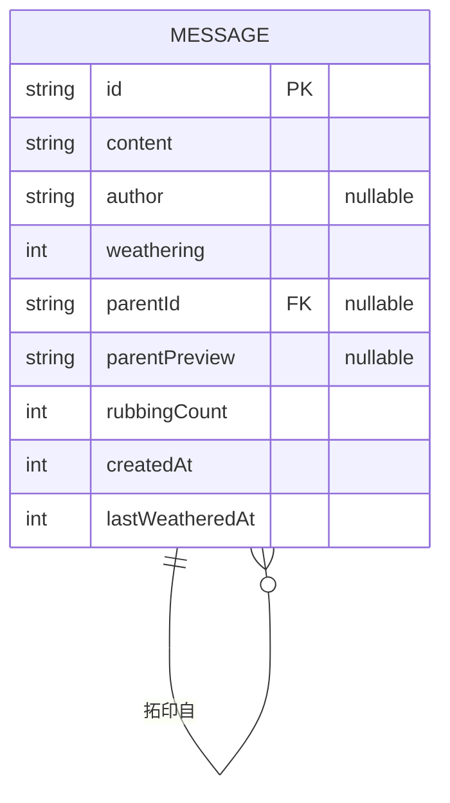

## 1. 架构设计



## 2. 技术说明

- **前端框架**: React 18 + TypeScript
- **构建工具**: Vite 5 + @vitejs/plugin-react (支持HMR)
- **后端框架**: Express 4 + TypeScript
- **实时通信**: Socket.io (客户端+服务端)
- **样式方案**: 原生CSS (石碑浮雕、风化动画、毛玻璃效果)
- **数据存储**: 内存存储 (开发阶段，可扩展为Redis/SQLite)
- **状态管理**: React useState/useEffect (轻量级，无需额外库)

## 3. 目录结构

```
auto232/
├── package.json              # 项目依赖与脚本
├── vite.config.js            # Vite构建配置
├── tsconfig.json             # TypeScript严格模式配置
├── index.html                # 入口HTML
├── server/
│   └── index.ts              # Express后端 + Socket.io
└── client/
    ├── App.tsx               # React主组件
    ├── MessageCard.tsx       # 留言卡片组件
    ├── ChainView.tsx         # 拓印链视图组件
    └── styles.css            # 全局样式
```

**模块调用关系与数据流向**:

1. **index.html** → 挂载React根节点，引入styles.css
2. **client/App.tsx** → 
   - 数据输入: 用户输入表单 → POST /api/messages
   - 数据获取: GET /api/messages?page=&size= 获取初始列表
   - 实时更新: socket.on('message/new' | 'message/weathered') 更新状态
   - 子组件: 渲染MessageCard列表、ChainView
3. **client/MessageCard.tsx** → 
   - 输入: 单个message对象
   - 输出: 拓印按钮点击 → 触发App.tsx回调打开编辑框
4. **client/ChainView.tsx** →
   - 输入: messages数组
   - 输出: SVG树状拓印关系图
5. **server/index.ts** →
   - REST: GET /api/messages (分页), POST /api/messages (创建), GET /api/stats (统计)
   - WebSocket: 连接管理、广播新消息、广播风化更新
   - 内部: weatheringTimer 每10分钟触发风化逻辑

## 4. API定义

### 4.1 TypeScript类型定义

```typescript
interface Message {
  id: string;
  content: string;
  author: string | null;  // null表示匿名
  weathering: number;     // 0-100 风化度百分比
  parentId: string | null; // 拓印来源ID
  parentPreview: string | null; // 拓印来源前20字预览
  rubbingCount: number;   // 被拓印次数
  createdAt: number;      // 时间戳
  lastWeatheredAt: number; // 上次风化时间戳
}

interface CreateMessageRequest {
  content: string;
  author?: string;        // 不传则为匿名
  parentId?: string;      // 拓印来源
}

interface StatsResponse {
  online: number;
  totalMessages: number;
}

interface PaginatedResponse {
  data: Message[];
  hasMore: boolean;
  total: number;
}

// WebSocket事件
type WSEvent =
  | { type: 'message/new'; payload: Message }
  | { type: 'message/weathered'; payload: { id: string; weathering: number }[] }
  | { type: 'stats/update'; payload: StatsResponse };
```

### 4.2 REST接口

| 方法 | 路径 | 说明 | 请求体 | 响应 |
|-----|------|-----|--------|------|
| GET | /api/messages | 分页获取留言 | Query: page(number), size(number) | PaginatedResponse |
| POST | /api/messages | 创建新留言 | CreateMessageRequest | Message |
| GET | /api/stats | 获取在线人数与总数 | - | StatsResponse |

## 5. 服务端架构



**核心服务职责**:

- **MessageService**: 
  - createMessage(): 校验内容、生成ID、关联parent、重置被拓印消息风化度
  - getMessages(): 分页查询、按时间倒序
  - applyWeathering(): 所有消息风化度+10%（封顶100%）
- **StatsService**: 维护在线连接数、消息总数统计
- **WeatheringTimer**: setInterval每10分钟触发一次风化并广播

## 6. 数据模型

### 6.1 ER图



### 6.2 核心数据结构

```typescript
// 服务端内存存储
class MessageRepository {
  private messages: Map<string, Message> = new Map();
  private orderedIds: string[] = []; // 按创建时间倒序

  save(message: Message): void;
  findById(id: string): Message | undefined;
  findPage(page: number, size: number): Message[];
  count(): number;
  updateWeathering(id: string, weathering: number): void;
  incrementRubbingCount(id: string): void;
}
```

### 6.3 风化算法

```
每次风化触发（每10分钟）:
  对每条消息:
    weathering = min(weathering + 10, 100)
    lastWeatheredAt = now()

被拓印时:
  parentMessage.weathering = 0
  parentMessage.rubbingCount += 1
  parentMessage.lastWeatheredAt = now()

剩余可见时间计算 (前端):
  remainingCycles = ceil((100 - weathering) / 10)
  remainingMinutes = remainingCycles * 10
```

## 7. 性能优化策略

### 7.1 前端
- **虚拟滚动**: 仅渲染可视区域内的留言卡片（约20条），滚动200条保持50FPS+
- **代码分割**: ChainView组件使用React.lazy懒加载
- **requestAnimationFrame**: 风化进度条动画使用rAF确保平滑
- **防抖节流**: 滚动事件节流(16ms)，输入事件防抖(100ms)

### 7.2 后端
- **批量广播**: 风化更新一次性批量推送，而非单条推送
- **内存存储**: O(1)查找的Map数据结构，避免数据库IO
- **Socket.io优化**: 启用压缩，设置合理的pingInterval
- **连接池**: 单进程支持1000+并发（Node.js默认能力）
