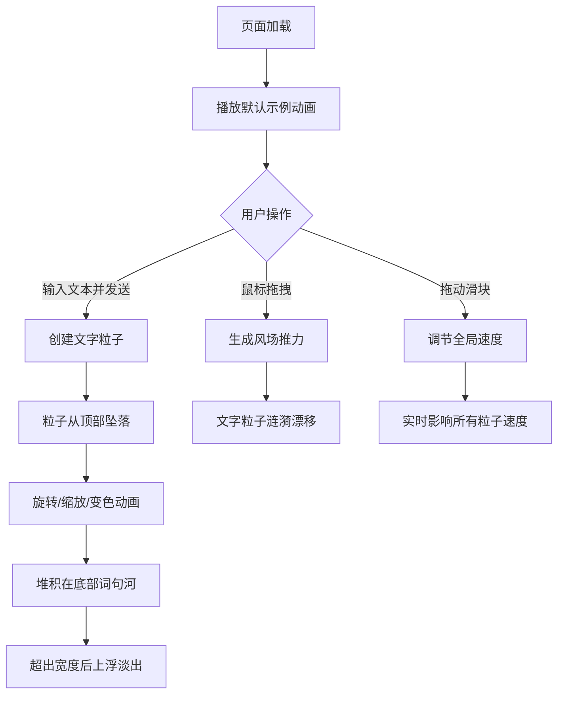

## 1. 产品概述

「星雨诗笺」是一款基于Canvas的交互式文字动画应用，用户输入任意文本后，系统将文字逐字拆解以流星雨形式从画布顶部坠落，最终堆积成七彩的"词句河"。通过动态视觉效果赋予文字诗意的表现力，为用户提供沉浸式的文字艺术体验。

- 主要用途：文字艺术展示、创意互动、诗意体验
- 目标用户：文字爱好者、创意工作者、普通用户

## 2. 核心功能

### 2.1 功能模块

1. **主界面**：全屏Canvas画布、顶部文字输入区域、底部状态栏、实时FPS计数器、流速滑块
2. **文字流星雨系统**：文字粒子从顶部随机位置坠落，伴随旋转、缩放、颜色闪烁效果
3. **词句河堆积系统**：文字粒子在底部堆积形成词句河，超出宽度后上浮淡出
4. **交互风场系统**：鼠标拖拽产生局部推力场，使文字粒子产生涟漪漂移效果
5. **速度控制系统**：可拖动的流速滑块调节全局坠落速度

### 2.2 页面详情

| 页面名称 | 模块名称 | 功能描述 |
|-----------|-------------|---------------------|
| 主页面 | 文字输入区 | 半透明毛玻璃输入框、发送按钮，支持回车键提交 |
| 主页面 | Canvas画布 | 全屏渲染文字粒子动画，深空蓝紫渐变背景 |
| 主页面 | 状态栏 | 底部显示运行状态提示 |
| 主页面 | FPS计数器 | 左上角实时显示帧率和活跃粒子数 |
| 主页面 | 流速滑块 | 右下角可拖动滑块调节全局速度（0.1-3.0倍） |

## 3. 核心流程

用户进入页面后，默认显示示例短诗"星辰大海 皆是归途"的流星雨动画。用户可随时输入新文本，点击发送或按回车触发新的流星雨。文字粒子从顶部坠落，过程中旋转、缩放、变色，最终堆积在底部形成词句河。用户可通过鼠标拖拽在词句河区域产生风场效果，也可通过滑块调节速度。

## 4. 用户界面设计

### 4.1 设计风格

- **主色调**：深空蓝紫渐变背景（#0B0C10到#1F2833径向渐变）
- **强调色**：青绿色#45A29E、亮青色#66FCF1
- **文字色板**：12种鲜艳色（红#FF3B30、橙#FF9500、黄#FFCC00、绿#34C759、青#5AC8FA、蓝#007AFF、紫#AF52DE、粉#FF2D55、珊瑚#FF6B6B、薄荷#4ECDC4、樱#FFB7C5、金#FFD700）
- **按钮风格**：圆角8px，悬停亮度提升1.2倍并微放大1.05倍，点击缩回，过渡0.2秒ease-out
- **字体**：monospace字体用于计数器，系统默认字体用于文字粒子
- **布局风格**：全屏沉浸式布局，交互元素悬浮在Canvas之上

### 4.2 页面设计概述

| 页面名称 | 模块名称 | UI元素 |
|-----------|-------------|-------------|
| 主页面 | 输入框 | 半透明毛玻璃（rgba(255,255,255,0.1)）、1px实线#45A29E边框、圆角8px、白色文字、#888888占位符 |
| 主页面 | 发送按钮 | #45A29E背景色、圆角8px、悬停放大效果 |
| 主页面 | FPS计数器 | monospace 12px、白色半透明（0.7）、左上角定位 |
| 主页面 | 流速滑块 | #2C3E50背景、#45A29E滑条、14px圆形#66FCF1手柄、右下角定位 |
| 主页面 | Canvas背景 | 深空蓝紫径向渐变、全屏无边框 |

### 4.3 响应式设计

- 桌面端优先设计
- 移动端（宽度<768px）：交互元素缩小为桌面版50%，输入框宽度变为90%，适配触控输入

## 5. 性能要求

- 同时渲染300个文字粒子时，帧率稳定在55FPS以上
- 鼠标拖拽风场效果响应延迟小于50ms
- 颜色切换周期0.3-0.8秒，粒子堆积密度每20像素容纳2-3个字
- 超出屏幕宽度的粒子在1.5秒内从透明度1线性衰减到0
