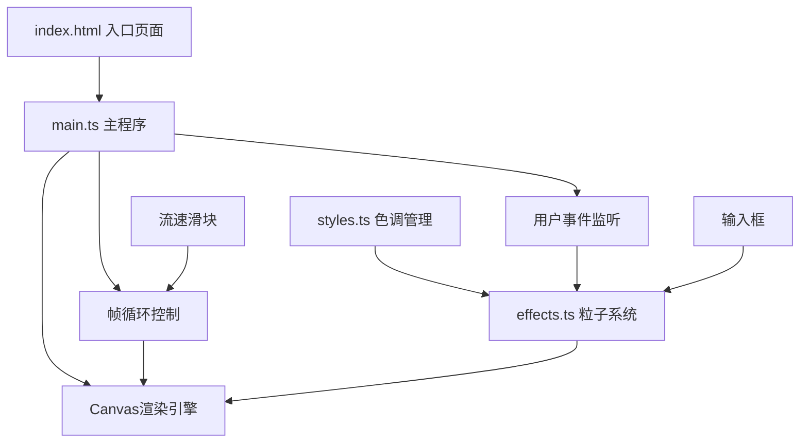

## 1. 架构设计



## 2. 技术描述

- **前端框架**：原生TypeScript + Canvas API（无框架依赖）
- **构建工具**：Vite@5.x
- **开发语言**：TypeScript（严格模式，目标ES2020，模块ESNext）
- **初始化方式**：Vite vanilla-ts模板

## 3. 文件结构

| 文件路径 | 用途 |
|-------|---------|
| `package.json` | 项目依赖配置（typescript、vite），启动脚本 |
| `index.html` | 入口页面，Canvas画布、输入框、状态栏 |
| `tsconfig.json` | TypeScript配置（严格模式、ES2020、ESNext） |
| `vite.config.js` | Vite构建配置，支持HMR |
| `src/main.ts` | Canvas初始化、帧循环控制、用户事件监听 |
| `src/effects.ts` | 粒子系统管理（创建、更新、碰撞、渲染） |
| `src/styles.ts` | 色调管理函数（动态配色方案） |

## 4. 核心数据结构

### 4.1 文字粒子接口

```typescript
interface TextParticle {
  char: string;
  x: number;
  y: number;
  vx: number;
  vy: number;
  rotation: number;
  rotationSpeed: number;
  scale: number;
  opacity: number;
  color: string;
  colorTimer: number;
  colorInterval: number;
  settled: boolean;
  settleTime: number;
  windOffset: number;
  windForce: number;
  windDuration: number;
  fading: boolean;
  fadeStartTime: number;
  targetX: number;
  bounceOffset: number;
}
```

### 4.2 风场接口

```typescript
interface WindZone {
  x: number;
  y: number;
  radius: number;
  force: number;
  direction: number;
  duration: number;
  startTime: number;
}
```

## 5. 核心算法

### 5.1 粒子物理更新
- 位置更新：`x += vx * speedMultiplier`，`y += vy * speedMultiplier`
- 旋转更新：`rotation += rotationSpeed * speedMultiplier`
- 边界检测：y >= canvasHeight * 0.8 时进入堆积状态

### 5.2 堆积布局算法
- 底部区域：canvas高度的80%-100%
- 水平分布：每20像素宽度容纳2-3个字
- 超出处理：最早粒子上浮并在1.5秒内淡出

### 5.3 风场影响计算
- 距离衰减：`influence = max(0, 1 - distance / radius)`
- 粒子速度叠加：`vx += force * influence * direction`
- 持续时间：1-2秒后恢复原位

### 5.4 颜色管理
- 12色调色板数组，按时间随机切换
- 切换周期：0.3-0.8秒随机值
