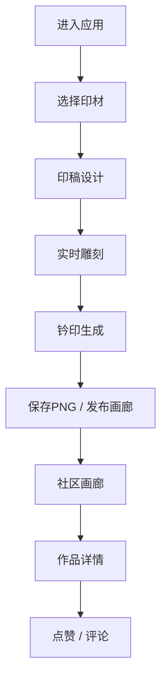

## 1. 产品概述

虚拟篆刻工坊是一款面向篆刻爱好者和传统文化用户的在线Web应用，让用户无需实体工具，在浏览器中模拟传统印章篆刻的雕刻过程，通过社区分享和实时刻印功能，重现古老技艺的数字温度。

- 核心目标：数字化传承传统篆刻技艺，降低学习门槛，提供沉浸式雕刻体验
- 目标用户：篆刻爱好者、书法艺术从业者、传统文化爱好者、普通用户

## 2. 核心功能

### 2.1 用户角色

| 角色 | 注册方式 | 核心权限 |
|------|----------|----------|
| 访客用户 | 无需注册 | 浏览画廊、查看印章详情 |
| 注册用户 | 匿名昵称（本地存储） | 创作印章、发布作品、点赞评论 |

### 2.2 功能模块

1. **印材选择页**：三种材质卡片（石、木、铜），带纹理预览
2. **印稿设计器**：篆书文字拖拽布局，添加删除文字
3. **雕刻工作台**：Canvas实时雕刻交互，刀痕、粒子、振动效果
4. **印迹生成器**：钤印效果渲染，PNG导出下载
5. **社区画廊**：时间倒序作品展示，缩略图网格
6. **作品详情页**：大图预览，点赞，评论列表与发表

### 2.3 页面详情

| 页面名称 | 模块名称 | 功能描述 |
|----------|----------|----------|
| 首页/材质选择 | 材质卡片 | 展示石、木、铜三种材质，点击进入雕刻 |
| 雕刻工作台 | 印稿设计 | 拖拽篆书文字到印面，调整位置和角度 |
| 雕刻工作台 | 实时雕刻 | 鼠标/触控笔雕刻，刀痕深度随速度变化 |
| 雕刻工作台 | 印迹导出 | 钤印生成朱红印迹，PNG下载 |
| 社区画廊 | 作品列表 | 200x200缩略图网格，时间倒序，懒加载 |
| 作品详情 | 大图展示 | 800x800印章预览 |
| 作品详情 | 点赞评论 | ❤️点赞、💬评论列表与发表 |

## 3. 核心流程

用户进入应用 → 选择印材（石/木/铜）→ 进入雕刻工作台 → 设计印稿（拖拽篆书文字）→ 实时雕刻（鼠标/笔刷）→ 点击钤印生成印迹 → 保存PNG或发布到画廊 → 画廊中浏览他人作品 → 点赞与评论

## 4. 用户界面设计

### 4.1 设计风格

- **主色调**：深赭石渐变背景（#1A1210 → #2A1E1A），朱红（#CC3333），赭石（#A0522D），淡金（#D4AF37）
- **材质纹理**：石#C4B89A砂粒、木#A67B5B木纹、铜#B87333金属拉丝
- **面板样式**：半透明毛玻璃（rgba(255,245,235,0.08)），边框1px rgba(255,225,200,0.2)，圆角12px，backdrop-blur 10px
- **按钮样式**：圆角8px，渐变#3A2A20→#4A3A30，悬停亮度+20%，scale 1.05弹性动画
- **字体**：衬线体展示标题，配合传统篆刻氛围；正文清晰易读
- **图标**：❤️、💬、✎等emoji与传统风格图标

### 4.2 页面设计概览

| 页面名称 | 模块名称 | UI元素 |
|----------|----------|--------|
| 材质选择 | 材质卡片 | 三张并排卡片，纹理预览图，材质名称，崩边率参数，悬停放大效果 |
| 雕刻工作台 | 印面画布 | 居中300px圆形印面，响应式最大500px，自定义笔刷光标 |
| 雕刻工作台 | 工具栏 | 雕刻模式切换、撤销、钤印、保存按钮，打字机文字效果 |
| 社区画廊 | 缩略图网格 | 200x200缩略图，悬停1.1倍放大+阴影，点赞数评论数显示 |
| 作品详情 | 评论区 | 头像、昵称、时间、内容，输入框+发送按钮 |

### 4.3 响应式设计

- Desktop-first，768px及以上屏幕正常使用
- 移动端导航栏折叠为汉堡菜单
- 印面区域响应式缩放，最大宽度不超过视口
- 画廊缩略图网格自适应列数

### 4.4 动效设计

- 文字加载：打字机效果，30ms/字
- 按钮悬停：0.2s弹性放大 scale 1.05
- 雕刻光标：圆形半透明朱红笔刷，20px拖尾
- 粒子飞溅：放射状飞出，速度2-8px/帧，0.3-0.8s生命周期
- 振动反馈：Canvas抖动2px，10Hz，0.1s
- 点赞按钮：scale 0.9→1.0，0.15s反馈
