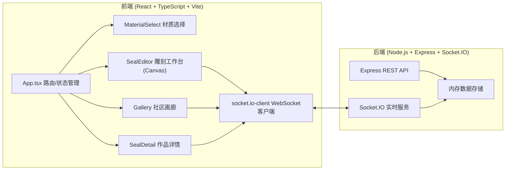
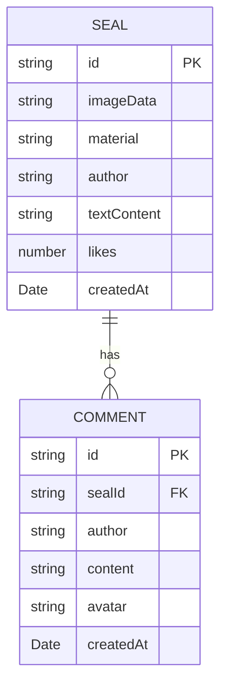

## 1. 架构设计



## 2. 技术说明

- **前端构建**：Vite 5.x，React 18 + TypeScript，支持HMR
- **状态管理**：Zustand 轻量状态管理
- **样式方案**：Tailwind CSS 3 + 自定义CSS变量（毛玻璃、渐变、动画）
- **路由**：React Router DOM 6
- **后端**：Express 4.x + Socket.IO 4.x
- **实时通信**：WebSocket (Socket.IO)
- **噪声算法**：simplex-noise（材质纹理生成）
- **绘图引擎**：HTML5 Canvas 2D API
- **字体**：Google Fonts - Noto Serif SC（衬线中文）

## 3. 目录结构

```
auto235/
├── package.json
├── vite.config.js
├── tsconfig.json
├── index.html
├── src/
│   ├── server/
│   │   └── index.ts              # Express + Socket.IO 服务端
│   └── client/
│       ├── main.tsx              # 入口
│       ├── App.tsx               # 主组件/路由
│       ├── store/
│       │   └── useSealStore.ts   # Zustand状态管理
│       ├── pages/
│       │   ├── MaterialSelect.tsx    # 材质选择页
│       │   ├── SealWorkspace.tsx     # 雕刻工作台
│       │   ├── Gallery.tsx           # 画廊列表
│       │   └── SealDetail.tsx        # 作品详情
│       ├── components/
│       │   ├── SealEditor.tsx        # Canvas雕刻核心
│       │   ├── SealPreview.tsx       # 印迹预览
│       │   ├── SealCard.tsx          # 画廊卡片
│       │   ├── CommentList.tsx       # 评论列表
│       │   └── Navbar.tsx            # 导航栏
│       ├── hooks/
│       │   ├── useSocket.ts          # WebSocket hook
│       │   ├── useCanvas.ts          # Canvas操作hook
│       │   └── useParticles.ts       # 粒子系统hook
│       ├── utils/
│       │   ├── texture.ts            # 材质纹理生成
│       │   ├── carving.ts            # 雕刻算法
│       │   └── sealExport.ts         # 印迹导出
│       ├── types/
│       │   └── index.ts              # 类型定义
│       └── styles/
│           └── globals.css           # 全局样式/动画
└── .trae/documents/
    ├── PRD.md
    └── Technical-Architecture.md
```

## 4. 路由定义

| 路由 | 页面组件 | 说明 |
|------|----------|------|
| `/` | MaterialSelect | 材质选择首页 |
| `/workspace` | SealWorkspace | 雕刻工作台 |
| `/gallery` | Gallery | 社区画廊 |
| `/gallery/:id` | SealDetail | 作品详情 |

## 5. API 定义

### REST API

```typescript
// GET /api/seals?page=1&limit=20
interface SealListResponse {
  list: SealItem[];
  total: number;
  hasMore: boolean;
}

// POST /api/seals
interface CreateSealRequest {
  imageData: string;      // base64 PNG
  material: 'stone' | 'wood' | 'copper';
  author: string;
  textContent: string;
}

// POST /api/seals/:id/like
interface LikeResponse {
  likes: number;
  liked: boolean;
}

// GET /api/seals/:id/comments
interface CommentListResponse {
  list: CommentItem[];
}

// POST /api/seals/:id/comments
interface CreateCommentRequest {
  author: string;
  content: string;
  avatar?: string;
}
```

### WebSocket 事件

```typescript
// 客户端 -> 服务端
'carve:stroke'      // 发送雕刻笔触数据
'seal:create'       // 发布新印章
'seal:like'         // 点赞
'seal:comment'      // 评论

// 服务端 -> 客户端
'carve:broadcast'   // 广播他人雕刻笔触
'seal:new'          // 新印章发布通知
'seal:liked'        // 点赞数更新
'seal:commented'    // 新评论通知
'user:online'       // 在线用户数
```

## 6. 数据模型



## 7. 数据流

### 雕刻数据流
```
用户鼠标移动 → SealEditor捕获坐标/速度
  → useParticles生成粒子
  → carving.ts计算刀痕深度+崩边
  → Canvas局部重绘(脏矩形)
  → useSocket发送carve:stroke
  → 服务器广播carve:broadcast
  → 其他客户端SealEditor增量渲染
```

### 画廊数据流
```
Gallery挂载 → GET /api/seals加载前20条
  → WebSocket监听seal:new
  → 新印章实时插入列表顶部
  → 滚动到底部 → 懒加载下一页
  → 点击卡片 → 跳转SealDetail
  → 点赞/评论 → Socket.IO实时同步
```

## 8. 性能优化

- **Canvas渲染**：requestAnimationFrame + 脏矩形局部重绘，不重绘全画布
- **印迹导出**：OffscreenCanvas + 离屏像素处理，100ms内完成
- **WebSocket**：消息压缩，批量合并小幅雕刻事件，延迟<50ms
- **画廊加载**：一次20条，IntersectionObserver懒加载
- **粒子系统**：对象池复用粒子，超出生命周期自动回收
