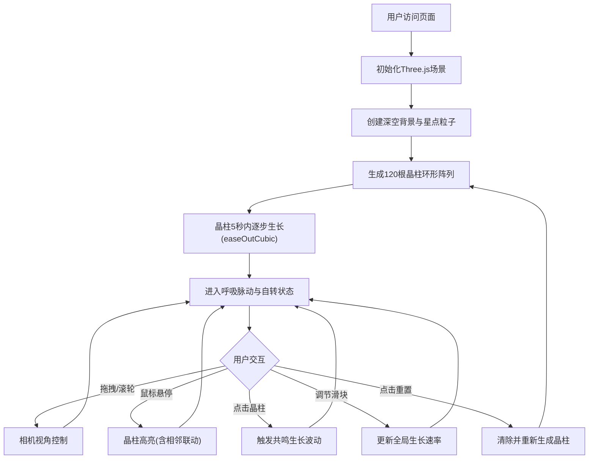

## 1. 产品概述

「晶列共生」是一个基于Three.js的沉浸式3D动态雕塑可视化应用，展示数百根半透明彩色晶柱在空间中缓慢生长、旋转并交互，模拟矿物结晶的复杂美学，供数字艺术家和观众在虚拟展厅中自由观赏。

- 核心目标：打造具有高度艺术感染力的3D晶柱共生可视化，提供流畅的交互体验
- 目标用户：数字艺术家、艺术爱好者、虚拟展厅参观者

## 2. 核心功能

### 2.1 用户角色

| 角色 | 注册方式 | 核心权限 |
|------|---------|---------|
| 访客用户 | 无需注册 | 观赏3D雕塑、自由视角控制、交互触发晶柱生长、调节生长速率 |

### 2.2 功能模块

1. **3D场景渲染**：深空渐变背景、星点粒子、120根晶柱环形阵列、晶柱间连接线
2. **晶柱动态系统**：初始生长动画、呼吸脉动、自转、颜色渐变过渡
3. **交互控制系统**：轨道相机控制、鼠标悬停高亮联动、点击触发生长共鸣
4. **UI控制面板**：晶柱数量统计、FPS计数器、生长速率滑块、重置按钮

### 2.3 页面详情

| 页面名称 | 模块名称 | 功能描述 |
|---------|---------|---------|
| 主场景 | 3D场景渲染 | 深空径向渐变背景(#0A0A1A→#1A1A3A)、200个星点粒子、全屏沉浸式渲染 |
| 主场景 | 晶柱阵列 | 120根六棱柱环形排列(半径10单位)、随机高度(0.5-3)、随机倾斜(-15°~15°)、5秒easeOutCubic初始生长 |
| 主场景 | 晶柱动画 | 达到最终高度后呼吸脉动(5-15秒周期，0.1-0.3幅度)、Y轴自转(0.01-0.05 rad/s)、RGB颜色渐变 |
| 主场景 | 晶柱连接 | 距离<1.5单位时绘制发光连接线(颜色混合、透明度0.15-0.3、随脉动闪烁) |
| 主场景 | 相机控制 | OrbitControls拖拽旋转(上下-40°~60°)、滚轮缩放(5-30单位)、初始位置z=15 y=5 |
| 主场景 | 悬停交互 | Raycaster检测、颜色亮度+20%、透明度→0.85、距离<2单位相邻晶柱联动高亮、角速度0.02rad/s |
| 主场景 | 点击交互 | 半径4单位内、高度<2.5单位的晶柱：easeOutBack快速生长0.8单位(0.2秒)→easeInOutSine回落(2秒) |
| 信息面板 | 左上角统计 | 半透明毛玻璃效果(rgba(10,10,30,0.6))、圆角8px、显示晶柱数量与实时FPS、文字#D0D0E0 |
| 控制面板 | 右下角控件 | 渐变滑块(0.1-2.0，轨道#333355→#555588，按钮#00E5FF)、圆形重置按钮(直径36px，#FF6B6B→#FF8E8E) |
| 响应式 | 移动端适配 | 窗口<768px时UI缩小50%并移至屏幕边缘 |

## 3. 核心流程

用户进入页面 → 场景初始化(背景/星点/光源/相机) → 120根晶柱5秒内逐步生长 → 用户拖拽旋转视角/滚轮缩放 → 鼠标悬停触发高亮联动 → 点击触发生长共鸣 → 调节滑块控制生长速率 → 点击重置重新生成

## 4. 用户界面设计

### 4.1 设计风格
- **主色调**：深空蓝黑渐变(#0A0A1A → #1A1A3A)
- **晶柱色板**：#FF6B6B(珊瑚红)、#4ECDC4(青绿)、#FFD93D(明黄)、#6C5CE7(紫罗兰)、#FD79A8(粉红)
- **强调色**：#00E5FF(电光蓝 - 滑块按钮)、#FF6B6B(珊瑚红 - 重置按钮)
- **文字色**：#D0D0E0(浅灰白)
- **视觉风格**：沉浸式极简、半透明毛玻璃、发光边缘、流畅动画
- **字体**：无衬线现代字体

### 4.2 页面设计概述

| 页面名称 | 模块名称 | UI元素 |
|---------|---------|-------|
| 主场景 | 3D视口 | 全屏Canvas、径向渐变背景、星点粒子层、晶柱网格、连接线层 |
| 信息面板 | 左上角 | 毛玻璃卡片(rgba(10,10,30,0.6))、边框rgba(255,255,255,0.15)、圆角8px、晶柱计数、FPS显示 |
| 控制面板 | 右下角 | 渐变滑块(轨道线性渐变、电光蓝圆形把手hover放大1.1倍+弹性过渡)、圆形重置按钮(hover变色+上跳5px、click旋转0.3秒) |

### 4.3 响应式
- 桌面端优先设计
- 窗口宽度 < 768px 时，所有UI元素缩小50%并移至屏幕边缘确保触屏可用
- 触屏支持单指拖拽旋转、双指缩放

### 4.4 3D场景指导
- **环境**：深空径向渐变背景(#0A0A1A中心→#1A1A3A边缘)、200个随机星点粒子(1px、#FFFFFF、透明度0.3-0.7)
- **光照**：环境光(AmbientLight，强度0.4) + 点光源(PointLight，位置偏移，强度1.0，彩色温度)
- **相机**：PerspectiveCamera(fov=60, near=0.1, far=1000)，初始位置(0, 5, 15)
- **构图**：晶柱环形阵列位于原点，半径10单位，相机围绕阵列中心旋转
- **交互**：OrbitControls(minPolarAngle=50°, maxPolarAngle=130°即上下-40°~60°、minDistance=5、maxDistance=30)
- **动画**：每帧updateScene驱动所有晶柱生长/脉动/旋转/颜色渐变，生长速率由滑块全局控制
- **后处理**：晶柱材质使用MeshPhysicalMaterial(transmission透光、roughness微粗糙)实现半透明晶体质感
- **性能预算**：恒定120根晶柱，连接线≤300条，FPS≥45

## 5. 性能约束
- 稳定运行帧率 ≥ 45 FPS
- 晶柱数量恒定 120 根
- 连接线数量 ≤ 300 条
- 鼠标悬停/点击响应延迟 ≤ 50ms
- 滑块值变化后动画响应 ≤ 0.5s
