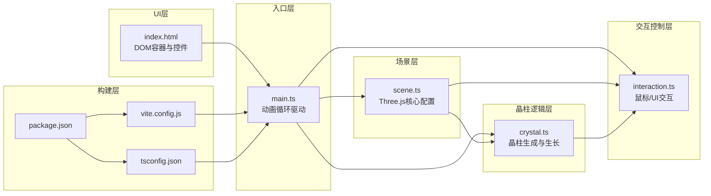

## 1. 架构设计

纯前端3D可视化应用，无后端服务。采用模块化分层设计：入口层(main.ts)协调场景层(scene.ts)、晶柱逻辑层(crystal.ts)、交互控制层(interaction.ts)与UI层(index.html)。



**模块调用关系与数据流向：**
- `index.html` → 提供全屏容器div、FPS显示DOM、滑块/重置按钮 → `main.ts`读取并监听
- `main.ts` → 调用`initScene()`获取{scene, camera, controls, renderer} → 传递给`createCrystal()`与`setupInteraction()`
- `main.ts` → 每帧调用`updateScene(delta)`、`growCrystal(delta, growthRate)`、`handleUIEvents()`
- `scene.ts` → 接收容器DOM → 创建并导出scene/camera/controls/renderer/lights/stars
- `crystal.ts` → 接收scene引用 → 将晶柱Mesh添加到scene；导出`createCrystal(scene)`、`growCrystal(delta, rate)`、`resetCrystals()`、`crystalGroup`
- `interaction.ts` → 接收{scene, camera, crystalGroup} → 设置Raycaster与DOM事件监听；导出`setupInteraction()`、`handleUIEvents()`、`hoveredCrystal`状态

## 2. 技术描述

- **前端框架**：纯 TypeScript（无React/Vue，用户明确指定）
- **3D引擎**：Three.js (latest)
- **构建工具**：Vite 5.x（支持HMR）
- **类型系统**：TypeScript 5.x（strict严格模式）
- **类型定义**：@types/three
- **初始化方式**：`npm init vite-init@latest . -- --template vanilla-ts --force`（因用户指定纯TS而非React/Vue模板）

## 3. 项目文件结构

```
auto241/
├── package.json              # 依赖: three, typescript, vite, @types/three; 脚本: dev
├── vite.config.js            # Vite基本构建配置, HMR支持
├── tsconfig.json             # strict: true, target: ES2020, module: ESNext
├── index.html                # 入口页面, 全屏3D容器, 信息面板, 控制面板
└── src/
    ├── main.ts               # 应用主入口, 整合所有模块, 动画循环
    ├── scene.ts              # 场景初始化与Three.js核心配置
    ├── crystal.ts            # 晶柱生成/生长/脉动/旋转/连接线逻辑
    └── interaction.ts        # 鼠标交互(Raycaster)与UI控件事件处理
```

## 4. 核心数据结构

### 4.1 晶柱数据模型

```typescript
interface CrystalData {
  mesh: THREE.Mesh;
  baseHeight: number;          // 目标最终高度 (0.5-3)
  currentHeight: number;       // 当前高度
  targetHeight: number;        // 动画目标高度
  growProgress: number;        // 初始生长进度 0-1 (5秒完成)
  growStartTime: number;       // 初始生长开始时间戳
  pulsePhase: number;          // 呼吸脉动相位 (0-2π)
  pulsePeriod: number;         // 脉动周期秒 (5-15)
  pulseAmplitude: number;      // 脉动幅度 (0.1-0.3)
  rotationSpeed: number;       // Y轴自转角速度 rad/s (0.01-0.05)
  baseColor: THREE.Color;      // 基础颜色
  colorA: THREE.Color;         // 渐变颜色A
  colorB: THREE.Color;         // 渐变颜色B
  colorPhase: number;          // 颜色渐变相位
  baseOpacity: number;         // 基础透明度 (0.3-0.7)
  isHovered: boolean;          // 是否处于悬停高亮
  hoverRotationSpeed: number;  // 悬停时额外旋转速度
  // 点击共鸣动画状态
  resonanceActive: boolean;
  resonancePhase: 'rise' | 'fall' | null;
  resonanceStartTime: number;
  resonanceExtraHeight: number; // 共鸣动画额外增加的高度
}

// 连接线数据
interface ConnectionLine {
  line: THREE.Line;
  crystalA: CrystalData;
  crystalB: CrystalData;
  baseOpacity: number;
}
```

### 4.2 缓动函数库

```typescript
// 所有缓动函数输入输出均为 0-1
const easeOutCubic = (t: number) => 1 - Math.pow(1 - t, 3);
const easeOutBack = (t: number) => {
  const c1 = 1.70158;
  const c3 = c1 + 1;
  return 1 + c3 * Math.pow(t - 1, 3) + c1 * Math.pow(t - 1, 2);
};
const easeInOutSine = (t: number) => -(Math.cos(Math.PI * t) - 1) / 2;
```

## 5. 关键实现逻辑

### 5.1 六棱柱BufferGeometry构建
- 使用`CylinderGeometry(radiusTop, radiusBottom, height, radialSegments=6, heightSegments=10)`创建六棱柱
- 每根晶柱通过`mesh.scale.y`控制高度变化（初始scale.y=0，逐步动画到目标值）
- 使用`MeshPhysicalMaterial`：`transparent=true, transmission=0.6, roughness=0.2, thickness=0.5`实现晶体透光质感

### 5.2 环形阵列生成算法
- 晶柱数=120，环形半径=10单位
- 第i根晶柱角度 = `i * 2π / 120`
- 位置 = `(cos(angle)*10, 0, sin(angle)*10)`
- 倾斜：X轴旋转 = `random(-15°, +15°)`，Z轴旋转 = `random(-15°, +15°)`（转换为弧度）
- 向外朝向修正：使晶柱略微向环形外侧倾斜

### 5.3 初始生长动画（5秒 easeOutCubic）
- 每根晶柱记录`growStartTime = performance.now() + i * staggerOffset`（微小错开更自然）
- 每帧计算`progress = clamp((now - growStartTime) / 5000, 0, 1)`
- `displayProgress = easeOutCubic(progress)`
- `mesh.scale.y = baseHeight * displayProgress * growthRateMultiplier`

### 5.4 悬停联动高亮
- 每帧调用`raycaster.setFromCamera(mouseNDC, camera)`
- `intersects = raycaster.intersectObjects(crystalGroup.children)`
- 若命中晶柱C：遍历所有晶柱，计算与C的XZ平面距离，距离<2的全部设为`isHovered=true`
- 高亮效果：材质color = baseColor.clone().multiplyScalar(1.2)，opacity = 0.85
- 未悬停晶柱恢复：color = baseColor经过RGB渐变插值的当前值，opacity = baseOpacity

### 5.5 点击共鸣波动
- 点击命中晶柱C时：遍历所有晶柱D
  - 若`distance(C, D) < 4 && D.baseHeight < 2.5`
  - 触发`D.resonanceActive = true, resonancePhase='rise', resonanceStartTime = now, resonanceExtraHeight = 0.8`
- 上升阶段(0-0.2s)：`t = clamp((now - start)/200, 0, 1)` → `extra = 0.8 * easeOutBack(t) * growthRate`
- 上升完成后切换`resonancePhase='fall'`，记录fallStartTime
- 下降阶段(0-2s)：`t = clamp((now - fallStart)/2000, 0, 1)` → `extra = 0.8 * (1 - easeInOutSine(t)) * growthRate`
- 最终高度叠加：`scale.y = baseHeight * displayProgress + extra + pulseOffset`

### 5.6 晶柱连接线
- 初始化时预计算所有晶柱对的XZ平面距离，收集距离<1.5的对（上限300条）
- 每对创建`Line(BufferGeometry(2点), LineBasicMaterial(transparent, color混合, opacity 0.15-0.3))`
- 每帧更新两端点为晶柱顶端世界坐标
- opacity随两端晶柱的脉动相位同步轻微波动（±0.1）模拟闪烁

### 5.7 FPS计算
- 维护`frameCount`、`lastFpsUpdateTime`
- 每帧`frameCount++`
- 每500ms更新一次：`fps = Math.round(frameCount * 1000 / (now - lastFpsUpdateTime))`
- 通过`textContent`更新DOM显示

## 6. 性能优化策略

- **几何复用**：六棱柱Geometry使用单个CylinderGeometry实例，所有晶柱共享，仅通过scale变换高度
- **材质实例化**：每根晶柱独立材质（需独立颜色/透明度），但设置`material.needsUpdate`仅在变化时标记
- **连接线优化**：预计算距离过滤，不每帧做全量N²距离检测；限制最多300条
- **Raycaster优化**：仅在鼠标移动时更新mouseNDC，每帧最多一次intersectObjects调用
- **DOM更新节流**：FPS显示每500ms更新一次，避免每帧操作DOM
- **矩阵自动更新**：Three.js默认开启，无需手动`updateMatrix()`

## 7. 类型配置（tsconfig.json）

```json
{
  "compilerOptions": {
    "target": "ES2020",
    "module": "ESNext",
    "moduleResolution": "Bundler",
    "strict": true,
    "esModuleInterop": true,
    "skipLibCheck": true,
    "forceConsistentCasingInFileNames": true,
    "resolveJsonModule": true,
    "isolatedModules": true,
    "noEmit": true,
    "lib": ["ES2020", "DOM"]
  },
  "include": ["src"]
}
```
