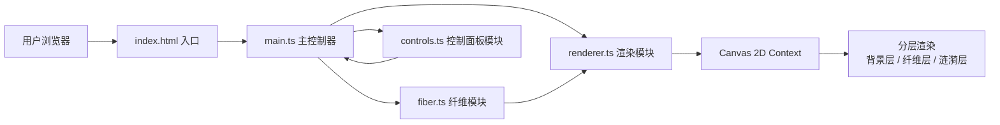

## 1. 架构设计



## 2. 技术说明

- **前端框架**：纯 TypeScript 原生实现，不引入额外UI框架
- **构建工具**：Vite 5.x，目标 ES2020
- **渲染技术**：HTML5 Canvas 2D Context，分层离屏渲染优化性能
- **类型系统**：TypeScript 严格模式（strict: true）

## 3. 文件结构

| 文件路径 | 职责说明 |
|---------|---------|
| `package.json` | 项目依赖配置（typescript、vite）及启动脚本 |
| `index.html` | 入口页面，含全屏Canvas容器、meta viewport、标题 |
| `tsconfig.json` | TypeScript配置，严格模式，目标ES2020，模块ESNext |
| `vite.config.js` | Vite基本配置，目标浏览器es2020 |
| `src/main.ts` | 入口逻辑，Canvas初始化、事件绑定、主循环启动 |
| `src/fiber.ts` | Fiber类定义，封装位置、方向、颜色、转向逻辑、交叉检测 |
| `src/renderer.ts` | 渲染器模块，分层绘制沙滩、纤维网、连接线、涟漪特效 |
| `src/controls.ts` | 控制面板模块，滑块与按钮创建、事件监听、参数更新 |

## 4. 核心数据结构

### 4.1 Fiber 纤维对象

```typescript
interface Fiber {
  x: number;           // 中心X坐标
  y: number;           // 中心Y坐标
  length: number;      // 纤维长度 (1-4px)
  width: number;       // 纤维宽度 (0.3px)
  angle: number;       // 当前角度（弧度）
  baseAngle: number;   // 原始基础角度（弧度）
  angularVelocity: number;  // 角速度
  colorStart: string;  // 起始颜色 #4A90D9
  colorEnd: string;    // 结束颜色 #6BB8E8
  colorProgress: number; // 颜色渐变进度 0-1
}
```

### 4.2 Ripple 涟漪对象

```typescript
interface Ripple {
  x: number;           // X坐标
  y: number;           // Y坐标
  radius: number;      // 半径 (3-5px)
  opacity: number;     // 当前透明度
  life: number;        // 剩余生命周期 (ms)
  maxLife: number;     // 最大生命周期 (1000ms)
}
```

### 4.3 GlobalParams 全局参数

```typescript
interface GlobalParams {
  flowStrength: number;     // 水流强度 0-100，默认50
  connectionDensity: number; // 织网密度 10-100，默认50
  isPaused: boolean;        // 暂停状态
}
```

## 5. 性能优化策略

1. **分层Canvas渲染**：背景层（静态，仅渲染一次缓存为离屏Canvas）、纤维层（每帧更新）、涟漪层（每帧更新）
2. **空间网格索引**：将交互区划分为网格，纤维交叉检测仅在相邻网格内进行，降低O(n²)复杂度
3. **离屏Canvas缓存**：沙滩背景和噪点渲染一次后缓存，避免每帧重复计算
4. **requestAnimationFrame调度**：使用浏览器原生动画API，确保帧率稳定在40FPS以上
5. **批量绘制优化**：纤维使用Path批量绘制，减少Canvas状态切换次数
