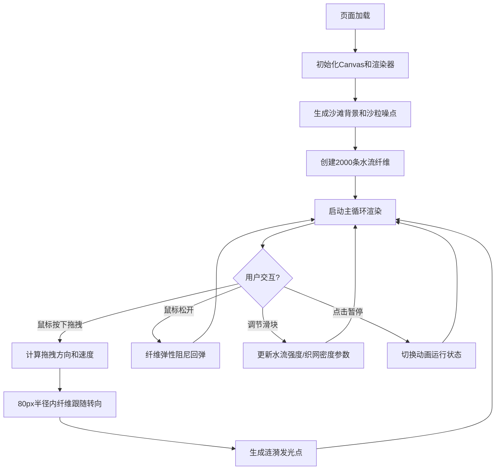

## 1. 产品概述

「潮汐织网」是一个基于浏览器的交互式视觉艺术应用，模拟海浪退去时水流在沙粒间形成的动态网状纹理。用户可以通过鼠标拖拽改变水流方向，观察纤维网如何随潮汐方向重塑，体验自然之美与交互艺术的融合。

- 核心价值：提供沉浸式的自然现象模拟体验，让用户通过直观交互感受流体动力学美学
- 目标用户：设计爱好者、艺术创作者、普通大众用户

## 2. 核心功能

### 2.1 功能模块

1. **沙滩场景渲染**：全屏沙滩背景，径向渐变暖色基底叠加沙粒噪点纹理
2. **水流纤维网**：中央交互区域内的2000条动态水流纤维，形成半透明网状结构
3. **鼠标交互系统**：鼠标拖拽影响纤维方向、生成涟漪特效、纤维弹性回弹
4. **控制面板**：水流强度调节、织网密度调节、暂停/恢复功能
5. **响应式适配**：桌面端与移动端自适应布局

### 2.2 页面详情

| 页面名称 | 模块名称 | 功能描述 |
|---------|---------|---------|
| 主页面 | 沙滩背景层 | 径向渐变从#E8D5A3到#D4B87A，叠加0.08透明度、2-4px随机沙粒噪点 |
| 主页面 | 纤维交互区 | 400x400px（移动端自适应90%宽度），2000条长度1-4px、宽度0.3px纤维，颜色从#4A90D9到#6BB8E8渐变 |
| 主页面 | 交叉连接线 | 纤维距离小于阈值时产生透明度0.1-0.3的微弱交叉连接 |
| 主页面 | 鼠标交互 | 拖拽时80px半径内纤维以0.5°/帧转向跟随，松开后弹性阻尼0.96回弹 |
| 主页面 | 涟漪特效 | 拖拽路径生成3-5px白色发光点，透明度0.6，1秒内衰减消失 |
| 主页面 | 控制面板 | 右上角毛玻璃风格，水流强度滑块(0-100,默认50)、织网密度滑块(10-100,默认50)、暂停/播放按钮 |

## 3. 核心流程

用户打开页面后，自动加载全屏沙滩背景和中央纤维网，纤维以随机朝下方向（90°-270°）漂浮形成动态网。用户按下鼠标并拖拽时，周围纤维跟随鼠标方向偏转，同时拖拽轨迹产生涟漪发光点；松开鼠标后纤维缓慢回弹。用户可通过控制面板调整水流强度、织网密度，或暂停/恢复动画。移动端竖屏模式下交互区自动缩放，控制面板居中顶部显示。

## 4. 用户界面设计

### 4.1 设计风格

- **主色调**：沙滩暖色基底（#E8D5A3 → #D4B87A径向渐变），纤维冷蓝冰蓝渐变（#4A90D9 → #6BB8E8）
- **按钮风格**：圆形毛玻璃（rgba(255,255,255,0.15)），直径35px，极简圆角
- **控件风格**：滑块采用细轨道 + 圆形手柄，毛玻璃质感，0.2-0.3秒平滑过渡
- **整体氛围**：精致柔和的现代科技感，自然与科技的和谐融合

### 4.2 页面设计概述

| 页面名称 | 模块名称 | UI元素 |
|---------|---------|--------|
| 主页面 | 沙滩背景 | 径向渐变、随机噪点叠加、全屏覆盖 |
| 主页面 | 纤维网 | 线状纤维、冷蓝渐变、半透明交叉连接、动态漂浮 |
| 主页面 | 涟漪特效 | 白色发光圆点、径向渐变透明度、平滑衰减 |
| 主页面 | 控制面板 | 右上角圆形按钮组、毛玻璃背景、弹性缩放动画 |

### 4.3 响应式设计

- **桌面端**：交互区400x400px居中，控制面板右上角固定
- **移动端竖屏**：交互区自动缩放至设备宽度90%，控制面板自适应顶部居中排列
- **触控优化**：支持触摸拖拽交互，触控半径与桌面鼠标一致
