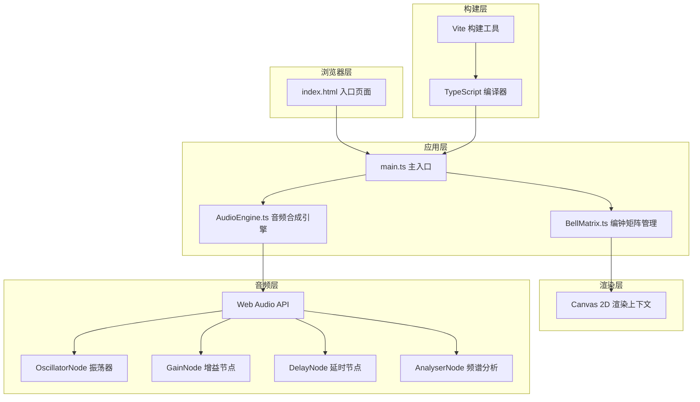

## 1. 架构设计



## 2. 技术选型说明

- **前端框架**: 原生TypeScript + HTML5 Canvas（无额外UI框架，保持轻量高性能）
- **构建工具**: Vite 5.x（快速开发，热模块替换）
- **音频技术**: Web Audio API（实时音频合成，支持振荡器、增益、延时、频谱分析）
- **渲染技术**: Canvas 2D Context（高性能图形绘制，支持复杂动画）

## 3. 项目文件结构

```
├── index.html              # 入口HTML页面
├── package.json            # 项目依赖配置
├── tsconfig.json           # TypeScript配置
├── vite.config.js          # Vite构建配置
└── src/
    ├── main.ts             # 主入口，初始化、事件绑定、动画循环
    ├── BellMatrix.ts       # 编钟矩阵管理类
    └── AudioEngine.ts      # 音频合成引擎类
```

## 4. 核心模块设计

### 4.1 AudioEngine 音频引擎

| 方法名 | 参数 | 返回值 | 功能描述 |
|-------|-----|-------|---------|
| constructor | 无 | AudioEngine实例 | 初始化AudioContext，创建主增益、延时、混响、分析节点 |
| init | 无 | Promise<void> | 懒加载初始化音频上下文（用户交互后调用） |
| playNote | frequency: number, volume?: number, duration?: number | string (noteId) | 播放指定频率音符，返回音符ID |
| stopNote | noteId: string | void | 停止指定ID的音符 |
| getFrequencyData | 无 | Uint8Array | 获取当前频域数据（32个频段） |
| getActiveNoteCount | 无 | number | 获取当前正在发音的音符数量 |

**音频合成算法**:
- 基础波形: 三角波(60%) + 正弦波(40%) 混合
- 衰减包络: 1.2秒指数衰减
- 混响效果: 0.05秒延时节点 + 反馈增益(0.3)
- 共鸣泛音: 2倍频(1/2振幅)、3倍频(1/3振幅)、4倍频(1/4振幅)

### 4.2 BellMatrix 编钟矩阵

| 方法名 | 参数 | 返回值 | 功能描述 |
|-------|-----|-------|---------|
| constructor | ctx: CanvasRenderingContext2D, audioEngine: AudioEngine | BellMatrix实例 | 初始化编钟数据 |
| resize | width: number, height: number | void | 响应式调整矩阵布局 |
| draw | timestamp: number | void | 绘制所有编钟及动画效果 |
| handleMouseMove | x: number, y: number | void | 处理鼠标悬停事件 |
| handleClick | x: number, y: number | void | 处理点击事件，触发音符和共鸣 |
| triggerBell | index: number | void | 触发指定编钟（用于自动演奏） |

**编钟数据结构**:
```typescript
interface Bell {
    index: number;
    row: number;
    col: number;
    noteName: string;      // C4, D4, ... C5
    frequency: number;     // Hz
    x: number;             // 中心x坐标
    y: number;             // 中心y坐标
    width: number;         // 底部宽度
    height: number;        // 高度
    color: string;         // 钟体颜色
    patternRotation: number; // 暗纹旋转角度
    hoverStartTime: number | null;  // 悬停开始时间
    clickStartTime: number | null;  // 点击开始时间
    resonanceStartTimes: number[];  // 共鸣触发时间
}
```

### 4.3 main.ts 主入口

负责：
- Canvas初始化与尺寸自适应
- 鼠标事件监听与分发
- requestAnimationFrame动画循环驱动
- 自动演奏控制面板逻辑
- 频谱图绘制
- 三首预设旋律数据

## 5. 音律数据（十二平均律）

| 音名 | 频率(Hz) |
|-----|---------|
| C4  | 261.63  |
| D4  | 293.66  |
| E4  | 329.63  |
| F4  | 349.23  |
| G4  | 392.00  |
| A4  | 440.00  |
| B4  | 493.88  |
| C5  | 523.25  |

4×4矩阵排布：从左到右、从上到下，低音到高音。

## 6. 预设旋律数据

- **茉莉花**: [G4, A4, G4, E4, D4, E4, G4, D4]
- **小星星**: [C4, C4, G4, G4, A4, A4, G4]
- **两只老虎**: [C4, D4, E4, C4, C4, D4, E4]

## 7. 动画参数

| 动画 | 时长 | 参数 |
|-----|-----|------|
| 悬停震颤 | 0.3秒 | 水平偏移±3px，正弦曲线 |
| 悬停光晕 | 持续 | 半径1.3倍，渐变#FFD700→#FFA500，透明度0.4 |
| 敲击冲击波 | 0.6秒 | 半径0→80px，线宽2px，金色渐变透明 |
| 音频衰减 | 1.2秒 | 指数衰减包络 |
| 共鸣延迟 | 0.1-0.3秒 | 随机延迟触发 |
| 共鸣音量 | 0.3-0.6倍 | 随机音量衰减 |
