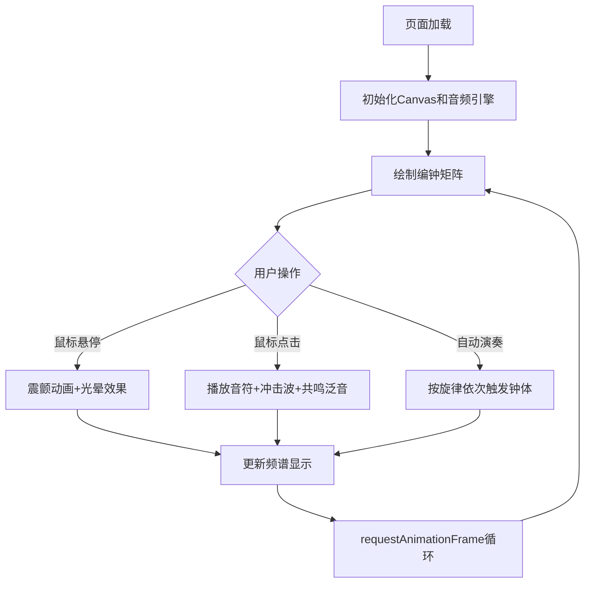

## 1. 产品概述

编钟回响互动音乐模拟游戏是一款基于浏览器的音乐体验应用，通过Web Audio API和Canvas技术模拟中国古代编钟乐器的演奏效果，让用户能够直观体验编钟敲击时产生的复杂谐波共鸣、音律渐变与空间混响效果。

- 解决传统编钟乐器难以大规模普及和展示的问题
- 为音乐爱好者、文化学习者提供沉浸式的编钟互动体验
- 通过可视化和音频技术还原古代皇家乐器的声学特性

## 2. 核心功能

### 2.1 功能模块

1. **编钟矩阵展示模块**：4行4列共16口编钟的可视化展示，包含钟体渐变、暗纹、音名标注
2. **交互反馈模块**：悬停震颤光晕、敲击冲击波动画、实时音名频率提示
3. **音频合成引擎模块**：Web Audio API实时合成，三角波+正弦波混合，泛音共鸣与混响效果
4. **自动演奏模块**：三首预设旋律（茉莉花、小星星、两只老虎），可调节播放速度
5. **频谱分析模块**：实时频谱可视化显示，当前发音钟数统计

### 2.2 功能详情

| 页面名称 | 模块名称 | 功能描述 |
|---------|---------|----------|
| 主页面 | 编钟矩阵 | 16口钟4×4排列，渐变色彩，随机暗纹，音名标注 |
| 主页面 | 悬停交互 | 鼠标悬停时0.3秒震颤动画，#FFD700到#FFA500光晕，显示音名和频率 |
| 主页面 | 敲击交互 | 点击产生圆形冲击波，播放对应音高音频，触发其他钟体泛音共鸣 |
| 主页面 | 自动演奏控制 | 旋律选择、播放/暂停、速度滑块（0.5-2.0倍速） |
| 主页面 | 频谱分析 | 右上角200×80px频谱图，32个频段，显示当前发音钟数 |

## 3. 核心流程

### 3.1 用户交互流程
用户打开页面后，首先看到编钟矩阵和控制面板。用户可以：
- 鼠标悬停查看钟体信息和光晕效果
- 点击钟体演奏音符并触发共鸣
- 使用控制面板选择旋律进行自动演奏
- 观看频谱分析图实时显示音频输出

### 3.2 流程图

## 4. 用户界面设计

### 4.1 设计风格
- **主色调**：古代皇家青金色调，深灰石墙背景（#3A3C42到#2A2C32渐变）
- **强调色**：金色#FFD700、橙色#FFA500
- **钟体色彩**：低音到高音从#C0A080到#F0D0A0渐变
- **字体**：简洁现代无衬线字体，音名标注使用12px金色
- **整体氛围**：庄严肃穆的古代宫殿质感，带有纹理细节

### 4.2 页面设计概览

| 模块位置 | 模块名称 | UI元素 |
|---------|---------|--------|
| 全屏背景 | 石墙纹理 | 渐变砖墙，0.1透明度随机砖缝线 |
| 中央区域 | 编钟矩阵 | 4×4钟体，倒钟形轮廓，暗纹，音名标注 |
| 右上角 | 频谱分析 | 半透明黑背景，32条频谱条，橙金渐变，发音钟数 |
| 底部 | 控制面板 | 旋律下拉选择器，播放/暂停按钮，速度滑块 |

### 4.3 响应式设计
- **桌面端**（≥768px）：钟体高60px底部宽40px，矩阵正常间距
- **移动端**（<768px）：钟体尺寸缩小至70%，矩阵间距自动调整，控制面板横向滚动

## 5. 性能要求
- 编钟矩阵绘制和音频合成保持稳定60fps
- 音频合成延迟不超过20ms
- 鼠标交互响应无卡顿
- 所有动画使用requestAnimationFrame驱动
