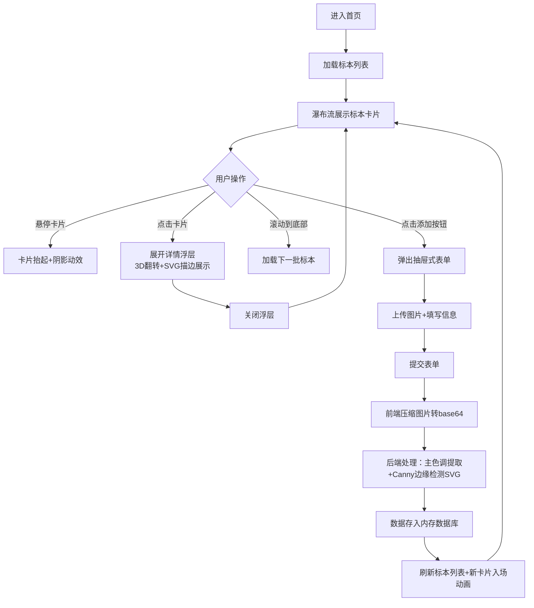

## 1. 产品概述
「风物集」是一款在线植物标本数字收藏馆应用，让用户通过上传植物照片，系统自动提取特征并生成手绘风格的电子标本卡，以瀑布流方式展示在虚拟「标本墙」上，打造个人专属的植物收藏记忆空间。

### 产品定位
- 面向植物爱好者、自然观察者、旅行记录者
- 解决植物发现记忆零散化、缺乏艺术性呈现的问题
- 提供富有仪式感的数字化植物标本收藏体验

## 2. 核心功能

### 2.1 用户角色
| 角色 | 注册方式 | 核心权限 |
|------|----------|----------|
| 普通用户 | 无需注册即可使用（演示版本） | 浏览标本墙、添加标本、删除标本 |

### 2.2 功能模块
1. **标本墙首页**：瀑布流标本展示、顶部导航、添加按钮、滚动加载
2. **标本添加表单**：抽屉式表单、图片上传、植物信息录入
3. **标本卡片详情**：卡片悬停效果、3D翻转展示、SVG叶脉描边、笔记查看
4. **图片处理后端**：图像压缩、主色调提取、叶脉边缘检测生成SVG

### 2.3 页面详情
| 页面名称 | 模块名称 | 功能描述 |
|----------|----------|----------|
| 标本墙首页 | 导航栏 | 展示logo、用户头像、登录按钮 |
| 标本墙首页 | 瀑布流网格 | 自适应3/2/1列布局，卡片入场动画，滚动加载 |
| 标本墙首页 | 标本卡片 | 椭圆预览图、植物名称、日期、主色调色块、悬停抬起效果 |
| 标本墙首页 | 详情浮层 | 点击卡片展开、3D翻转、SVG描边路径、笔记文本 |
| 标本墙首页 | 添加按钮 | 右下角圆形浮动按钮，弹性悬停动画 |
| 添加标本表单 | 图片上传区 | 拖拽/点击上传、拖拽视觉反馈 |
| 添加标本表单 | 信息录入 | 植物名称、发现地点、日期、随想笔记 |
| 添加标本表单 | 字数统计 | 笔记文本域实时字数限制 |

## 3. 核心流程

### 主用户流程
用户进入首页看到标本墙瀑布流 → 浏览已有的标本卡片 → 悬停查看卡片微动效 → 点击卡片展开详情浮层 → 查看手绘叶脉描边和笔记 → 关闭浮层 → 点击右下角添加按钮 → 底部弹出抽屉表单 → 上传植物照片 → 填写植物信息 → 提交表单 → 图片压缩上传 → 后端处理提取主色调和SVG描边 → 新标本卡片入场动画 → 继续滚动加载更多标本

## 4. 用户界面设计

### 4.1 设计风格
- **整体基调**：复古博物学、手账风格、自然有机感
- **主色**：绿松石色 `#4A8C70`（代表自然生命）
- **辅助色**：米色纸纹背景 `#F5F0E8` 到 `#EDE4D6` 渐变、卡其线条 `#D4C9B3`、橄榄绿描边 `#A8C0A0`、深棕文字 `#4A3F35`
- **按钮风格**：圆形浮动按钮，悬停弹性放大
- **字体**：标题使用 Playfair Display 优雅衬线体，正文使用 Georgia 仿手写衬线体
- **布局风格**：瀑布流卡片式布局，纸质感纹理背景
- **图标风格**：简约线性图标，自然有机

### 4.2 页面设计概述
| 页面名称 | 模块名称 | UI 元素 |
|----------|----------|---------|
| 标本墙首页 | 导航栏 | 半透明深色背景、左侧Logo绿松石色Playfair Display 24px、右侧头像占位+登录按钮 |
| 标本墙首页 | 背景 | 浅米色毛坯纸纹理渐变 `#F5F0E8 → #EDE4D6` |
| 标本墙首页 | 瀑布流网格 | 3列自适应（<768px 1列、768-1024px 2列、>1024px 3列），24px间距，卡片入场弹跳动画 |
| 标本墙首页 | 标本卡片 | 280px宽自适应高度、白色圆角矩形、1px `#D4C9B3` 边框、椭圆预览图200x200px带 `#A8C0A0` 半透明描边、底部Georgia手写体植物名+日期、右上角10x10px主色调圆点、悬停上移8px+柔和阴影 |
| 标本墙首页 | 添加按钮 | 右下角固定、圆形 `#4A8C70` 56px、白色加号、悬停扩大至60px且背景提亮至 `#5BA080`、0.25s弹性过渡 |
| 添加标本表单 | 抽屉容器 | 底部弹出滑入、半透明白色0.9透明度+毛玻璃blur(10px)、顶部圆角20px、600px宽居中 |
| 添加标本表单 | 上传区 | 虚线边框 `#A8C0A0`、底色 `#F8FAF5`、拖拽时实线边框+底色提亮至 `#E8F0E0` |
| 添加标本表单 | 输入控件 | 仿手写字体、边框1px `#D4C9B3`、聚焦时边框 `#4A8C70` 外发光、下拉选择5种地点类型、笔记限制200字实时统计 |

### 4.3 响应式设计
- Desktop-first 设计策略
- 瀑布流列数响应式：>1024px 3列、768-1024px 2列、<768px 1列
- 抽屉表单移动端宽度自适应全屏
- 触摸设备优化点击区域

### 4.4 动效与交互
- 卡片入场：从底部向上弹入，随机延迟0-300ms，0.5s ease-out
- 卡片悬停：上移8px + 底部柔和阴影扩散，0.3s ease-out
- 添加按钮：悬停弹性放大，0.25s cubic-bezier 过渡
- 抽屉表单：从底部向上滑入
- 详情浮层：3D翻转动效展示
- 滚动加载：距底部200px触发，防抖1秒

## 5. 性能要求
- 加载20张卡片时滚动帧率 ≥ 50fps
- 添加新卡片时布局重排响应时间 ≤ 100ms
- 图片压缩至最大1200px宽度，JPEG质量0.85
