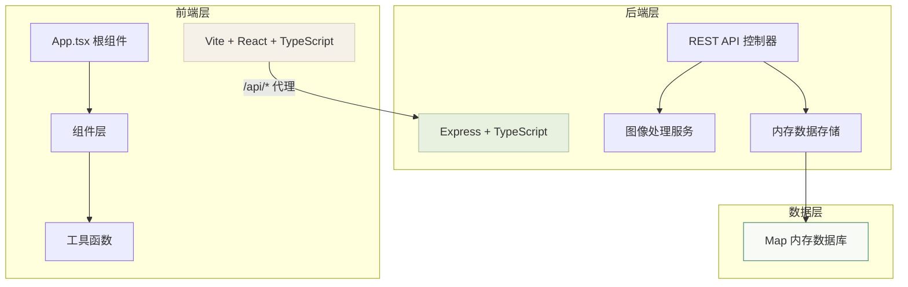
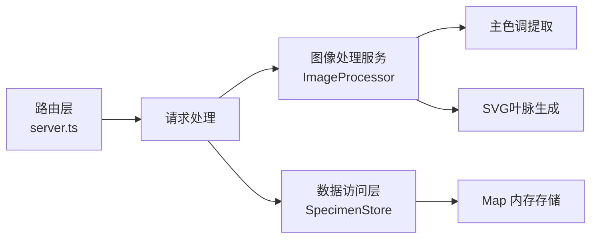

## 1. 架构设计



## 2. 技术描述
- **前端**：React 18 + TypeScript + Vite 5
  - UI 样式：原生 CSS（含 CSS 变量、动画）
  - 状态管理：React useState/useEffect（无需额外状态库）
  - 图像处理：Canvas API（前端压缩）
- **后端**：Express 4 + TypeScript
  - 图像处理：Canvas API（后端图像处理、Canny 边缘检测模拟）
  - 数据存储：Map 内存数据库
  - 跨域：cors 中间件
- **构建工具**：Vite 5
  - 代理配置：`/api` → `http://localhost:3001`

## 3. 路由定义

| 路由 | 用途 |
|------|------|
| / | 首页（标本墙） |
| POST /api/specimen | 创建新标本 |
| GET /api/specimens?page=1&limit=8 | 分页获取标本列表 |
| DELETE /api/specimens/:id | 删除指定标本 |

## 4. API 定义

### 4.1 类型定义

```typescript
interface Specimen {
  id: string;
  name: string;
  location: '山林' | '河畔' | '荒漠' | '城市' | '温室';
  date: string;
  notes: string;
  imageBase64: string;
  dominantColor: string;
  veinSvgPath: string;
  createdAt: number;
}

interface SpecimenCreateInput {
  name: string;
  location: string;
  date: string;
  notes: string;
  imageBase64: string;
}

interface PaginatedResponse<T> {
  data: T[];
  total: number;
  page: number;
  limit: number;
  hasMore: boolean;
}
```

### 4.2 接口详情

#### POST /api/specimen
- 请求体：`SpecimenCreateInput`
- 响应：`Specimen`（含生成的 id、createdAt、dominantColor、veinSvgPath）
- 处理流程：接收图片 base64 → 提取主色调 → 生成 SVG 叶脉描边 → 存入 Map → 返回完整对象

#### GET /api/specimens
- 查询参数：`page` (默认1)，`limit` (默认8)
- 响应：`PaginatedResponse<Specimen>`
- 排序：按 createdAt 降序

#### DELETE /api/specimens/:id
- 路径参数：`id` - 标本 ID
- 响应：`{ success: boolean }`

## 5. 服务端架构



### 图像处理流程
1. **主色调提取**：取图像中心 100x100 像素块 → 计算 RGB 平均值 → 转换 HSL → 取饱和度最高色
2. **SVG 叶脉描边**：图像转灰度 → 模拟 Canny 边缘检测 → 简化路径至 30 控制点 → 生成 SVG path 字符串

## 6. 项目结构

```
auto245/
├── .trae/documents/
│   ├── PRD.md
│   └── Technical-Architecture.md
├── index.html
├── package.json
├── tsconfig.json
├── vite.config.js
├── server.ts
└── src/
    ├── App.tsx
    ├── main.tsx
    ├── index.css
    └── components/
        ├── MasonryGrid.tsx
        ├── SpecimenCard.tsx
        ├── AddSpecimenForm.tsx
        ├── Header.tsx
        └── AddButton.tsx
```

## 7. 启动脚本
```bash
npm install      # 安装依赖
npm run dev      # 同时启动前端(Vite 5173)和后端(Express 3001)
```
