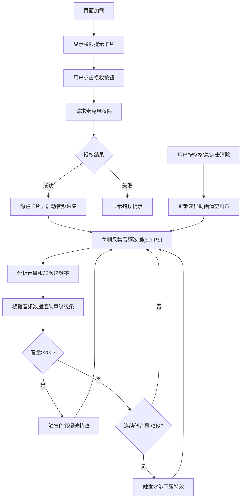

## 1. 产品概述
声纹绘画游戏是一款基于Web Audio API的互动体验应用，玩家通过麦克风输入的声音（说话或吹气）在画布上生成随音量和频率变化的五彩声纹图案，营造「声音被看见」的视觉体验。

- 目标用户：游戏玩家、艺术爱好者、对声音可视化感兴趣的普通用户
- 产品价值：提供一种新颖的互动艺术创作方式，让用户通过声音创造独特的视觉作品

## 2. 核心功能

### 2.1 用户角色
| 角色 | 注册方式 | 核心权限 |
|------|----------|----------|
| 普通用户 | 无需注册，浏览器直接使用 | 使用全部声纹绘画功能 |

### 2.2 功能模块
1. **麦克风权限模块**：请求用户授权麦克风访问，处理授权状态
2. **音频分析模块**：实时采集音频数据，提取音量和频率分布信息
3. **声纹渲染模块**：根据音频数据在Canvas上绘制动态声纹线条
4. **特效系统**：色彩爆破效果、水泡下落效果、清空淡出动画
5. **控制面板**：音量显示、FPS计数器、清除按钮
6. **频谱可视化**：右侧动态频谱条显示32个频段能量

### 2.3 页面详情
| 页面名称 | 模块名称 | 功能描述 |
|----------|----------|----------|
| 主页面 | 权限提示卡片 | 半透明卡片提示用户授权麦克风，含授权按钮 |
| 主页面 | 全屏Canvas画布 | 声纹绘画主区域，背景#0D0D1A |
| 主页面 | 左侧控制面板 | 音量数值、FPS计数器、清除按钮 |
| 主页面 | 右侧频谱条 | 32条竖条实时显示各频段能量 |

## 3. 核心流程

## 4. 用户界面设计

### 4.1 设计风格
- 主色调：深夜空蓝 #0D0D1A（背景）、亮白 #FFFFFF（起始点）
- 声纹色彩：HSL色环从低频红 #FF0000 到高频紫 #9900FF
- 强调色：绿色 #00FF88（音量数字）、红色 #CC3333（清除按钮）、蓝色 #44AAFF（水泡）
- 卡片背景：#1A1A2E，圆角12px
- 控制面板：rgba(20,20,40,0.7)，圆角8px，宽度180px
- 按钮风格：圆角4px，悬停变色，点击0.1秒缩放反馈
- 字体：默认无衬线字体，清晰易读
- 动画：所有过渡使用 ease 缓动，0.15秒平滑过渡

### 4.2 页面设计概述
| 页面名称 | 模块名称 | UI元素 |
|----------|----------|--------|
| 主页面 | 权限卡片 | 居中半透明卡片、白色提示文字、授权按钮 |
| 主页面 | Canvas画布 | 全屏铺满、深夜空蓝背景、动态声纹线条 |
| 主页面 | 控制面板 | 左侧悬浮、音量数值(绿色)、FPS(白色)、清除按钮(红色) |
| 主页面 | 频谱条 | 右侧垂直、32条渐变竖条、蓝到紫渐变 |

### 4.3 响应式
- Desktop-first 设计
- 在2560px和1024px宽度屏幕上布局比例自动调整
- 控制面板和频谱条位置按视口比例自适应
- Canvas始终全屏铺满

## 5. 性能约束
- 动画循环稳定运行在30FPS
- 50条以上活动线条 + 10个下落水泡时，单帧渲染时间≤25ms
