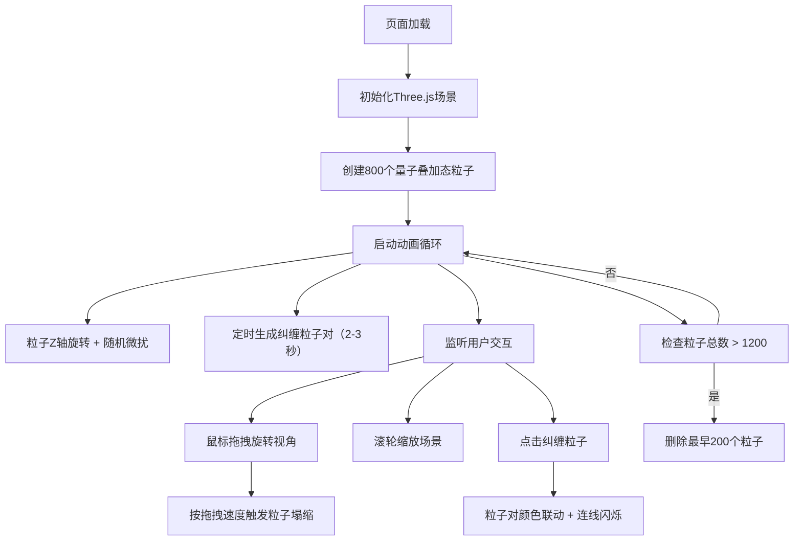

## 1. 产品概述

量子星涡是一个基于WebGL的3D交互可视化应用，用于在浏览器中模拟量子态叠加与纠缠的动态效果。解决现有粒子特效难以表现量子概率云、粒子瞬时关联变化和双色态叠加视觉悖论的问题。

- 目标用户：对量子物理感兴趣的教育工作者、学生和科技爱好者
- 产品价值：以直观的视觉方式展示量子力学的核心概念（叠加态、塌缩、纠缠），兼具教育性和艺术观赏性

## 2. 核心功能

### 2.1 功能模块

1. **量子星涡粒子系统**：800个半透明球状粒子组成的动态星涡，表现量子叠加态
2. **观测塌缩交互**：鼠标拖拽触发观测效应，粒子从叠加态塌缩为单一颜色
3. **纠缠粒子对系统**：随机生成纠缠粒子对，点击触发颜色联动变化
4. **控制面板UI**：量子态概率滑块、观测强度滑块、粒子总数显示
5. **性能管理**：自动粒子回收机制，确保FPS稳定在50以上

### 2.2 页面详情

| 页面名称 | 模块名称 | 功能描述 |
|-----------|-------------|---------------------|
| 主场景 | 量子星涡 | 800个粒子组成的扁椭圆球云团，Z轴旋转，双色叠加态显示，随机微扰 |
| 主场景 | 观测塌缩 | 拖拽时按速度比例触发粒子塌缩，颜色突变，透明度降低，缓慢漂移 |
| 主场景 | 纠缠粒子对 | 每2-3秒生成黄绿色纠缠对，连接线显示，点击触发颜色联动 |
| UI层 | FPS计数器 | 左下角实时显示帧率，毛玻璃样式 |
| UI层 | 控制面板 | 右下角半透明面板，含滑块和粒子计数 |

## 3. 核心流程

## 4. 用户界面设计

### 4.1 设计风格
- **主色调**：深空蓝紫渐变背景（#050512 → #0F0A1E）
- **强调色**：青色 #00E5FF（滑块、边框）
- **粒子色**：红色 #FF3366、蓝色 #33CCFF、黄绿纠缠色 #CCFF33
- **UI风格**：毛玻璃半透明效果（背景 #1A1A2E，透明度 0.7，圆角 12px，边框 1px solid #00E5FF 透明度 0.3）

### 4.2 页面设计概述

| 页面名称 | 模块名称 | UI元素 |
|-----------|-------------|-------------|
| 主场景 | 背景 | 深空蓝紫径向渐变，营造宇宙深空氛围 |
| 主场景 | 粒子云 | 800个半透明球体，红蓝双色叠加闪烁，Z轴缓慢旋转 |
| 主场景 | 纠缠对 | 黄绿色发光粒子 + 半透明连接线 |
| UI层 | FPS计数器 | 左下角，毛玻璃卡片，实时更新 |
| UI层 | 控制面板 | 右下角，毛玻璃面板，悬停上浮2px，含2个滑块 + 粒子计数 |

### 4.3 响应式
- Desktop-first设计，全屏3D渲染
- 监听window resize事件，自动调整画布尺寸和相机比例
- 触摸设备支持触屏拖拽和捏合缩放

### 4.4 3D场景指导
- **环境**：纯深空背景，无外部光源，使用自发光材质
- **光照**：粒子使用MeshBasicMaterial自发光，不需要场景光源
- **相机**：PerspectiveCamera，初始距离约15单位，支持OrbitControls式交互
- **交互**：鼠标拖拽绕Y/X轴旋转（-180°~180°），滚轮缩放0.5x~3x
- **后处理**：粒子叠加使用Additive Blending实现辉光效果
- **性能**：使用BufferGeometry和InstancedMesh优化大量粒子渲染
