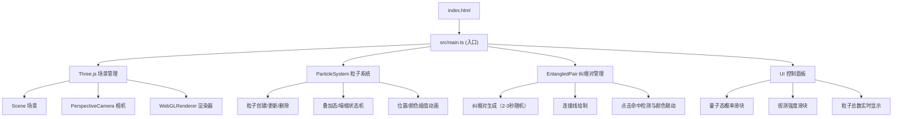

## 1. 架构设计



## 2. 技术描述

- **前端框架**：纯 TypeScript + Three.js（无React/Vue，用户明确要求）
- **构建工具**：Vite 5.x，ES Module 输出，支持 HMR
- **3D渲染**：Three.js r160+，使用 Points / MeshBasicMaterial + AdditiveBlending
- **类型定义**：@types/three
- **无后端**：纯前端可视化应用

## 3. 文件结构

| 文件路径 | 用途 |
|----------|------|
| `package.json` | 依赖声明：three, typescript, vite, @types/three；脚本：dev |
| `vite.config.js` | Vite 基本配置，ES Module 输出，HMR 开启 |
| `tsconfig.json` | 严格模式，target ES2020，module ESNext，包含 three 类型 |
| `index.html` | 入口页面，全屏 canvas，标题「量子星涡」，FPS 与控制面板 DOM |
| `src/main.ts` | 应用入口，初始化场景/相机/渲染器，动画循环，事件绑定，UI 更新 |
| `src/particleSystem.ts` | ParticleSystem 类，粒子创建/塌缩/删除/更新逻辑 |
| `src/entangledPair.ts` | EntangledPair 类，纠缠对生成/连线/点击/消失逻辑 |

## 4. 数据模型

### 4.1 Particle（粒子）

| 字段 | 类型 | 说明 |
|------|------|------|
| id | number | 唯一标识，创建时间戳 |
| mesh | THREE.Mesh | 球体网格 |
| basePosition | THREE.Vector3 | 基准位置（扁椭圆球分布） |
| currentPosition | THREE.Vector3 | 当前位置 |
| perturbation | THREE.Vector3 | 水平随机微扰 |
| state | 'superposition' \| 'collapsed' | 量子态 |
| collapsedColor | 'red' \| 'blue' \| null | 塌缩后颜色 |
| redOpacity | number | 红色态透明度（动画插值） |
| blueOpacity | number | 蓝色态透明度（动画插值） |
| driftVelocity | THREE.Vector3 | 塌缩后漂移速度 |
| driftDistance | number | 累计漂移距离 |
| blinkPhase | number | 叠加态闪烁相位 |

### 4.2 EntangledPair（纠缠对）

| 字段 | 类型 | 说明 |
|------|------|------|
| id | number | 唯一标识 |
| particleA | THREE.Mesh | 左半区粒子 |
| particleB | THREE.Mesh | 右半区粒子 |
| line | THREE.Line | 连接线 |
| createdAt | number | 创建时间戳 |
| lifetime | number | 剩余存活时间（秒） |
| isFlashing | boolean | 连接线是否处于闪烁状态 |
| flashTimer | number | 闪烁剩余时间 |
| colorChanged | boolean | 是否已触发颜色跳转 |
| colorRestoreTimer | number | 颜色恢复倒计时 |

## 5. 核心算法

### 5.1 扁椭圆球粒子分布
```
theta = random(0, 2π)
phi = arccos(2 * random() - 1)
r = 5 * pow(random(), 1/3)
x = r * sin(phi) * cos(theta)
y = r * sin(phi) * sin(theta) * 0.6  // 扁率0.6
z = r * cos(phi)
```

### 5.2 观测塌缩速率
```
dragSpeed = sqrt(deltaX² + deltaY²) / deltaTime
collapseRatePerSec = 50 * (dragSpeed / maxSpeed) * (observationIntensity / 100)
每帧随机选择 N = ceil(collapseRatePerSec * deltaTime) 个叠加态粒子塌缩
```

### 5.3 叠加态闪烁
```
// 使用正弦波交错闪烁
redFactor = 0.5 + 0.5 * sin(blinkPhase)
blueFactor = 0.5 + 0.5 * sin(blinkPhase + π)
实际显示透明度 = redProb * redFactor * 0.6 + (1-redProb) * blueFactor * 0.6
```

### 5.4 纠缠对命中检测
```
将屏幕坐标点击位置投影为射线，与粒子球求交
命中半径 = particleRadius * 1.5（扩大点击热区）
```

### 5.5 粒子回收策略
```
当 totalParticles > 1200:
  1. 优先删除 driftDistance > 3 的已塌缩粒子（按创建时间升序）
  2. 不足200个时，按创建时间升序删除最老的已塌缩粒子
  3. 仍不足时，删除最老的叠加态粒子
```
