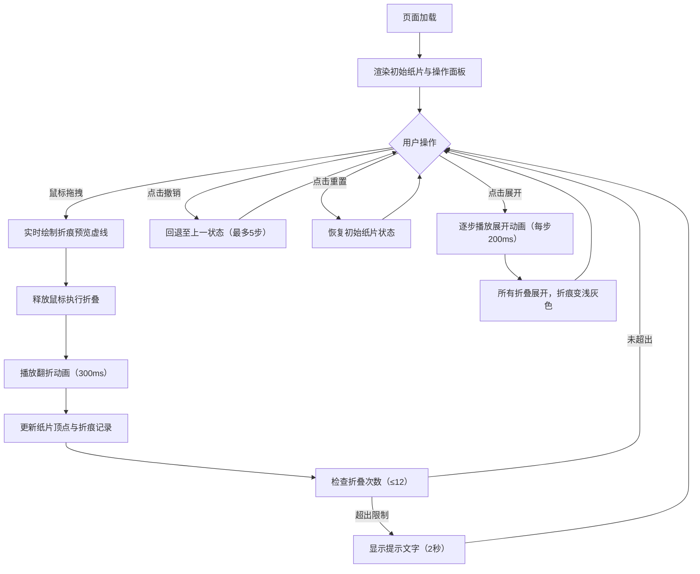

## 1. 产品概述

「浮影折纸」是一款基于浏览器的交互式折纸模拟应用，让用户通过拖拽和点击操作，将虚拟的正方形纸片折叠出各种立体造型，并实时展示折痕、翻折动画和3D效果。

- 主要目的：提供沉浸式的折纸创作体验，模拟真实纸张折叠的视觉效果
- 目标用户：折纸爱好者、教育工作者、创意设计人员
- 产品价值：无需物理材料即可探索折纸艺术，可视化理解几何变换，兼具教育与娱乐价值

## 2. 核心功能

### 2.1 功能模块

1. **主画布区域**：全屏Canvas画布，承载纸片渲染与交互
2. **纸片渲染系统**：8x8网格纸片，渐变色彩，半透明效果，网格吸附提示
3. **折叠交互系统**：拖拽生成折痕线，翻折动画，多点连续折叠
4. **操作控制面板**：折叠步数统计、折痕数量统计、撤销、重置、展开按钮
5. **历史状态管理**：最多12次折叠，最多5步撤销，完整状态回溯

### 2.2 页面详情

| 页面名称 | 模块名称 | 功能描述 |
|---------|---------|---------|
| 主界面 | 纸片渲染模块 | 渲染正方形纸片（300px边长，居中），8x8网格，渐变色彩（#FFF8E7到#F5E6CC），透明度0.9 |
| 主界面 | 网格吸附模块 | 鼠标悬停时网格交叉点显示3px灰色圆点作为吸附提示 |
| 主界面 | 折痕预览模块 | 拖拽时显示橙色虚线（#FF8800，2px宽，5px间距） |
| 主界面 | 折叠动画模块 | 释放鼠标后沿折痕翻折180度（300ms，ease-out缓动），翻折时透明度降至0.5，显示背面颜色#E8D5C8 |
| 主界面 | 折痕显示模块 | 折叠后折痕变为实线永久保留（#CC5500，1.5px宽），多次折叠使用不同灰度（#BB4400到#993300递减） |
| 主界面 | 折叠限制模块 | 最多12次折叠，超出时画布顶部中央显示红色提示文字（持续2秒） |
| 主界面 | 视差效果模块 | 鼠标移动时纸片产生5px左右的视差偏移 |
| 操作面板 | 统计信息模块 | 实时显示折叠步数和折痕数量 |
| 操作面板 | 撤销按钮模块 | 圆形图标，悬停时缩放1.1倍并投影，最多撤销5步 |
| 操作面板 | 重置按钮模块 | 圆形图标，悬停时变暗10%，清除所有折叠恢复初始状态 |
| 操作面板 | 展开按钮模块 | 逐步展开所有折叠（每步200ms，线性缓动），折痕保留为浅灰色#E0D5C0（透明度0.5） |

## 3. 核心流程

用户进入页面后看到居中的正方形纸片，可通过拖拽创建折痕进行折叠，或使用控制面板进行撤销、重置、展开操作。

## 4. 用户界面设计

### 4.1 设计风格

- **主色调**：暖橙色（#FF8800）作为交互强调色，传递温暖与创意感
- **辅助色**：米色（#F5E6CC）模拟纸张质感，深紫灰（#2A1B3D）营造复古氛围
- **背景**：径向渐变，从#2A1B3D到#1A0F2E，营造沉浸式暗色调空间
- **按钮风格**：圆形图标，12px圆角，悬停有微动效（缩放/投影/变暗）
- **面板风格**：半透明毛玻璃效果（rgba(255,255,255,0.1)背景，1px rgba(255,255,255,0.2)边框），12px圆角
- **整体风格**：复古纸张质感，温暖橙色调与深紫背景形成强烈对比，柔和光影营造立体感

### 4.2 页面设计概述

| 页面名称 | 模块名称 | UI元素 |
|---------|---------|--------|
| 主界面 | 背景层 | 径向渐变（#2A1B3D → #1A0F2E），全屏覆盖 |
| 主界面 | 纸片层 | 居中正方形，柔和阴影（偏移4px，模糊6px，rgba(0,0,0,0.3)），轻微视差跟随鼠标 |
| 主界面 | 网格层 | 8x8浅色网格线（#D4C5A0，透明度0.3），悬停交叉点显示吸附圆点 |
| 主界面 | 折痕层 | 预览时橙色虚线（#FF8800），完成后深橙色实线（#CC5500渐变） |
| 主界面 | 提示层 | 画布顶部中央红色错误提示，2秒自动消失 |
| 操作面板 | 面板容器 | 左侧固定，毛玻璃半透明，12px圆角 |
| 操作面板 | 统计区域 | 折叠步数、折痕数量，大号数字显示 |
| 操作面板 | 按钮组 | 撤销、重置、展开三个圆形图标按钮，各有独特悬停动效 |

### 4.3 响应式设计

- 桌面端优先设计，画布尺寸随浏览器窗口自适应
- 纸片始终居中且保持宽高比，最小不小于200px
- 操作面板在小屏幕下可切换为底部悬浮栏
- 触摸设备支持双指缩放与单指拖拽折叠

### 4.4 视觉效果指导

- **光影环境**：纸片投射柔和阴影，营造悬浮于空间的质感
- **光照设置**：模拟左上方自然光源，翻折时背面呈现暖色（#E8D5C8）
- **动画节奏**：折叠动画300ms ease-out，展开动画每步200ms线性，按钮悬停150ms过渡
- **质感表现**：纸张采用渐变填充模拟厚度，折痕处线条加深表现折痕印记
