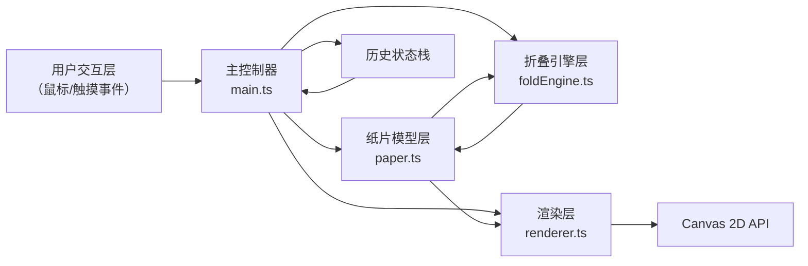

## 1. 架构设计



## 2. 技术说明

- **前端框架**：TypeScript + Vite（用户明确指定，不使用React）
- **初始化工具**：Vite 原生项目模板
- **渲染方式**：HTML5 Canvas 2D API（原生实现，不引入额外渲染库）
- **状态管理**：自定义历史栈实现撤销/重做
- **动画系统**：requestAnimationFrame + 自定义缓动函数

### 模块职责

| 模块 | 文件 | 职责 |
|-----|-----|-----|
| 主控制器 | src/main.ts | 初始化画布、事件监听、渲染循环，协调各模块，管理状态栈 |
| 纸片模型 | src/paper.ts | Paper类：网格顶点、颜色、透明度、foldAt折叠方法 |
| 折叠引擎 | src/foldEngine.ts | 折痕线计算、顶点变换、动画帧生成 |
| 渲染器 | src/renderer.ts | 绘制纸面、网格、折痕、阴影、立体光影 |

## 3. 路由定义

| 路由 | 用途 |
|-----|-----|
| / | 主页面，包含Canvas画布与操作面板 |

## 4. 数据模型

### 4.1 顶点数据结构

```typescript
interface Vertex {
    x: number;        // X坐标
    y: number;        // Y坐标
    z: number;        // Z坐标（用于3D深度）
    originalX: number; // 原始X坐标（用于折叠计算参考）
    originalY: number; // 原始Y坐标
    folded: boolean;  // 是否已被折叠到另一侧
}
```

### 4.2 折痕线数据结构

```typescript
interface CreaseLine {
    startX: number;
    startY: number;
    endX: number;
    endY: number;
    color: string;     // 折痕显示颜色
    timestamp: number; // 创建时间戳（用于颜色区分）
}
```

### 4.3 纸片状态快照

```typescript
interface PaperSnapshot {
    vertices: Vertex[];      // 顶点数组快照
    creaseLines: CreaseLine[]; // 折痕线快照
    foldCount: number;       // 折叠次数
}
```

### 4.4 Paper类定义

```typescript
class Paper {
    size: number;                  // 纸片边长（300px）
    gridSize: number;              // 网格划分数（8）
    vertices: Vertex[];            // 顶点数组（8x8网格共81个顶点）
    creaseLines: CreaseLine[];     // 折痕线数组
    frontColor: { from: string; to: string }; // 正面渐变色
    backColor: string;             // 背面颜色
    opacity: number;               // 当前透明度
    foldCount: number;             // 已折叠次数
    
    constructor(centerX: number, centerY: number, size: number);
    foldAt(px: number, py: number, angle: number, direction: number): void;
    getVertexAt(gridX: number, gridY: number): Vertex;
    snapshot(): PaperSnapshot;
    restore(snapshot: PaperSnapshot): void;
}
```

### 4.5 FoldEngine类定义

```typescript
class FoldEngine {
    static calculateCreaseLine(startX: number, startY: number, endX: number, endY: number): CreaseLine;
    static computeFoldAnimation(
        vertices: Vertex[],
        creaseLine: CreaseLine,
        foldDirection: number,
        progress: number
    ): Vertex[];
    static isVertexOnSide(vertex: Vertex, lineStart: {x:number;y:number}, lineEnd: {x:number;y:number}): number;
    static rotateVertexAroundLine(vertex: Vertex, lineStart: {x:number;y:number}, lineEnd: {x:number;y:number}, angle: number): Vertex;
}
```

### 4.6 Renderer类定义

```typescript
class Renderer {
    ctx: CanvasRenderingContext2D;
    canvas: HTMLCanvasElement;
    
    constructor(canvas: HTMLCanvasElement);
    clear(): void;
    drawPaper(paper: Paper, parallaxX: number, parallaxY: number, animationProgress?: number, isFolding?: boolean): void;
    drawGrid(paper: Paper): void;
    drawCreaseLines(lines: CreaseLine[]): void;
    drawCreasePreview(startX: number, startY: number, endX: number, endY: number): void;
    drawSnapPoints(paper: Paper, mouseX: number, mouseY: number): void;
    drawShadow(paper: Paper, parallaxX: number, parallaxY: number): void;
    drawNotification(text: string, color: string): void;
}
```

## 5. 核心算法

### 5.1 折叠几何变换

1. 根据用户拖拽起点和终点确定折痕线方程
2. 计算每个顶点相对于折痕线的位置（左侧/右侧/线上）
3. 对翻折侧的顶点执行绕折痕线的180度旋转变换
4. 动画过程中旋转角度从0到180度插值，使用ease-out缓动

### 5.2 点关于直线的反射

利用向量投影计算点P关于直线AB的镜像点P'：
1. 计算向量AP在AB方向上的投影
2. P' = P + 2 × (投影点 - P)

### 5.3 渲染优化

- 仅当状态变化或动画进行中时重绘
- 顶点数控制在81个（8×8网格）以内
- 使用离屏缓冲预渲染静态元素
