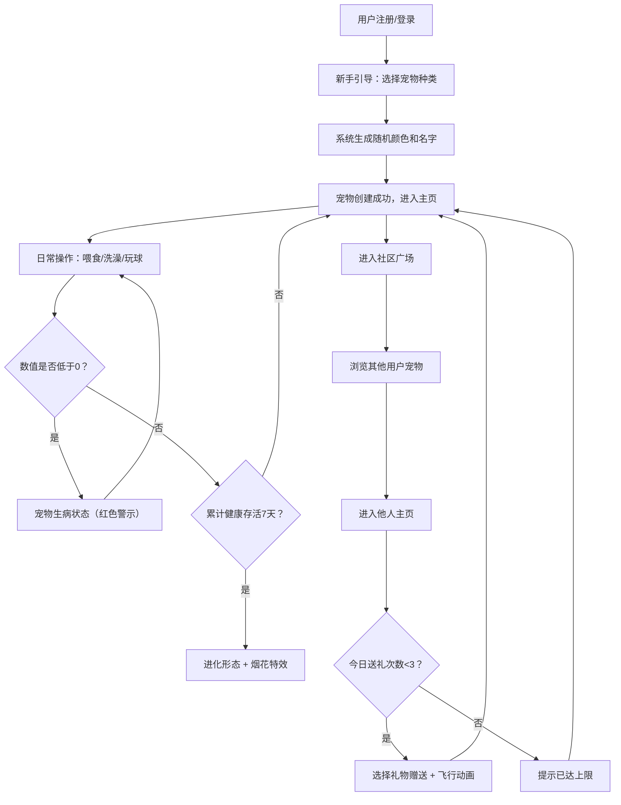

## 1. 产品概述

像素萌宠养成社区——一个让用户领养、照顾虚拟像素宠物并与其他宠物主人互动的在线养成游戏平台。
- 核心目标：提供轻松治愈的养成体验，通过日常互动和社区互动增强用户粘性
- 目标用户：喜欢休闲养成游戏、像素风格、社交互动的年轻用户群体
- 产品价值：在碎片化时间内获得陪伴感和成就感，通过社区互动形成情感连接

## 2. 核心功能

### 2.1 用户角色
| 角色 | 注册方式 | 核心权限 |
|------|----------|----------|
| 普通用户 | 用户名注册（无需登录验证） | 领养宠物、照顾宠物、查看社区、赠送礼物 |

### 2.2 功能模块
1. **宠物领养/新手引导页**：用户注册后选择宠物种类、生成随机属性
2. **主页/宠物详情页**：展示宠物外观、状态数值、成长进度、操作按钮
3. **社区广场页**：展示所有用户宠物列表、支持进入他人主页送礼
4. **全局组件**：宠物面板、状态数值条、礼物动画、烟花特效、提示气泡

### 2.3 页面详情
| 页面名称 | 模块名称 | 功能描述 |
|----------|----------|----------|
| 新手引导页 | 宠物选择 | 从猫/狗/龙三种中选择，生成随机颜色和名字，确认领养 |
| 主页/详情 | 宠物展示 | 像素风格宠物渲染，根据进化阶段显示不同外观，生病时视觉警示 |
| 主页/详情 | 状态数值 | 彩色进度条展示饱食度/清洁度/快乐度，颜色随数值变化平滑过渡 |
| 主页/详情 | 成长进度 | 左上角进度条显示存活天数进度，每7天进化一次 |
| 主页/详情 | 操作按钮 | 喂食/洗澡/玩球三个圆角按钮，悬停放大，点击播放对应动画 |
| 主页/详情 | 进化特效 | 进化时全屏烟花粒子特效，停留2秒渐隐 |
| 社区广场 | 宠物列表 | 卡片式展示所有用户宠物：名字、等级、当前状态图标 |
| 社区广场 | 送礼功能 | 进入他人主页后可赠送礼物（小鱼干/小花/小骨头），每只宠物每日限3次 |
| 送礼动画 | 飞行动画 | 礼物图标从底部飞入对方宠物头顶，显示+5爱心数值 |
| 侧边栏 | 快捷面板 | 桌面端左侧240px固定侧边栏，移动端转为底部导航栏 |

## 3. 核心流程

用户注册后进入新手引导选择宠物种类，系统生成随机颜色和名字后创建宠物。用户每日通过喂食、洗澡、玩球维持宠物健康数值（每小时下降10点），数值降到0时宠物生病（视觉警示）。连续健康存活7天后宠物进化，解锁新形态并触发烟花特效。用户可访问社区广场浏览其他用户宠物，进入他人主页赠送礼物增加爱心值。

## 4. 用户界面设计

### 4.1 设计风格
- **主色调**：浅米色背景 #FFF8E7，浅卡其卡片 #F5E6C8，暖橙色系强调色
- **渐变效果**：宠物展示区域采用中心到边缘的细微渐变（深1-2个色阶）
- **按钮风格**：圆角矩形（圆角8px），悬停时 0.2秒 scale 1.05 放大效果
- **字体**：圆润可爱的像素风格字体配合现代无衬线字体，主标题24px，正文14px
- **图标风格**：像素风格emoji图标，配合Lucide图标库的线性图标
- **布局风格**：桌面端两栏布局（240px侧边栏 + 自适应主区域），移动端侧边栏转底部导航

### 4.2 页面设计概述
| 页面名称 | 模块名称 | UI元素 |
|----------|----------|--------|
| 新手引导 | 宠物选择卡片 | 三张并排宠物卡片，选中高亮，底部确认按钮 |
| 主页/详情 | 侧边栏/底部栏 | 宠物小头像、状态数值条、快捷操作按钮、导航链接 |
| 主页/详情 | 宠物展示区 | 大尺寸像素宠物、成长进度条、爱心数值、状态图标 |
| 主页/详情 | 操作按钮区 | 三个主要按钮：🍖喂食、🛁洗澡、⚽玩球 |
| 社区广场 | 宠物卡片网格 | 响应式网格，每张卡片显示宠物缩略图、名字、等级、状态 |
| 他人主页 | 送礼按钮 | 三个礼物按钮，禁用状态显示已达上限 |
| 全局组件 | 状态进度条 | 彩色渐变（绿>70/黄30-70/红<30），0.3秒颜色过渡动画 |
| 全局组件 | 提示气泡 | 从底部上浮，停留1.5秒自动消失 |

### 4.3 响应式设计
- 桌面端（≥1024px）：左侧固定240px侧边栏，右侧主内容区域自适应
- 平板端（768-1024px）：侧边栏折叠为图标栏，主区域全宽
- 移动端（<768px）：侧边栏转为底部固定导航栏（4-5个图标），主区域全宽单列布局
- 触摸优化：按钮最小点击区域48x48px，手势反馈

### 4.4 动画与特效
- 按钮悬停：scale 1.05，0.2s 缓动
- 状态数值变化：进度条颜色过渡 0.3s ease
- 喂食动画：宠物头顶出现肉骨头图标，弹跳0.3秒
- 礼物动画：礼物图标从按钮位置抛物线飞入宠物头顶，出现+5数字
- 进化特效：全屏烟花粒子，停留2秒后渐隐
- 提示气泡：translateY从20px到0 + fadeIn，1.5秒后fadeOut
