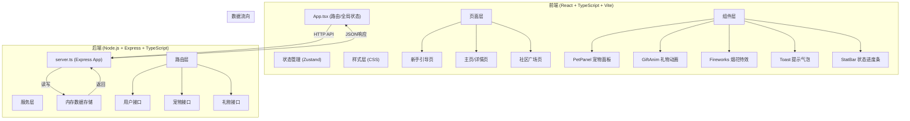
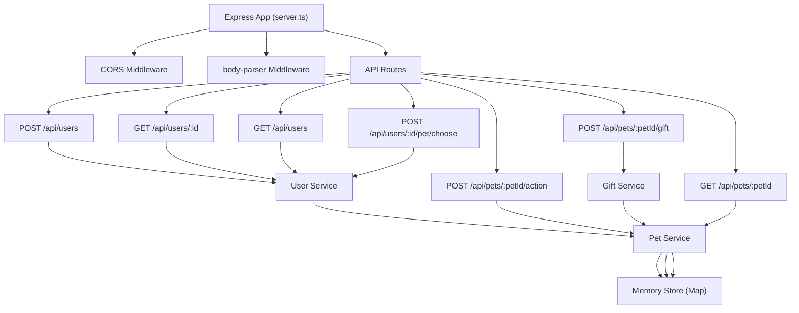
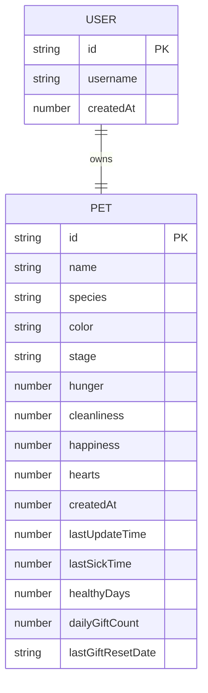

## 1. 架构设计



## 2. 技术说明
- **前端框架**：React@18 + TypeScript
- **构建工具**：Vite@5 + @vitejs/plugin-react
- **状态管理**：Zustand（轻量级全局状态管理）
- **样式方案**：原生CSS（CSS变量 + 模块化类名），不使用Tailwind以保证像素风格精细控制
- **后端框架**：Express@4 + TypeScript + ts-node
- **跨域处理**：cors 中间件
- **唯一ID**：uuid 库
- **请求体解析**：body-parser
- **数据存储**：内存存储（Map对象），无需数据库
- **并发启动**：concurrently 同时启动前后端

## 3. 路由定义
| 前端路由 | 页面组件 | 用途 |
|----------|----------|------|
| /onboarding | OnboardingPage | 新手引导，选择宠物 |
| / | HomePage | 宠物主页，展示和操作当前宠物 |
| /community | CommunityPage | 社区广场，浏览所有用户宠物 |
| /pet/:userId | PetProfilePage | 他人宠物主页，可赠送礼物 |
| * | Redirect to /onboarding or / | 路由重定向 |

## 4. API 接口定义

### 4.1 TypeScript 类型定义

```typescript
// 宠物种类
type PetSpecies = 'cat' | 'dog' | 'dragon';

// 宠物进化阶段
type PetStage = 'baby' | 'young' | 'adult';

// 宠物状态
interface PetStats {
  hunger: number;      // 饱食度 0-100
  cleanliness: number; // 清洁度 0-100
  happiness: number;   // 快乐度 0-100
}

// 宠物数据
interface Pet {
  id: string;
  name: string;
  species: PetSpecies;
  color: string;               // 十六进制颜色代码
  stage: PetStage;             // 进化阶段
  stats: PetStats;
  hearts: number;              // 爱心值
  createdAt: number;           // 创建时间戳
  lastUpdateTime: number;      // 上次状态更新时间
  lastSickTime: number | null; // 上次生病时间
  healthyDays: number;         // 累计健康存活天数
  dailyGiftCount: number;      // 今日被赠送次数
  lastGiftResetDate: string;   // 礼物计数重置日期 YYYY-MM-DD
}

// 用户数据
interface User {
  id: string;
  username: string;
  pet: Pet;
  createdAt: number;
}

// 礼物类型
type GiftType = 'fish' | 'flower' | 'bone';

// 礼物数据
interface Gift {
  type: GiftType;
  emoji: string;
  label: string;
}

// 操作类型
type ActionType = 'feed' | 'clean' | 'play';
```

### 4.2 API 接口列表

| 方法 | 路径 | 请求体 | 响应 | 说明 |
|------|------|--------|------|------|
| POST | /api/users | `{ username: string }` | `User` | 注册新用户，自动进入新手引导 |
| GET | /api/users/:id | - | `User` | 获取指定用户信息（含宠物数据） |
| GET | /api/users | - | `User[]` | 获取所有用户列表（社区广场用） |
| POST | /api/users/:id/pet/choose | `{ species: PetSpecies }` | `Pet` | 选择并创建宠物 |
| POST | /api/pets/:petId/action | `{ action: ActionType }` | `{ pet: Pet; animated: boolean }` | 执行喂食/洗澡/玩球操作 |
| POST | /api/pets/:petId/gift | `{ giftType: GiftType, fromUserId: string }` | `{ pet: Pet; success: boolean; message?: string }` | 向宠物赠送礼物 |
| GET | /api/pets/:petId | - | `Pet` | 获取宠物当前状态（含离线数值衰减） |

## 5. 服务端架构



## 6. 数据模型

### 6.1 ER 图



### 6.2 内存数据结构

```typescript
// 内存存储 - 使用 Map 保证 O(1) 读写
const users = new Map<string, User>();
const pets = new Map<string, Pet>();

// 用户名索引（保证用户名唯一）
const usernameIndex = new Map<string, string>(); // username -> userId
```

### 6.3 核心业务规则
1. **数值衰减**：每经过1小时，饱食度/清洁度/快乐度各下降10点，离线时间也计算
2. **生病判定**：任一数值降到0时，宠物进入生病状态（图标变灰、红边闪烁）
3. **操作恢复**：每次喂食/洗澡/玩球，对应数值 +20（上限100）
4. **进化规则**：连续健康存活（不生病）7天进化一次，共3阶段：baby → young → adult
5. **成长进度**：按天计算，每天进度约 14.29%（1/7）
6. **送礼限制**：每只宠物每天最多被赠送3次礼物，礼物随机3种，每次+5爱心
7. **日期重置**：每日0点重置送礼计数
