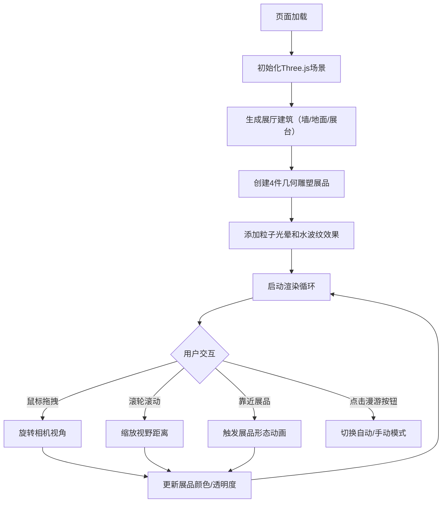

## 1. 产品概述

「流光幻阁」是一个基于Three.js的沉浸式3D虚拟艺术展馆应用，让观众在浏览器中自由漫步，观赏动态生成的几何雕塑展品。展品形态与颜色随观众视角实时变化，营造梦幻的艺术沉浸体验。

- 目标用户：数字艺术爱好者、策展人、普通观众
- 核心价值：在浏览器中即可体验高品质沉浸式虚拟艺术展览，无需下载额外软件

## 2. 核心功能

### 2.1 功能模块

1. **3D展厅场景**：四面渐变半透明墙、深色磨砂地面、中央发光展台
2. **几何雕塑展品**：4件动态展品（环形扭结、莫比乌斯带等），相距2.5单位呈环形排列
3. **视角控制系统**：鼠标拖拽360°旋转、滚轮缩放（3-20单位）、靠近展品触发动效
4. **动态材质系统**：根据视角角度实时变化颜色渐变和透明度
5. **粒子光晕效果**：每件展品200个悬浮粒子，绕Y轴旋转营造氛围
6. **地面水波纹**：展台周围三个同心圆环动态扩散效果
7. **自动漫游模式**：相机沿预设路径遍历所有展品，每件停留5秒
8. **信息展示UI**：左下角显示展品名称和视角坐标，右下角控制按钮

### 2.2 页面详情

| 页面名称 | 模块名称 | 功能描述 |
|---------|---------|---------|
| 主展厅页 | 3D渲染容器 | 全屏Three.js渲染，展示完整展厅场景 |
| 主展厅页 | 信息面板 | 左下角实时显示当前展品名称和视角坐标 |
| 主展厅页 | 控制面板 | 右下角自动漫游开关和重置视角按钮 |

## 3. 核心流程

### 3.1 主流程描述
用户打开页面后，自动渲染完整3D展厅，4件几何雕塑呈环形分布在展厅中央，聚光灯自上而下旋转投射阴影。用户可通过鼠标拖拽旋转视角、滚轮缩放视野，靠近展品时触发形态变化动画。点击右下角按钮可开启/关闭自动漫游模式，自动遍历所有展品。

### 3.2 流程图

## 4. 用户界面设计

### 4.1 设计风格
- **主色调**：深紫黑渐变（#120A1F 到 #0A0515），展品从红#FF6B6B渐变到蓝#4D96FF
- **点缀色**：粉色发光边缘#FF6B9D
- **UI风格**：半透明毛玻璃效果，背景rgba(20,20,30,0.5)，圆角8px
- **边框**：默认1px rgba(255,255,255,0.2)，悬停时rgba(255,100,150,0.5)
- **字体色**：#E0D8F0（浅紫白色）
- **整体氛围**：梦幻、沉浸式、赛博艺术感

### 4.2 页面设计概览

| 页面名称 | 模块名称 | UI元素 |
|---------|---------|-------|
| 主展厅页 | 3D场景 | 四面渐变墙、星光纹理地面、发光展台、旋转聚光灯 |
| 主展厅页 | 展品 | 环形扭结/莫比乌斯带几何体，动态渐变材质，粒子光晕 |
| 主展厅页 | 信息面板 | 左下角毛玻璃卡片，展品名称+视角坐标 |
| 主展厅页 | 控制面板 | 右下角毛玻璃按钮组，自动漫游开关+重置按钮 |

### 4.3 响应式设计
- 全屏渲染，自适应浏览器窗口大小
- 桌面端优先设计，鼠标键盘交互
- UI控件固定在画面边缘，不遮挡3D内容

### 4.4 3D场景指引
- **环境**：深紫黑渐变背景，营造夜间艺术馆氛围
- **光照**：中央白色聚光灯（强度0.8，投射阴影）+ 环境光补光
- **相机**：透视相机，FOV 60°，初始位置(0,5,12)，看向原点
- **动画**：展品形态扭曲碎裂重组（3秒）、粒子旋转、水波纹扩散、聚光灯旋转
- **性能预算**：1080p下FPS≥30，单展品粒子≤200，几何体≤5000面
