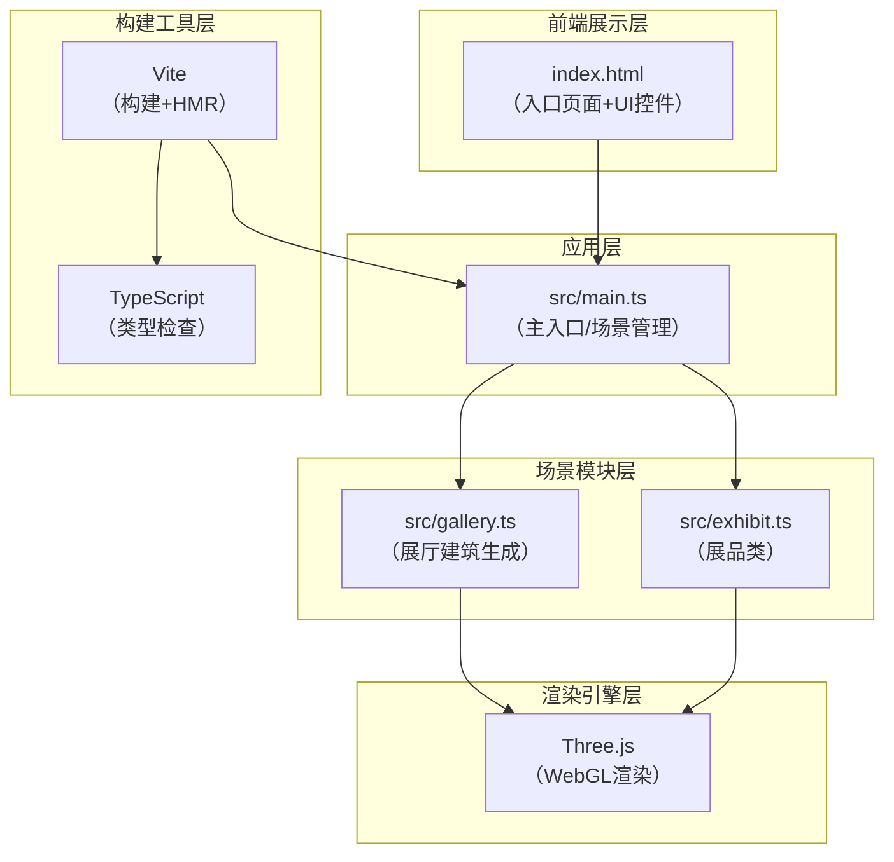

## 1. 架构设计



### 模块调用关系与数据流向

1. **src/main.ts**（主控制器）
   - 初始化：Three.js场景 → 渲染器 → 透视相机 → 光照
   - 调用 `src/gallery.ts` 创建展厅建筑
   - 创建4个 `Exhibit` 实例（来自 `src/exhibit.ts`），环形分布
   - 接收鼠标/键盘事件 → 更新相机球坐标 → 每帧调用各展品 `update()`
   - 管理自动漫游状态机，驱动相机沿路径运动
   - 更新UI显示（展品名称、视角坐标）

2. **src/gallery.ts**（展厅模块）
   - 生成：四面渐变半透明墙 + 星光地面 + 4个发光展台 + 中央聚光灯 + 地面水波纹
   - 提供：`createGallery(scene)` 函数将所有建筑元素加入场景
   - 水波纹每帧由 main.ts 调用更新

3. **src/exhibit.ts**（展品模块）
   - 类 `Exhibit`：封装单个展品的几何体、材质、粒子光晕、形态动画状态机
   - 数据流：接收相机位置 → 计算相对水平/垂直角度 → 更新材质颜色（红→蓝渐变）和透明度 → 更新顶点位置（形态动画）→ 粒子绕Y轴旋转
   - 距离检测：相机距离<2单位时触发3秒形态动画（扭曲→碎裂→重组）

## 2. 技术描述

- **前端核心**：Three.js（3D渲染引擎）+ TypeScript（类型安全）+ Vite（构建工具）
- **Three.js版本**：latest，使用 `three/addons` 引入附加模块
- **初始化工具**：手动配置Vite + TypeScript项目结构
- **后端**：无（纯前端静态应用）
- **数据库**：无

## 3. 项目文件结构

| 文件路径 | 职责 |
|---------|------|
| `package.json` | 项目依赖（three、@types/three、typescript、vite）与启动脚本 |
| `vite.config.js` | Vite构建配置，支持HMR热更新 |
| `tsconfig.json` | TypeScript配置，严格模式，target ES2020，module ESNext |
| `index.html` | 入口页面，全屏canvas容器，左下角信息面板，右下角控制按钮 |
| `src/main.ts` | 主入口：初始化场景/相机/渲染器，事件处理，渲染循环，漫游逻辑 |
| `src/gallery.ts` | 展厅生成：墙、地面、展台、聚光灯、水波纹 |
| `src/exhibit.ts` | 展品类：几何体生成、动态材质、粒子光晕、形态动画 |

## 4. 核心数据结构（TypeScript类型）

```typescript
// 球坐标相机控制参数
interface CameraSpherical {
  radius: number;      // 距离中心距离，范围3-20
  theta: number;       // 水平角度（弧度），0-2π
  phi: number;         // 垂直角度（弧度），限制约0.5-2.0（对应-30°~30°相对水平）
}

// 展品形态动画状态
interface MorphState {
  active: boolean;     // 是否正在动画
  startTime: number;   // 动画开始时间
  duration: number;    // 动画时长3000ms
  originalPositions: Float32Array;  // 原始顶点备份
}

// 展品信息
interface ExhibitInfo {
  name: string;        // 展品名称
  position: THREE.Vector3;  // 世界坐标
}
```

## 5. 关键交互实现方案

### 5.1 相机控制（轨道式）
- 不使用 OrbitControls，自实现球坐标系统
- 鼠标左键拖拽：更新 theta（水平）和 phi（垂直）
- 滚轮：更新 radius（距离），clamp在3-20之间
- 每帧通过 `Spherical.setFromSphericalCoords()` 转为笛卡尔坐标设置相机位置

### 5.2 展品动态颜色
- 计算相机相对展品的水平角度：`Math.atan2(dx, dz)` → 映射到0-1区间 → 对 #FF6B6B 和 #4D96FF 做 Color.lerp()
- 垂直角度：相机高度差 → 映射到透明度0.5-1.0

### 5.3 形态动画（3秒）
- 进度 t = (now - startTime) / 3000，范围0-1
- 0-0.33：扭曲（顶点沿法线方向正弦偏移）
- 0.33-0.66：碎裂（顶点沿随机方向扩散）
- 0.66-1.0：重组（顶点 lerp 回原始位置）

### 5.4 自动漫游
- 预设4个观察点球坐标，每件展品对应一个观察位置
- 使用 CatmullRomCurve3 生成平滑路径
- 状态机：行进中 → 停留5秒 → 前往下一站，循环
- 相机 lookAt 始终对准当前/下一个展品位置

### 5.5 性能优化
- 几何体顶点数控制：TorusKnotGeometry p=2,q=3,tubularSegments=64,radialSegments=16（约2000面）
- 粒子使用 Points + BufferGeometry，单次draw call
- 材质复用，避免每帧新建对象
- 水波纹使用修改 MeshBasicMaterial 的 opacity 和 scale，不改动几何体
