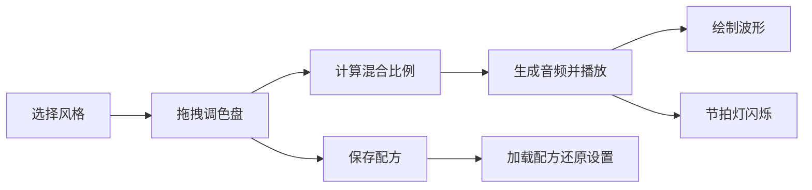

## 1. 产品概述
音乐风格混合可视化应用，帮助音乐爱好者通过视觉化方式探索和混合不同音乐风格。
- 解决普通人难以理解音乐理论（和弦、音阶、节奏型）且缺乏直观工具尝试多种风格混合创作的问题
- 目标用户：音乐爱好者、初学者、希望探索音乐创作的非专业人士
- 市场价值：降低音乐创作门槛，提供直观有趣的音乐探索体验

## 2. 核心功能

### 2.1 功能模块
1. **风格选择器**：下拉菜单切换爵士、流行、电子三种基础风格，切换时背景和界面颜色平滑过渡
2. **调色盘区域**：圆形可视化混合区域，用户拖拽小圆点实时计算混合比例，生成并播放MIDI音频
3. **波形时间线**：底部Canvas波形展示，支持点击跳转播放，波形颜色随混合比例变化
4. **风格配方列表**：保存/加载混合方案，最多保留10条记录
5. **BPM控制**：全局速度滑块（60-180），节拍指示灯实时闪烁

### 2.2 页面详情
| 页面名称 | 模块名称 | 功能描述 |
|-----------|-------------|---------------------|
| 主应用页 | 风格选择器 | 下拉菜单切换3种风格，1.5秒CSS颜色过渡动画 |
| 主应用页 | 调色盘组件 | 300px直径圆形，分3个120度扇形，拖拽计算混合比例（精确0.01），实时显示百分比 |
| 主应用页 | 波形时间线 | 80px高Canvas波形，点击跳转，颜色随混合比例合成 |
| 主应用页 | 配方列表 | 右侧面板，最多10条，显示缩略参数和时间，点击加载 |
| 主应用页 | BPM控制 | 60-180滑块，0.3秒ease-out缓动，节拍灯脉冲闪烁 |
| 主应用页 | 全局交互 | 空格播放/暂停，方向键控制时间轴 |

## 3. 核心流程
用户选择基础风格 → 拖拽调色盘上的点混合风格 → 实时计算比例并播放音频 → 波形同步更新 → 可保存配方到列表 → 点击配方还原设置

## 4. 用户界面设计
### 4.1 设计风格
- **主色调**：深色主题，背景#121212到#1A1A2E渐变
- **风格色**：爵士红#FF6B6B、流行黄#FFD93D、电子蓝#4D96FF
- **按钮样式**：圆角8px，3D凸起感box-shadow: 0 4px 6px rgba(0,0,0,0.3)
- **字体**：现代无衬线字体，白色文本，百分比16px
- **布局风格**：面板间距20px，中央调色盘玻璃效果backdrop-filter: blur(10px)

### 4.2 页面设计概述
| 页面名称 | 模块名称 | UI元素 |
|-----------|-------------|-------------|
| 主应用页 | 风格选择器 | 下拉菜单、颜色过渡动画 |
| 主应用页 | 调色盘 | Canvas圆形、扇形分区、可拖拽圆点、百分比文本 |
| 主应用页 | 波形时间线 | Canvas波形图、深灰背景#2A2A2A |
| 主应用页 | 配方列表 | 背景#1E1E2E、40px高条目、灰色分隔线 |
| 主应用页 | BPM控制 | 滑块控件、圆形节拍指示灯 |

### 4.3 响应式
- 桌面端（≥768px）：调色盘和波形并排，右侧配方列表展开
- 移动端（<768px）：调色盘和波形上下排列，配方列表折叠为汉堡菜单
- 触摸操作优化
