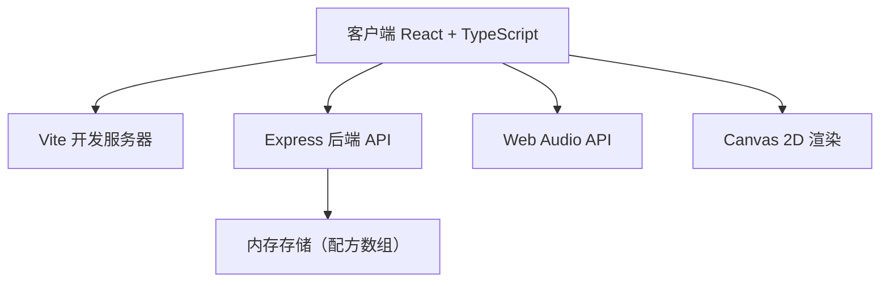
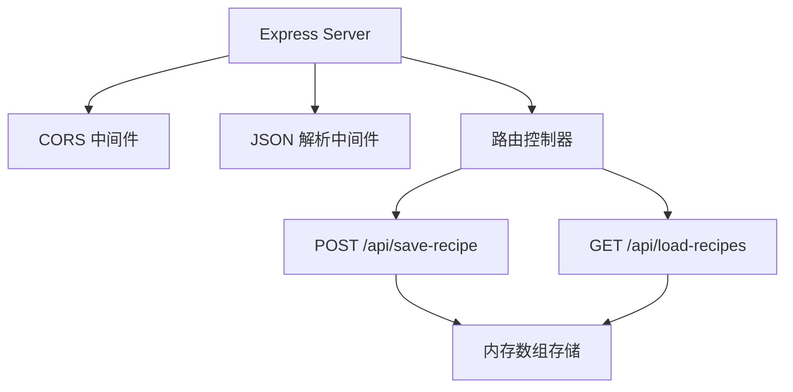
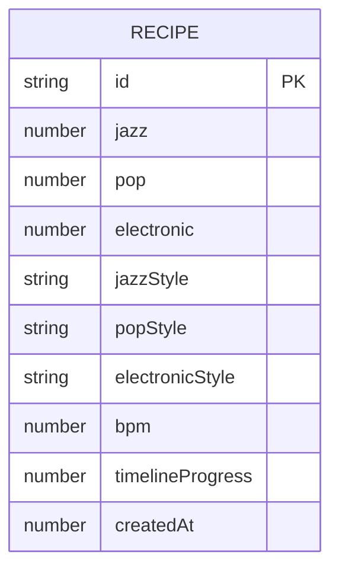

## 1. 架构设计



## 2. 技术描述
- **前端**：React@18 + TypeScript + Vite
- **后端**：Express@4 + CORS + uuid
- **音频**：Web Audio API（原生浏览器API，无需额外库）
- **渲染**：Canvas 2D API（调色盘和波形）
- **状态管理**：React useState/useReducer（轻量级场景）

## 3. 路由定义
| 路由 | 用途 |
|-------|---------|
| / | 主应用页面 |
| /api/save-recipe | 保存风格配方（POST） |
| /api/load-recipes | 加载所有配方（GET） |

## 4. API定义

### 类型定义
```typescript
interface StyleMix {
  jazz: number;
  pop: number;
  electronic: number;
}

interface Recipe {
  id: string;
  mix: StyleMix;
  styles: {
    jazz: string;
    pop: string;
    electronic: string;
  };
  bpm: number;
  timelineProgress: number;
  createdAt: number;
}
```

### POST /api/save-recipe
- Request: `Recipe`（不含id和createdAt，由后端生成）
- Response: `{ success: boolean; recipe: Recipe }`

### GET /api/load-recipes
- Response: `{ recipes: Recipe[] }`（最多10条，按创建时间倒序）

## 5. 服务器架构



## 6. 数据模型

### 6.1 数据模型定义



### 6.2 数据存储
- 使用内存数组存储，最多保留10条记录
- 新记录插入数组头部，超过10条时删除尾部
- 服务器重启后数据丢失（符合演示需求）

## 7. 文件结构

```
├── package.json
├── index.html
├── tsconfig.json
├── vite.config.js
├── server.js
└── src/
    ├── App.tsx
    ├── components/
    │   ├── MixingPalette.tsx
    │   ├── WaveformTimeline.tsx
    │   └── StyleSelector.tsx
    └── types/
        └── index.ts
```

## 8. 性能要求
- 音频播放无卡顿
- 点击/拖拽响应 < 50ms
- FPS ≥ 30（波形绘制）
- 内存 ≤ 200MB
