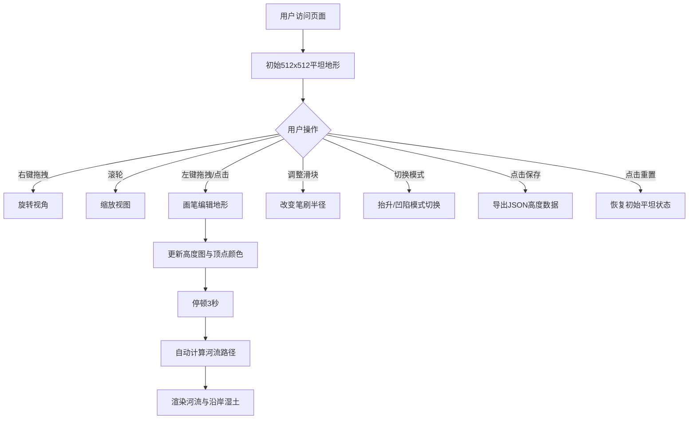

## 1. 产品概述

浮游群岛3D交互式地形生成与编辑器 - 一款面向创意设计师和游戏开发者的浏览器端实时地形编辑工具。
- 核心价值：无需专业软件，通过直觉化的画笔操作即可在三维空间内实时塑造地形并预览生态纹理变化
- 目标用户：游戏开发者、3D艺术爱好者、创意设计师、教育工作者

## 2. 核心功能

### 2.1 用户角色

| 角色 | 注册方式 | 核心权限 |
|------|---------|---------|
| 普通用户 | 无需注册，直接访问 | 完整使用所有地形编辑、预览、保存功能 |

### 2.2 功能模块

1. **主场景页面**：3D地形渲染、画笔编辑交互、视角控制
2. **控制面板**：笔刷参数调节、模式切换、重置、数据导出
3. **信息显示**：FPS计数器、海拔统计、小地图预览

### 2.3 页面详情

| 页面名称 | 模块名称 | 功能描述 |
|---------|---------|---------|
| 主场景页面 | 3D地形渲染 | 512x512网格地形，基于顶点高度实时颜色渐变，鼠标视角控制（右键旋转、滚轮缩放） |
| 主场景页面 | 画笔编辑 | 左键抬升/凹陷地形，笔刷半径0.5-15格可调，每帧最大抬升1单位 |
| 主场景页面 | 自动河流生成 | 编辑后3秒内自动沿最低海拔路线生成曲折半透明蓝色河流，沿线地表变色 |
| 控制面板 | 笔刷半径滑块 | 圆钮样式，轨道色#4FC3F7，拖拽实时填充变化，范围0.5-15格，默认5格 |
| 控制面板 | 模式切换按钮 | 抬升(向上箭头)/凹陷(向下箭头)，激活时高亮#FF9800，悬停放大1.1倍+2px阴影 |
| 控制面板 | 重置按钮 | 红色#F44336，一键清除所有地形修改恢复初始平坦状态 |
| 控制面板 | 保存快照按钮 | 绿色#4CAF50，导出Float32Array格式高度数据为JSON下载 |
| 信息显示 | FPS计数器 | 右上角白色14px字体，实时显示帧率 |
| 信息显示 | 最大海拔显示 | 右上角实时显示当前地形最大海拔值 |
| 信息显示 | 迷你小地图 | 右下角150x150px航拍俯视视角，颜色映射海拔高度 |

## 3. 核心流程

用户进入页面 → 初始显示平坦绿色地表 → 鼠标右键拖拽旋转视角/滚轮缩放观察 → 左键按住并拖拽使用抬升画笔塑造山脉 → 切换凹陷画笔雕刻山谷 → 编辑停顿3秒后自动生成蜿蜒河流 → 查看小地图预览整体地形 → 点击保存快照导出数据 → 或点击重置恢复初始状态

## 4. 用户界面设计

### 4.1 设计风格
- 主色调：深蓝夜空背景#1E293B，模拟宇宙浮游群岛氛围
- 生态渐变色：浅绿#7CB342 → 深绿#388E3C → 灰褐#8D6E63 → 雪白#F5F5F5
- 强调色：笔刷轨道#4FC3F7、激活状态#FF9800、重置#F44336、保存#4CAF50
- 面板样式：半透明磨砂玻璃效果 rgba(20,30,50,0.7)，圆角12px，内边距16px
- 按钮动效：悬停放大1.1倍、2px阴影投影，0.2秒平滑过渡
- 字体：使用等宽字体配合科技感UI，按钮简洁图标化

### 4.2 页面设计概览

| 页面名称 | 模块名称 | UI元素 |
|---------|---------|--------|
| 主场景 | 3D画布 | 全屏WebGL渲染，十字准星鼠标，深蓝背景#1E293B |
| 主场景 | 左上控制面板 | 磨砂玻璃面板、圆角、滑块(圆钮+填充轨道)、图标按钮(箭头↑↓)、彩色操作按钮 |
| 主场景 | 右上信息区 | FPS数值、最大海拔数值，白色14px等宽字体 |
| 主场景 | 右下小地图 | 150x150px方形画布、俯视航拍、海拔颜色映射 |

### 4.3 响应式
- 桌面优先设计，全屏渲染
- 控制面板固定定位，不随场景缩放
- 小地图固定右下角，保持固定尺寸

### 4.4 3D场景指引
- **环境**：深蓝夜空背景，营造浮游悬浮于虚空的奇幻感
- **光照**：环境光+方向光组合，方向光45度斜射营造地形立体感，支持顶点颜色自发光
- **相机**：默认45度俯视，距离地面10单位，OrbitControls右键旋转、滚轮缩放、禁用平移
- **构图**：地形居中占据大部分视口，UI面板浮于四角不遮挡核心编辑区域
- **交互**：鼠标悬停显示笔刷范围预览圆圈，编辑时地形实时形变，颜色平滑过渡
- **后处理**：微弱环境光遮蔽增强地形细节，水面带透明度与闪烁反光
- **性能预算**：地形编辑>55FPS，更新延迟<16ms，使用BufferGeometry动态更新
