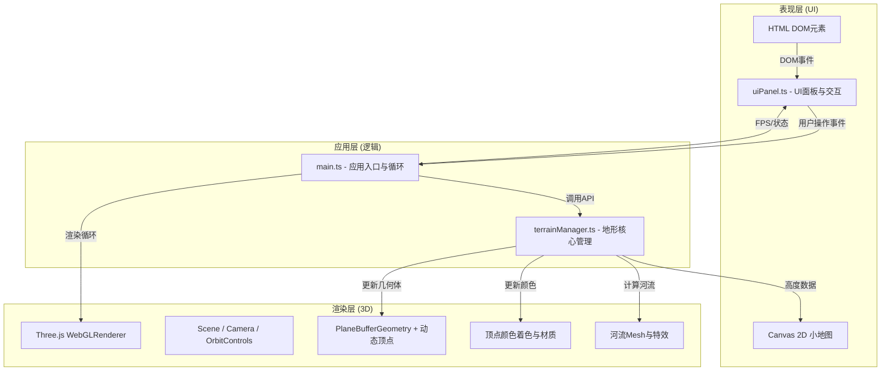

## 1. 架构设计



## 2. 技术说明

- **前端框架**：TypeScript 5 + Three.js 0.160 + Vite 5
- **开发语言**：TypeScript (strict模式, ES2020目标)
- **3D渲染**：Three.js BufferGeometry + MeshBasicMaterial/MeshLambertMaterial，动态更新顶点属性
- **UI交互**：原生HTML5 + CSS3 + Canvas 2D (小地图)，无额外UI框架
- **构建工具**：Vite，支持HMR热更新与路径别名
- **无后端**：纯前端单页应用，数据导出为本地JSON文件下载

## 3. 路由定义

| 路由 | 用途 |
|------|------|
| / | 主场景 - 3D地形编辑器（唯一页面） |

## 4. 数据模型

### 4.1 核心数据结构

```typescript
// 高度图 - 存储每个网格顶点的海拔高度
interface HeightMap {
    size: number;          // 网格尺寸 512
    data: Float32Array;    // 512*512 个浮点数，范围 0-12+
}

// 笔刷配置
interface BrushConfig {
    radius: number;        // 0.5 - 15 格
    mode: 'raise' | 'lower';
    maxDeltaPerFrame: number; // 每帧最大变化量 1.0
}

// 河流段
interface RiverSegment {
    x: number;             // 网格坐标X
    z: number;             // 网格坐标Z
    width: number;         // 河流宽度 0.5-1
}

// 保存快照格式
interface TerrainSnapshot {
    version: string;
    timestamp: number;
    size: number;
    heights: number[];     // Float32Array 导出后的数组
}
```

### 4.2 颜色映射规则

| 海拔区间 | 颜色HEX | 说明 |
|---------|---------|------|
| 0 - 2 | #7CB342 | 浅绿草地 |
| 2 - 5 | #388E3C | 深绿森林 |
| 5 - 8 | #8D6E63 | 灰褐岩石 |
| 8 - 12+ | #F5F5F5 | 白雪山顶 |
| 河流沿岸2单位 | #5D4037 | 深蓝湿土 |

过渡带宽度0.5单位，使用线性插值实现平滑渐变。

## 5. 文件结构

```
auto257/
├── .trae/documents/
│   ├── PRD.md
│   └── Technical-Architecture.md
├── src/
│   ├── main.ts              # 应用入口：场景初始化、循环、事件分发
│   ├── terrainManager.ts    # 地形核心：网格生成、高度读写、颜色、河流算法
│   └── uiPanel.ts           # UI层：控制面板、滑块、按钮、小地图、FPS
├── index.html               # 入口页面，全屏容器
├── package.json
├── tsconfig.json
└── vite.config.js
```

## 6. 性能优化策略

- **顶点复用**：使用PlaneGeometry的原生网格，仅更新position和color属性数组
- **局部更新**：画笔影响范围内的顶点才重新计算高度和颜色，避免遍历全部512²顶点
- **缓冲区标记**：设置geometry.attributes.position.needsUpdate = true仅在需要时
- **河流节流**：用户停止编辑3秒后才触发河流计算，使用setTimeout防抖
- **小地图降采样**：每4x4格取一个像素渲染150x150小地图，降低绘制开销
- **FPS限流**：requestAnimationFrame自然同步显示刷新率，避免过度渲染
